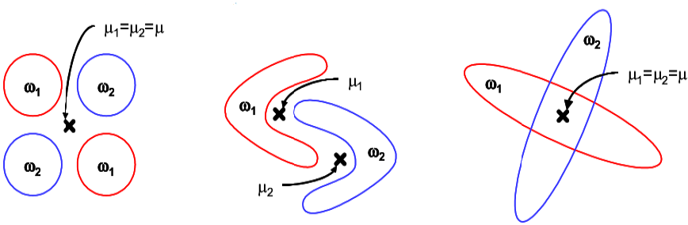

# Machine Learning 1

[TOC]

## 1. Introduction to Machine Learning

Machine learning is a field that lies at the intersection of statistics, probability, computer science, and optimization. The main goal is to explore **automatic methods for inferring models from data** (for example: finding structure, making predictions).

Examples of learning tasks:

- SUPERVISED LEARNING: uses labeled data.
  - **Classification:** predicting a class or category to each example; note multi-label, probabilistic generalizations.
  - **Regression:** predicting a real value for each example; note multi-variable generalization.
- UNSUPERVISED LEARNING: does not use or have data labels.
  - **Clustering:** discovering homogeneous groups (clusters) in data.
  - **Dimensionality reduction:** finding lower-dimensional data representations.
  - **Density estimation:** estimating the probabilistic mechanism that generates data.
  - **Novelty detection:** finding anomalous/novel/outlying data.
- SEMI-SUPERVISED LEARNING: uses partly labeled data.
  - **Ranking:** ordering examples according to some criterion.
  - **Reinforcement:** delayed rewarding.
- TRANSFER LEARNING: learning in a new task through the transfer of knowledge from a related task that has already been learned.

### Useful probability and statistics facts

- **Central Limit Theorem:**

  If $X_1,\ldots,X_n$ are *independent identically distributed random variables*, with $\mathbb E[X_i]=\mu$ and $\text{Var}(X_i)=\sigma^2$, then the sample mean

$$
\frac{X_1+\ldots+X_n}{n}\sim\mathcal N\left(\mu,\frac{\sigma^2}{n}\right)
$$

​		approaches a normal distribution as $n\rightarrow\infty$.

- **Product rule:**

  If $X_1,\ldots,X_n$ have a joint probability distribution $p(X_1,\ldots,X_n)$, then we can factorize the distribution as the product

$$
p(X_1,\ldots,X_n)=p(X_1)\prod_{i=2}^np(X_i|X_1,\ldots,X_{i-1}).
$$

- **Bayes Theorem:**

$$
P(B_i|A)=\frac{P(A|B_i)P(B_i)}{\sum_jP(A|B_j)P(B_j)}=\frac{P(A|B_i)P(B_i)}{P(A)}.
$$

- **Bayes formula for densities:**

  In a data analysis context, $\theta$ is a parameter vector and the following equality holds:

$$
\pi_{\text{POST}}(\theta|\text{data})=\frac{\pi_{\text{LIK}}(\text{data}|\theta)\cdot\pi_{\text{PRIOR}}(\theta)}{\int_{\Theta}\pi_{\text{LIK}}(\text{data}|\theta)\cdot\pi_{\text{PRIOR}}(\theta)d\theta}.
$$

​		This can also be expressed loosely as
$$
P(\theta|D)=\frac{P(D|\theta)P(\theta)}{P(D)}=\frac{P(D|\theta)P(\theta)}{\int_\Theta P(D|\theta)P(\theta)d\theta},
$$
​		where $D$ is the data. This expression gives rise to the notions of **likelihood**, **prior**, **posterior**, and **unconditional (expected likelihood)** distributions:

- $P(\theta)$: <u>prior probability</u>, confidence in $\theta$ before observing $D$.
- $P(D|\theta)$: <u>likelihood</u>, probability of observing $D$ if parameters are $\theta$.
- $P(D)$: <u>expected likelihood</u> of observing data $D$, also <u>unconditional</u>.
- $P(\theta|D)$: <u>posterior probability</u>, confidence in $\theta$ after observing $D$.

- **Conjugacy:**

  **Definition:** Suppose a prior distribution $\pi_{\text{PRIOR}}(\theta)$ belongs to a class of parametrized distributions $\Pi$. Then the distribution is said to be **conjugate** with respect to a likelihood $\pi_{\text{LIK}}(\cdot|\theta)$ if the posterior distribution $\pi_{\text{POST}}(\theta|\cdot)\in\Pi$.

  Remember that $\pi_{\text{POST}}(\theta|\cdot)\propto\pi_{\text{LIK}}(\cdot|\theta)\pi_{\text{PRIOR}}(\theta).$ For example, Gaussian is conjugate to Gaussian, and Beta is conjugate to Binomial.

Using the posterior:
$$
\hat\theta_{\text{MAP}}:=\text{argmax}_{\theta\in\Theta}\{P(\theta|D)\}\text{: the value of }\theta\text{ that maximizes the posterior.}
\\
\hat\theta_{\text{ML}}:=\text{argmax}_{\theta\in\Theta}\{P(D|\theta)\}\text{: the value of }\theta\text{ that maximizes the likelihood.}
\\
\hat\theta_{\text{EV}}:=\mathbb{E}[P(\theta|D)]=\int_{\Theta}P(\theta|D)\cdot P(\theta)d\theta\text{: the expected value of theta.}
$$

### Inductive bias

**Example:** complete the following series: $2,4,6,8,...$

**Answer 1:** 132 (model 1: $f(n)=n^4-10n^3+35n^2-48n+24$)

**Answer 2:** 10 (model 2: $f(n)=2n$)

How can we rule out the more complex model?

1. Supply more training data: $2,4,6,8,10,12,14,...$

2. Regularize: add penalty to higher-order terms.

3. Reduce the hypothesis space; for example, restrict to quadratic models.
   $$
   \text{Class of functions: }\mathcal F:=\{f_\theta:\mathcal X\rightarrow\mathcal Y\ |\ \theta\in\Theta\}.
   $$

So, the conclusions are this: based *only* on training data $D$, there is no means of choosing which function $f$ is better (generalitzation is not *guaranteed*). Thus, we must add control to the **fitting ability** of our methods (complexity control).
$$
\text{true error}(f)\leq\text{training error}(f)+\text{complexity of }f.
$$

### Formulation of ML

$X$ are the measured variables, $Z$ are the unmeasured ones, $y$ is the true function and $y'$, which would be $\hat y$, is the modeled function. There are some important translations from Statistics to ML and vice-versa:

|                       Machine Learning                       |                          Statistics                          |
| :----------------------------------------------------------: | :----------------------------------------------------------: |
|                            model                             |                            model                             |
|                       parameter/weight                       |                    parameter/coefficient                     |
|                            train                             |                             fit                              |
|                            learn                             |                        infer/estimate                        |
|                          regression                          |                          regression                          |
|                        classification                        |                        discrimination                        |
|                          clustering                          |                  clustering/classification                   |
|                  inputs/features/variables                   |   independent variables, explanatory variables, predictors   |
|                        ouputs/targets                        |                 dependent/response variables                 |
|                      instances/examples                      |                   individuals/observatiobs                   |
| error/loss function, training/empirical error, true/generalization error | fit criterion, deviance resubstitution/in-sample error, predictive, out-sample error |

#### Prediction vs. inference

**Prediction:** produce a good estimate for the predicted variable.

**Inference:**

1. Which predictors actually affect the target variable?
2. How strong are these dependencies?
3. Are these relationships positive or negative?

### Common Tasks

- **Regression:** The goal is to predict some quantitative outcome subject to probabilistic uncertainty.

- **Classification:** The goal is to obtain a model based on available **training data** (*known* examples) with high classification accuracy on  unseen *unknown* examples (**test data**), i.e. achieving good **generalization**.

- **Clustering:** The goal is to find homogeneous groups of data and set them apart accordingly. Looks like a very different task from regression or classification, but it's both of them with some added difficulty: it has an inherent large subjectivity.

**Why are these tasks stochastic?** 

We have a (complete) input data object $(x,z)$ and an output data object $y$. The true relationship is $f_c:\mathcal X\times\mathcal Z\rightarrow\mathcal Y$, that is $f_c(x,z)=y$. When we measure data about $f_c$, we measure only the $x$ portion of the input variables. Therefore, the relation between $x$ and $y$ becomes stochastic.

#### Setting up the tasks

There are (at least) two ways of setting up these tasks formally:

##### Optimization view

$$
\min_{\theta\in\Theta}E(\theta):=\frac{1}{n}\sum_{i=1}^nl(y_i,f_\theta(x_i))+\Omega(f_\theta).
$$

true error of $f_\theta\leq$ training error of $f_\theta$ + complexity of $f_\theta$ (empirical risk + regularizer)

$l(y_i,f_\theta(x_i))$ is called the *loss/error function*.

##### Statistics view

Use Bayes' formula to compute $P(\theta|\text{data})$ and choose one according to this (posterior) distribution.

Many times these two views can yield the same results (which is good!). An example would be LSQ $\equiv$ MaxLik+Gaussian.

The most general description of the data generation mechanism is in terms of the pdf $p(x,y)$ in the joint input-output space: this is the key to generalization.
$$
p(x,y)=p(y|x)\cdot p(x),\text{ where }p(x)=\int p(y,x)\ dy.
$$
Some techniques use $p(x)$, others do not. The important pdf is $p(y|x)$. *Discriminative* methods use only $p(y|x)$, while *generative* methods use the joint pdf $p(x,y)$.

**So, what is a Machine Learning algorithm/technique?**

A ML algorithm gets a dataset $D$ and returns a model of $D$ ( a representation of $D$ that either gives structure to $D$ or that allows to make predictions on unseen observations), together with an estimation of the model quality. The algorithm itself typically determines the model space $\mathcal F$ and the loss function $l$.

**And why are linear models so nice?**

We will begin our analyses with linear models and techniques. A model is linear when, up to an invertible mapping, it is **a linear function of its parameters**; $f_\theta(x)$ is linear when is depends linearly on $\theta$, but we do not say anything about $x$. For example, $f_\theta(x)=\sum_{i=0}^m\theta_i\sin(\exp(-x_i^2))$ is linear. A linear model:

- **Is analytically tractable:** we have closed-form solutions or fast convergent iterative methods for the solution.
- **Has a unique solution:** there are no local optima.
- **Is highly interpretable.**
- **Is amenable to inference:** we can ask (and answer) questions about the importance and weight on the target of the different variables.
- Has **user-defined fitting ability**, via the basis functions.
- Is capable of being **regularized:** complicated models can be penalized.

#### General form of a linear model

A linear model has a general expression as
$$
f(x;\theta)=g\left(\theta_0+\sum_{i=1}^h\theta_i\varphi_i(x)\right).
$$
The functions $\varphi_i$ are called **basis functions** (they constitute a *feature map*) and are non-linear wrt $x$. $g$ is a strictly monotonic function: in Neural Networks, this is called an **activation function**.

### On data pre-processing

Each problem requires a different approach in what concerns data cleaning and preparation. This pre-processing procedure is very important because it can have a deep impact on performance; it can easily take us a significant part of the time. So, the important things to take into account on data pre-processing are:

- Treatment of missing, anomalous, and incoherent or incorrect values.
- Coding of non-continuous or non-ordered variables.
- Possible elimination of irrelevant or redundant variables (*feature selection*).
- Creation of new variables that can be useful (*feature extraction*).
- Normalization of the variables (standardization).
- Transformations of the variables (for example, corrections of serious skewness and/or kurtosis)

Non-standard data (images, audio, text...) may need completely *ad hoc* treatments.

## 2. Linear Data Visualization

### Dimensionality reduction

There are two main goals associated to these techniques:

- **Signal representation:** the goal is to represent the data accurately in a lower-dimensional space.
- **Signal classification:** the goal is to enhance the class-discriminatory information in the lower-dimensional space.

Unfortunately, there is no systematic way to generate non-linear transforms, so we will focus on **linear** methods for **feature extraction**:

- PCA: Principal Components Analysis.
- FDA/LDA: Fisher's Discriminant Analysis.
- ICA: Independent Components Analysis.

### Principal Components Analysis

**ho farem a AD en principi**

### Fisher's Discriminant Analysis

FDA is a technique for **dimensionality reduction, supervised classification, feature extraction and data visualization**.

**Idea:** projection of the data onto a lower dimensional linear space, such that the separability of projected data is maximized.

Fisher's idea is to regard **dot product** as the projection $y$ of some $x\in\R^p$ from classes $\omega_1$ or $\omega_2$, via a projection vector $w$: $y=w^Tx\in\R$. In order to find a good projection vector, we need to define a measure of separation between the projections:
$$
m_k=\frac{1}{n_k}\sum_{i\in\omega_k}x_i,\qquad k\in\{1,2\},
$$
where $n_1+n_2=n$ is the number of examples on every class. We then choose to maximize the *squared* distance between the projected means,
$$
(\mu_2-\mu_1)^2=(w^Tm_2-w^Tm_1)^2=(w^T(m_2-m_1))^2.
$$
However, the distance between the projected means is not a very good measure since it does not take into account the dispersion (**scatter**) within the classes. The problem is that the covariance matrices for each class are far from being diagonal. We actually want to look for the projection where examples from the same class are projected very close to one another and the projected means are as far apart as possible:

The solution (proposed by R. Fisher) is to maximize a function that represents the difference between the means, normalized by a measure of the within-class scatter:

1. $\forall k$ a class we define the scatter as

$$
s_k^2=\sum_{i\in\omega_k}\left(w^Tx_i-\mu_k\right)^2,\qquad k\in\{1,2\}.
$$

2. The total scatter is $s_1^2+s_2^2$.
3. Fisher's idea was to maximize the following function:

$$
J(w)=\frac{(\mu_2-\mu_1)^2}{s_1^2+s_2^2}.
$$

It can be shown that $J(w)$ can be rewritten as:
$$
J(w)=\frac{(\mu_2-\mu_1)^2}{s_1^2+s_2^2}=\frac{w^TS_Bw}{w^TS_Ws},
$$
where

- $S_B=(m_2-m_1)(m_2-m_1)^T$ is the **between-class scatter matrix** (rank 1).
- $S_W=\sum_{i\in\omega_1}(x_1-m_1)(x_1-m_1)^T+\sum_{i\in\omega_2}(x_1-m_2)(x_1-m_2)^T$ is the **within-class scatter matrix**.

To find the maximum of $J$ we derive and equal to zero,
$$
\frac{\part J}{\part w}=0,
$$
and upon solving we arrive at the following **generalized eigenvalue problem**:
$$
\left(S_W^{-1}S_B\right)w=J(w)w;
$$
solving it yields $\boxed{\hat w=S_W^{-1}(m_1-m_2),}$ known as **Fisher's Linear Discriminant** (1936), although it is not a discriminant but a specific choice for projection down to one dimension.

FDA generalizes very gracefully for $K$ class problems: the only restriction is that the maximum number of projection directions is $K-1$. FDA can also be derived as the Maximum Likelihood result for the case of Gaussian class-conditional densities with equal covariance matrices; in this case, it is known as LDA.

***WARNING!*** FDA is able to extract a maximum of $K-1$ projection directions, maybe insufficient for complex data. PCA is able to extract $d$ projection directions, but it is not clear how many are necessary.

#### Counterparts

**When will FDA presumably fail?** If the classes are far from Gaussian, the FDA projections will not be able to preserve any complex structure; for an example, this image:

FDA will also fail when the discriminatory information is not in the mean but rather in the *variance* of the data (e.g., if $J(w)=0$); for example,

## 3. Theory for regression and linear models (I).

### The regression framework

Given data $D=\{(x_n,t_n)\}_{n=1,\ldots,N}$, where $x_n\in\R^d,t_n\in\R$,

- **Statistics:** estimation of a continuous random variable $T$ conditioned on a random vector $X$.
- **Mathematics:** estimation of a real function $f$ based on a finite number of *noisy* examples $(x_n,f(x_n))$.

The departing statistical setting is $t_n=f(x_n)+\varepsilon_n$; a model is any approximation of $f$. We assume $\varepsilon_n$ are iid random variables such that $\mathbb E[\varepsilon_n]=0$ and $\text{Var}(\varepsilon_n)=\sigma^2<\infty$, and that $\varepsilon_n$ and $x_n$ are independent variables.

The **risk** of a model $y$ is
$$
R(y):=\int_\R\int_{\R^d}L(t,y(\boldsymbol{x}))p(t,\boldsymbol{x})\ d\boldsymbol{x}\ dt,
$$
where $L$ is a suitable **loss** function that satisfies:

- $L(t,y(\boldsymbol x))\geq0$
- $L(t,y(\boldsymbol x))=0\impliedby t=y(\boldsymbol x)$ (not necessarily in the other direction)
- $L(t,y(\boldsymbol x))$ does not increase when $|t-y(\boldsymbol x)|$ decreases.

$L$ is closely related to the distribution of the noise model $\varepsilon_n$.

**Example:** if we assume for example that $\varepsilon_n\sim\mathcal N\left(0,\sigma^2\right)$, using a maximum likelihood argument it can be shown that the *right* loss function is the **square error**:
$$
L_{\text{SE}}(t,y(\boldsymbol x)):=(t-y(\boldsymbol x))^2.
$$
The **risk** is therefore
$$
R(y)=\int_\R\int_{\R^d}(t-y(\boldsymbol x))^2p(t|\boldsymbol x)p(\boldsymbol x)\ d\boldsymbol x\ dt
$$
If we enjoy complete freedom to choose $y$, the solution is:
$$
y^*(\boldsymbol x)=\int_\R tp(t|\boldsymbol x)\ dt=f(\boldsymbol x),
$$
known as the **regression function**. Since $\mathbb E[\varepsilon_n]=0$, we can alternatively express the regression setting by stating that $t$ is a continuous random variable such that $f(\boldsymbol x)=\mathbb E[t\ |\ X=\boldsymbol x]$.

**Claim:** $y^*(\boldsymbol x)=f(\boldsymbol x).$

**Proof:**
$$
y^*(\boldsymbol x)=\mathbb E[t\ |\ X=\boldsymbol x]=\mathbb E[f(\boldsymbol x)+\varepsilon\ |\ X=\boldsymbol x]=\\=\mathbb E[f(\boldsymbol x)\ |\ X=\boldsymbol x]+\mathbb E[\varepsilon\ |\ X=\boldsymbol x]=f(\boldsymbol x)+0=\\=f(\boldsymbol x).\qquad\qquad\qquad\qquad\qquad\qquad\qquad\qquad\ \square
$$
In a practical setting, we don't know $p(t|\boldsymbol x)$. Instead, we have a finite i.i.d. **data sample** of $N$ labeled observations $D=\{(\boldsymbol x_n,t_n)\}_{n=1,\ldots,N}$, where $\boldsymbol x_n\in\R^d,t_n\in\R$. Then, **intuition** tells us to solve for $y$
$$
\min_y\int_{\R^d}(f(\boldsymbol x)-y(\boldsymbol x))^2p(\boldsymbol x)\ d\boldsymbol x.
$$
This is equivalent to minimizing the risk function; we'll see this in the next part. For now, we must impose restrictions on the possible solutions $y$, this is, we must restrict the search space to a specific **class of functions** $\mathcal Y$.

We can compute an approximation to the true risk, called the **empirical risk**, by averaging the loss function on the available data $D$:
$$
R_{\text{emp}}(y):=\frac{1}{N}\sum_{n=1}^N(t_n-y(\boldsymbol x_n))^2.
$$
This quantity is also known as the **apparent error**. The **Empirical Risk Minimization (ERM)** principle stats that a learning algorithm should choose a hypothesis (model) $\hat y$ which minimizes the empirical risk among a predefined class of functions $\mathcal Y$:
$$
\DeclareMathOperator*{\argmax}{arg max}
\DeclareMathOperator*{\argmin}{arg min}
\hat y:=\argmin_{y\in\mathcal Y}R_{\text{emp}}(y).
$$
The quantity $R_{\text{emp}}(\hat y)$ is known as the **training error**. In theoretical ML, we are very much interested in:

- How this error fluctuates as a function of the data $D$.
- How far this error is from the true error, this is, to bound $|R_{\text{emp}}(\hat y)-R(y)|$; at the very least, to bound $|\mathbb E[R_{\text{emp}}(\hat y)]-R(y)|$.
- How far this error is from the best possible error, this is, to bound $|R_{\text{emp}}(\hat y)-R(y^*)|$; at the very least, to bound $|\mathbb E[R_{\text{emp}}(\hat y)]-R(y^*)|$.

### Bias-Variance analysis

Recall the assumption that $\varepsilon_n\sim\mathcal N(0,\sigma^2)$. In this case, using the square error, the risk can be decomposed as:
$$
R(y)=\int_\R\int_{\R^d}(t-y(\boldsymbol x))^2p(t,\boldsymbol x)\ d\boldsymbol x\ dt=\int_\R\int_{\R^d}(t-f(\boldsymbol x))^2p(t,\boldsymbol x)\ d\boldsymbol x\ dt\\+\int_{\R^d}(f(\boldsymbol x)-y(\boldsymbol x))^2p(\boldsymbol x)\ d\boldsymbol x=\sigma^2+\int_{\R^d}(f(\boldsymbol x)-y(\boldsymbol x))^2p(\boldsymbol x)\ d\boldsymbol x=\boxed{\sigma^2+\text{MSE}(y),}
$$
where $f$ is the **regression function**. Therefore, we arrive at $R(y)=\sigma^2+\text{MSE}(y)$. We can now *forget* about $\sigma^2$ and the risk and instead aim at minimizing the $\text{MSE}(y)$:
$$
\text{MSE}(y)=\int_{\R^d}(f(\boldsymbol x)-y(\boldsymbol x))^2p(\boldsymbol x)\ d\boldsymbol x.
$$
A **learning algorithm** for **regression** is a procedure that, given data $D$ and the search space $\mathcal Y$, outputs a model $y_D\in\mathcal Y$ that aims at minimizing $\text{MSE}(y)$.

Consider now one particular $\boldsymbol x_0$; different $D$ will produce different $y_D$ and therefore different predictions $y_D(\boldsymbol x_0)$. Let us concentrate on the quantity $(f(\boldsymbol x_0)-y(\boldsymbol x_0))^2$: we wish to eliminate the dependence on $D$. Therefore, we investigate its expected value, $\mathbb E\left[(f(\boldsymbol x_0)-y(\boldsymbol x_0))^2\right]$, taking over all possible $D$ of size $N$. If we develop a little more their formulas,
$$
\mathbb E\left[(f(\boldsymbol x_0)-y(\boldsymbol x_0))^2\right]=(f(\boldsymbol x_0)-\mathbb E[y_D(\boldsymbol x_0)])^2+\mathbb E\left[(y_D(\boldsymbol x_0)-\mathbb E[y_D(\boldsymbol x_0)])^2\right].
$$
We can interpret these summands as $f(\boldsymbol x_0)-\mathbb E[y_D(\boldsymbol x_0)]=\text{Bias}(y_D(\boldsymbol x_0))$, and $\mathbb E\left[(y_D(\boldsymbol x_0)-\mathbb E[y_D(\boldsymbol x_0)])^2\right]=\text{Var}(y_D(\boldsymbol x_0))$. Then, the formula is more clearly stated as
$$
\text{MSE}(y_D(\boldsymbol x_0))=\text{Bias}^2(y_D(\boldsymbol x_0))+\text{Var}(y_D(\boldsymbol x_0)),
$$
and the **risk** can be expressed as a sum of three summands:
$$
R(y_D(\boldsymbol x_0))=\sigma^2+\text{Bias}^2(y_D(\boldsymbol x_0))+\text{Var}(y_D(\boldsymbol x_0)).
$$
The derivation above depends on a particular point $\boldsymbol x_0$, so let us put it all back in place within their integrals:
$$
\text{Bias}^2(y_D)=\int_{\R^d}\text{Bias}^2(y_D(\boldsymbol x))p(\boldsymbol x)\ d\boldsymbol x,\\
\text{Var}(y_D)=\int_{\R^d}\text{Var}(y_D(\boldsymbol x))p(\boldsymbol x)\ d\boldsymbol x,\\
\boxed{R(y_D)=\sigma^2+\text{Bias}^2(y_D)+\text{Var}(y_D).}
$$

In general, an **underfit** model will have a big bias, while an **overfit** model will have a high variance. The *abilityi to fit* has a name: it's called the **complexity** of the function class. Both models that are more or less complex than needed will tend to have large prediction errors. In the former, this will be dominated by the variance term, while in the latter, it will be dominated by the (square) bias term.

## 4. Regression theory and linear regression models (II)

Our departing statistical model still is
$$
t_n=f(\boldsymbol x_n)+\varepsilon_n,\ \boldsymbol x_n\in\R^d,\ t\in\R
$$
where $\varepsilon_n$ is a continuous rv such that $\mathbb E[\varepsilon_n]=0$ and $\text{Var}(\varepsilon_n)=\sigma^2$. Let's assume again that we further model $\varepsilon_n\sim\mathcal N\left(0,\sigma^2\right)$, and:
$$
f(\boldsymbol x)\approx y(\boldsymbol x;\boldsymbol\beta)=\sum_{i=0}^d\beta_ix_i=\boldsymbol\beta^T\boldsymbol x
$$
with $\boldsymbol x=(1,x_1,\ldots,x_d)^T$ and $\boldsymbol\beta=(\beta_0,\beta_1,\ldots,\beta_d)^T$. Suppose we have an iid sample of $N$ labeled observations $D=\{(\boldsymbol x_n,t_n)\}_{n=1,\ldots,N}$, where $\boldsymbol x_n\in\R^d,t_n\in\R$. Therefore, our statistical model is $t_n\sim\mathcal N\left(y(\boldsymbol x_n;\boldsymbol\beta),\sigma^2\right)$ or:
$$
p(t_n|\boldsymbol x_n;\theta)=\frac{1}{\sqrt{2\pi\sigma^2}}\exp\left(-\frac{1}{2\sigma^2}\left(t_n-\boldsymbol\beta^T\boldsymbol x_n\right)^2\right),
$$
with unknown parameters $\theta:=\{\beta_0,\beta_1,\ldots,\beta_p,\sigma^2\}$. Put $\boldsymbol t=(t_1,\ldots,t_N)^T$ and $X_{N\times(d+1)}$ the matrix of the $\boldsymbol x_n$. Define the **likelihood** as $\mathcal L(\theta):=P(\boldsymbol t|X;\theta)$. Let us maximize the log-likelihood:
$$
l(\theta):=\log\mathcal L(\theta)=\log\prod_{n=1}^Np(t_n|\boldsymbol x_n;\theta)=\sum_{n=1}^N\log{p(t_n|\boldsymbol x_n;\theta)}=\\
=-\frac{N}{2}\log\left(2\pi\sigma^2\right)-\frac{1}{2\sigma^2}\sum_{n=1}^N\left(t_n-\boldsymbol\beta^T\boldsymbol x_n\right)^2=\\
=-\frac{N}{2}\log\left(2\pi\sigma^2\right)-\frac{1}{2\sigma^2}(\boldsymbol t-X\boldsymbol\beta)^T(\boldsymbol t-X\boldsymbol\beta)=\\
=-\frac{N}{2}\log\left(2\pi\sigma^2\right)-\frac{1}{2\sigma^2}\|\boldsymbol t-X\boldsymbol\beta\|^2.
$$
If we derive this wrt $\boldsymbol\beta$ and $\sigma^2$, and set equal to zero, we get:
$$
\frac{\part l}{\part\boldsymbol\beta}=-\frac{1}{2\sigma^2}\left(-2X^T\boldsymbol t+2X^TX\boldsymbol\beta\right)=0\\
\frac{\part l}{\part\sigma^2}=-\frac{N}{2\sigma^2}+\frac{1}{2\sigma^4}(\boldsymbol t-X\boldsymbol\beta)^T(\boldsymbol t-X\boldsymbol\beta)=0.\\
$$
Therefore, we can calculate the estimates for both parameters:
$$
\boldsymbol{\hat\beta}=\left(X^TX\right)^{-1}X^T\boldsymbol t,\\
\hat\sigma^2=\frac{1}{N}(\boldsymbol t-X\boldsymbol{\hat\beta})^T(\boldsymbol t-X\boldsymbol{\hat\beta})=\frac{1}{N}\|\boldsymbol t-X\boldsymbol{\hat\beta}\|^2.
$$
Note that $\hat\sigma^2=R_{\text{emp}}(y_D)$, which is a **biased estimator** for $\sigma^2$. An unbiased estimator is
$$
\bar\sigma^2=\frac{N}{N-d}\hat\sigma^2.
$$
It's also known that $\boldsymbol{\hat\beta}$ is an unbiased estimator of $\boldsymbol\beta$ and that $\text{Var}(\boldsymbol{\hat\beta})=\left(X^TX\right)^{-1}\sigma^2$. All of this implies that $\boldsymbol{\hat\beta}\sim\mathcal N\left(\boldsymbol\beta,\left(X^TX\right)^{-1}\sigma^2\right)$.

The matrix $X^+=\left(X^TX\right)^{-1}X^T$ is known as the **Moore-Penrose pseudo-inverse** of $X$. It is the generalization of the notion of an inverse matrix to non-square matrices. It has the property that $X^+X=I$, although in general $XX^+\neq I$. However, both are symmetric.

**Theorem.** Let $X_{N\times M}$, with $N>M$. If the column vectors of $X$ are linearly independent, *i.e.*, if $\text{rank}(X)=M$, then:

1. The matrix $X^TX$ is symmetric and positive definite. In particular, it is non-singular.
2. The least squares problem

$$
\min_{\boldsymbol\beta\in\R^M}\|\boldsymbol t-X\boldsymbol\beta\|^2,
$$

​		has a unique solution.

3. This solution can be found solving the so-called Gauss' normal equations,

$$
\left(X^TX\right)\boldsymbol\beta=X^T\boldsymbol t
$$

​		for $\boldsymbol\beta$.

### Quality of the fit

- In statistics, $-2l=-2\log\mathcal L$ is called the **deviance**.
- In ML, this quality measure is the **square error**:

$$
N\log\left(2\pi\sigma^2\right)+\frac{1}{\sigma^2}\|\boldsymbol t-X\boldsymbol{\hat\beta}\|^2
$$

- A much better quantity to report is the $\text{NRMSE}$,

$$
\text{NRMSE}(\boldsymbol{\hat\beta})=\sqrt{\frac{\|\boldsymbol t-X\boldsymbol{\hat\beta}\|^2}{(N-1)\text{Var}(\boldsymbol t)}}.
$$

In statistics, $R^2=1-\text{NRMSE}^2$ is the proportion of the target variability *explained* by the model.

### Leaping forward: basis functions

Recall that a model is **linear** if up to an invertible function its parameters play a linear role in the model. For example,
$$
y(x;\boldsymbol\beta)=\sum_{j=0}^d\beta_jx^j,\ x\in\R
$$
is a polynomial on $x$, but also a linear model on $\boldsymbol\beta$.

A simple but powerful idea is the introduction of **basis functions**:
$$
y(\boldsymbol x;\boldsymbol w)=\sum_{j=0}^Mw_j\varphi_j(\boldsymbol x)=\boldsymbol w^T\boldsymbol\varphi(\boldsymbol x),
$$
where $\varphi_0(\boldsymbol x)=1,\boldsymbol\varphi(\boldsymbol x)=\left(1,\varphi_1(\boldsymbol x),\ldots,\varphi_M(\boldsymbol x)\right)^T,\boldsymbol w=\left(w_0,w_1,\ldots,w_M\right)^T$. This is still a **linear model**. Define $\boldsymbol t=\left(t_1,\ldots,t_N\right)^T$ as the vector of targets, and $\boldsymbol\varphi_{N\times(M+1)}$ as the matrix of the $\boldsymbol\varphi_{ij}=\varphi_j(\boldsymbol x_i),i=1,\ldots,N,j=1,\ldots,M$:
$$
\boldsymbol\varphi=\begin{pmatrix}
1 & \varphi_1(\boldsymbol x_1) & \varphi_2(\boldsymbol x_1) & \cdots & \varphi_M(\boldsymbol x_1) \\
1 & \varphi_1(\boldsymbol x_2) & \varphi_2(\boldsymbol x_2) & \cdots & \varphi_M(\boldsymbol x_2) \\
\cdots & \cdots & \cdots & \ddots & \cdots \\
1 & \varphi_1(\boldsymbol x_N) & \varphi_2(\boldsymbol x_N) & \cdots & \varphi_M(\boldsymbol x_N) \\
\end{pmatrix}.
$$
So, let us maximize the new log-likelihood: the Gauss' normal equations are
$$
\left(\boldsymbol\varphi^T\boldsymbol\varphi\right)w=\boldsymbol\varphi^T\boldsymbol t
$$
and their solution is
$$
\boldsymbol{\hat w}=\left(\boldsymbol\varphi^T\boldsymbol\varphi\right)^{-1}\boldsymbol\varphi^T\boldsymbol t=\boldsymbol\varphi^+\boldsymbol t,\\
\hat\sigma^2=\frac{1}{N}(\boldsymbol t-\boldsymbol\varphi\boldsymbol{\hat w})^T(\boldsymbol t-\boldsymbol\varphi\boldsymbol{\hat w})=\frac{1}{N}\|\boldsymbol t-\boldsymbol\varphi\boldsymbol{\hat w}\|^2.
$$

### Singular Value Decomposition

The direct computation of the pseudo-inverse of $\boldsymbol\varphi$ has two major drawbacks:

- When $M$ is large, $\boldsymbol\varphi^T\boldsymbol\varphi$ is a large $(M+1)\times(M+1)$ matrix; then, the computation of the required inverse $\left(\boldsymbol\varphi^T\boldsymbol\varphi\right)^{-1}$ can be costly.
- If $\boldsymbol\varphi^T\boldsymbol\varphi$ is singular, or close to, then the required inverse $\left(\boldsymbol\varphi^T\boldsymbol\varphi\right)^{-1}$ can be impossible, or numerically delicate.

**Theorem.** Every matrix $X_{N\times M}$ can be expressed as $X=U\Delta V^T$, with $U\in\mathcal M_N(\R)$,$V\in\mathcal M_M(\R)$,$\Delta\in\mathcal M_{N\times M}(\R)$ diagonal. The columns of $U$ are the eigenvectors of $XX^T$, and the columns of $V$ are the eigenvectors of $X^TX$.

Let $\text{rank}(X)=r\leq\min(N,M)$. Then exactly $r$ elements $\lambda_k$ in the diagonal of $\Delta$ are strictly positive; the remaining elements are null. These $\lambda_k>0$ are called the **singular values** and correspond to the square roots of the positive eigenvalues of $XX^T$ (same as $X^TX$).

Sometimes an *economy* size decomposition is delivered: If $X$ is $N\times M$ with $N>M$, then only the first $M$ columns of $U$ are given and $\Delta$ is $M\times M$.

#### SVD for least squares

Given the least squares problem
$$
\min_{\boldsymbol w\in\R^M}\|\boldsymbol t-X\boldsymbol w\|^2,
$$
the solution can be obtained with the SVD as:

- Compute the economy size SVD of $X=U\Delta V^T$.
- Solve for $\boldsymbol w$ as $\boldsymbol{\hat w}=V\text{diag}\left(\lambda_k^{-1}\right)U^T\boldsymbol t$, where only the $\lambda_k>0$ are considered.

### Regularized least squares

The maximum likelihood framework can yield unstable parameter estimates, specially when

- the explanatory variables are highly correlated;
- there is an insufficient number of observations $(N)$ relative to the number of predictors (basis functions $M+1$ or dimensions $d+1$).

In the context of regression with Gaussian noise (square error), it is quite common to penalize the parameter vector. Define the **penalized empirical error** as:
$$
R_{\text{emp}}(y(\cdot;\boldsymbol w)):=\|\boldsymbol t-\boldsymbol\varphi\boldsymbol w\|^2+\lambda\|\boldsymbol w\|^2,\ \lambda>0.
$$
If we set its derivative wrt $\boldsymbol w$ equal to zero
$$
-2\boldsymbol\varphi^T\boldsymbol t+2\boldsymbol\varphi^T\boldsymbol\varphi\boldsymbol w+2\lambda\boldsymbol w=0,
$$
we solve for $\boldsymbol w$ and we get
$$
\boxed{
\boldsymbol{\hat w}=(\boldsymbol\varphi^T\boldsymbol\varphi+\lambda I)^{-1}\boldsymbol\varphi^T\boldsymbol t.
}
$$
This is known as **Tikhonov** or $L^2$ **regularization** in ML. Perhaps it's best known as **ridge regression** in statistics, where it's usually explained as a "penalized log-likelihood". This can also be derived from Bayesian statistics arguments. Tikhonov regularization has some advantages:

- Pushing the length of the parameter vector $\|\boldsymbol w\|$ to $0$ allows the fit to be under explicit control with the regularization parameter $\lambda$.
- The matrix $\boldsymbol\varphi^t\boldsymbol\varphi$ is positive semi-definite; therefore $\boldsymbol\varphi^T\boldsymbol\varphi+\lambda I$ is guaranteed to be positive definite (hence non-singular), for all $\lambda>0$.

$$
\boxed{
\textbf{Bayesian derivation:}\\
\begin{matrix}
D\text{ data}\\
\boldsymbol\theta\text{ parameter vector}
\end{matrix}
\Bigg\} \argmax_{\theta\in\Theta}P(\theta\vert D)=\frac{P(D\vert\theta)P(\theta)}{P(D)}
\sim\argmax_{\theta\in\Theta}P(D\vert\theta)P(\theta)\sim\\
\sim\argmax_{\theta\in\Theta}\ln(P(D\vert\theta)P(\theta))\sim\argmax_{\theta\in\Theta}\left\{\ln P(D\vert\theta)+\ln P(\theta)\right\}\sim\\

\sim\argmin_{\theta\in\Theta}\left\{-\ln P(D\vert\theta)-\ln P(\theta)\right\}
}
$$

We change names of $\theta=w$, for it is fancier. If we assume that the $w\sim\mathcal N\left(0,\sigma^2\text{Id}\right)$, then $-\ln P(w)=\frac{\|w\|^2}{2\sigma^2_w}$ and then, observe that $-\ln\mathcal L$ is the mean square error,
$$
\boxed{
\ldots\argmin_{w\in W}\left\{-\ln\mathcal L-\ln P(w)\right\}=\argmin_{w\in W}\left\{\|t-\varphi w\|^2+\frac{\|w\|^2}{2\sigma^2_w}+C\left(d,\sigma_w^2\right)\right\}\sim\\
\sim\argmin_{w\in W}\left\{\|t-\varphi w\|^2+\lambda\|w\|^2\right\},\ \lambda>0.
}
$$
This is all nice, but how do we control the fit explicitly?

- Regularization allows the specification of models that are more complex than needed because it limits the effective complexity.
- Instead of trial-and-error on complexity, we can set a large complexitr and adjust the $\lambda$.

And how do we set the value of $\lambda$? Using a technique called **Leaving-one-out cross validation (LOOCV)**, because

- In this case, $\lambda$ is a very forgiving parameter; we usually perform a log search.
- There is a closed efficient formula for the LOOCV for **linear models**.

To get to the best model we can, we follow this steps:

1. Choose a (large) set of values $\Lambda$.
2. For every $\lambda\in\Lambda$,
   1. Solve for $\hat w=\left(\boldsymbol\varphi^T\boldsymbol\varphi+\lambda I\right)^{-1}\boldsymbol\varphi^T\boldsymbol t$.
   2. Compute the **hat matrix** $H:=\boldsymbol\varphi\boldsymbol\varphi^+\equiv\boldsymbol\varphi\left(\boldsymbol\varphi^T\boldsymbol\varphi+\lambda I\right)^{-1}\boldsymbol\varphi^T$.
   3. Compute the LOOCV of $y(\cdot)=\hat{\boldsymbol w}^T\boldsymbol\varphi(\cdot)$ in $D$ as

$$
\texttt{LOOCV}(y)=\frac{1}{N}\sum_{n=1}^N \left(\frac{t_n-\hat{\boldsymbol w}^T\boldsymbol\varphi(x_n)}{1-h_{nn}}\right)^2.
$$

3. Choose the model with the lowest LOOCV.

A very popular method is **Generalized Cross-Validation (GCV)**:
$$
\DeclareMathOperator{\tr}{tr}
\texttt{GCV}(y)=\frac{1}{N}\frac{\sum_{n=1}^N\left(t_n-\hat{\boldsymbol w}^T\boldsymbol\varphi(x_n)\right)^2}{\left(1-\frac{\tr(H)}{N}\right)^2},
$$
which is a more stable computation for the LOOCV. Note that $\lambda$ is needed to compute both $\hat{\boldsymbol w}$ and $H$.

### LASSO Regression

The LASSO (**Least Absolute Shrinkage and Selection Operator**) regression is $L^1-$regularized linear regression. The choice for the regularizer is $\|\boldsymbol w\|_1$ and we get:
$$
\renewcommand{\mbs}{\boldsymbol}
R_{\text{emp}}(y(\cdot;\mbs w))=\|\mbs t-\mbs\varphi\mbs w\|^2+\tau\|\mbs w\|_1,\quad\tau>0.
$$
This turns out to be equivalent to
$$
R_{\text{emp}}(y(\cdot;\mbs w))=\|\mbs t-\mbs\varphi\mbs w\|^2,\quad\text{subject to }\|\mbs w\|_1\leq\tau.
$$
In ridge regression, as the penalty $\lambda$ is increased, all coefficients are reduced while still remaining non-zero. In the LASSO regression, increasing the $\tau$ penalty causes more and more of the coefficients to be driven to zero. As the dimension $d$ increases, the multidimensional $L^1-$spheres have an increasing number of corners, and so it is highly likely that some coefficients will be set equal to zero. Hence, the LASSO regression model performs **shrinkage** and therefore, **feature selection**.

The LASSO loss function is no longer quadratic, but it is still convex. The **minimization problem** tied to LASSO regression is a special **quadratic programming (QP)** problem, for which the **Least Angle Regression (LARS)** procedure is used. It exploits the special structure of the problem, and provides an efficient way to compute the solutions for all possible values of $\tau>0$ (the **regularization path**).

### Conclusions

We have introduced **linear models** as linear combinations of non-linear **basis functions (BF)**:

ADVANTAGES:

- We can represent non-linear functions of the data using linear fitting techniques; we have the freedom to choose the form of the BFs.
- The fit can be under tight explicit control by regularization.
- The computations can be very efficient, no need to refit for LOOCV.
- Interpretability of the model is rather high.

LIMITATIONS: the most important weak point is the BFs.

- Many interesting BFs scale very poorly with dimension (polynomials, Fourier series, splines, ...)
- Our BFs are not flexible; they are data-independent.
- As a consequence, their number may be very high, which in turn leads to unstability (because of low significance of the coefficients).

The solution is to **develop basis functions with parameters** such that:

- This BFs scale well with dimension (inner products, distances, ...)
- They are **data-dependent**, because of the parameters.
- As a consequence, their number might be much lower, and the coefficients will be significant.
- Unfortunately, the new parameters will play a **non-linear role** in the model: their optimization is plagued with local optima.

## 5. Classification theory and linear classification models (I). Bayesian decision theory.

### Introduction: Bayes' formula

**Discrete Random Variables.** Let $A$ be a discrete r.v. with probability mass function (*pmf*) $P_A$. We use the shorthand notation $P(a)$ to mean $P_A(A=a)$. Similarly, we write $P(b\vert a)$ to mean $P_{B\vert A}(B=b\vert A=a)$, etc, where
$$
P(b\vert a)=\frac{P(b,a)}{P(a)},\ P(a)>0.
$$
Let $\mathcal A=\{a_1,\ldots,a_n\},\mathcal B=\{b_1,\ldots,b_m\}$ be the possible values that $A$ and $B$ can take, respectively. Then, $\forall a\in\mathcal A$,
$$
P(a)=\sum_{i=1}^m P(a,b_i)=\sum_{i=1}^m P(a\vert b_i)P(b_i).
$$
Since $P(a,b)=P(b,a)$, it follows that, for any $a\in\mathcal A,b\in\mathcal B$
$$
P(b\vert a)=\frac{P(a\vert b)P(b)}{\sum_{b'\in\mathcal B} P(a\vert b')P(b')},\quad\text{with }\sum_{b'\in\mathcal B}P(b\vert a)=1.
$$
**Continuous Random Variables.** Let $X,Y$ two continuous r.v. with pdfs $p_X,p_Y$ and joint density $p_{XY}$. We use the shorthand notation $p(x)$ to mean $p_X(X=x)$, etc.
$$
p(x)=\int_{\mathbb R}p(x,y)\ dy;\quad p(y)=\int_{\mathbb R}p(x,y)\ dx.
$$
Therefore,
$$
p(y\vert x)=\frac{p(x\vert y)p(y)}{\int_{\mathbb R}p(x\vert y)p(y)\ dy},\quad\text{with }\int_{\mathbb R}p(y\vert x)\ dy=1.
$$
**Observation.** *Mixed random variables.*

Suppose $X$ is a continuous r.v. and $Y$ is a discrete r.v. with values in $\{y_1,\ldots,y_m\}$. In this case, $p(\cdot\vert y_i)$ is a continuous r.v. and $P(\cdot\vert x)$ is a discrete r.v. Moreover,
$$
P(y_j\vert x)=\frac{p(x\vert y_j)P(y_j)}{\sum_{i=1}^m p(x\vert y_j)P(y_j)},\qquad\text{ with }\sum_{j=1}^m P(y_j\vert x)=1.
$$

### Decision rules

We are interested in determining the class or category of objects of nature according to $\Omega$, a discrete r.v. with values $\{\omega_1,\omega_2\}$ that represent the two possible classes. The prior probabilities are $P(\omega_1),P(\omega_2)$. How should we classify objects?

**Decision Rule 1.** We don't measure any variable. We have no information other than "a new object comes".
$$
\boxed{\texttt{If }P(\omega_1)>P(\omega_2)\texttt{ then class of object is }\omega_1\texttt{ else class is }\omega_2.}
$$
This rule classifies all objects into the same class; therefore, it will eventually classify an object into the wrong class. Thus, the **probability of error** of this rule is
$$
P_e(\texttt{rule1})=\min\{P(\omega_1),P(\omega_2)\}.
$$
This rule is useful only if $P(\omega_1)<<P(\omega_2)$ or if $P(\omega_2)<<P(\omega_1)$. This is the optimum rule when no information is measured.

**Discrete feature measuring.** Suppose now that $X$ is a discrete r.v. taking values in $\mathcal X=\{x_1,\ldots,x_d\}$ that measures a **feature** of objects. Now, $P(\omega_i\vert x)=\frac{P(x\vert\omega_i)P(\omega_i)}{P(x)}$ is the **posterior** probability that an object with measured feature $x$ belongs to class $\omega_i,\ i\in\{1,2\}$. Moreover, $P(x)=P(x\vert\omega_1)P(\omega_1)+P(x\vert\omega_2)P(\omega_2)$.

Upon observing $x$, the Bayes formula converts **prior** class probabilities $P(\omega_i)$ into **posterior** probabilities $P(\omega_i\vert x)$. How should we classify objects now?

**Decision Rule 2.** We now measure a feature $x$ of the object coming forth.
$$
\boxed{\texttt{If }P(\omega_1\vert x)>P(\omega_2\vert x)\texttt{ then class of object is }\omega_1\texttt{ else class is }\omega_2.}
$$
The probability of error for this rule is
$$
P_e(\texttt{rule2})=\sum_{i=1}^d \min\{P(\omega_1\vert x_i),P(\omega_2\vert x_i)\}P(x_i).
$$
This rule is known as the **Bayes rule** or **classifier**.

**Lemma.** For all $a,b,c,d\in\mathbb R$, $\min(a,b)+\min(c,d)\leq\min(a+c,b+d)$.

**Proposition.** $P_e(\texttt{rule2})\leq P_e(\texttt{rule1}).$

*Proof:*
$$
\begin{split}
\sum_{i=1}^d \min\{P(\omega_1\vert x_i),P(\omega_2\vert x_i)\}P(x_i)=\\
=\sum_{x\in\mathcal X}\min\{P(\omega_1\vert x)P(x),P(\omega_2\vert x)P(x)\}=\\
=\sum_{x\in\mathcal X}\min\{P(x\vert\omega_1)P(\omega_1),P(x\vert\omega_2)P(\omega_2)\}\leq\\
\leq \min\left\{\sum_{x\in\mathcal X}P(x\vert\omega_1)P(\omega_1),\sum_{x\in\mathcal X}P(x\vert\omega_2)P(\omega_2)\right\}=\\
= \min\left\{P(\omega_1)\sum_{x\in\mathcal X}P(x\vert\omega_1),P(\omega_2)\sum_{x\in\mathcal X}P(x\vert\omega_2)\right\}=\\
=\min\left\{P(\omega_1),P(\omega_2)\right\}\square
\end{split}
$$
Equality holds only if $P(x\vert\omega_1)=P(x\vert\omega_2),\ \forall x\in\mathcal X$.

**Continuous feature measuring.** The next step is to consider a r.v. $X$ with pdf $p(x)$ that measures a *continuous* feature of an object. Let $\mathcal P$ be the support of $p$, i.e. $\mathcal P=\{x\in\mathbb R\vert p(x)>0\}$. In this setting, $p(x\vert\omega_i),\ i\in\{1,2\}$ are the conditional densities of $x$ for every class.

**Proposition.** $P_e(\texttt{rule2})\leq P_e(\texttt{rule1}).$

*Proof:*
$$
\begin{split}
\int_\mathcal{P} \min\{P(\omega_1\vert x),P(\omega_2\vert x)\}p(x)\ dx=\\
\int_\mathcal{P}\min\{P(\omega_1\vert x)p(x),P(\omega_2\vert x)p(x)\}\ dx=\\
\int_\mathcal{P}\min\{p(x\vert\omega_1)P(\omega_1),p(x\vert\omega_2)P(\omega_2)\}\ dx\leq\\
\min\left\{\int_\mathcal{P}p(x\vert\omega_1)P(\omega_1)\ dx,\int_\mathcal{P}p(x\vert\omega_2)P(\omega_2)\ dx\right\}=\\
\min\left\{P(\omega_1)\int_\mathcal{P}p(x\vert\omega_1)\ dx,P(\omega_2)\int_\mathcal{P}p(x\vert\omega_2)\ dx\right\}=\\
\min\left\{P(\omega_1),P(\omega_2)\right\}\square
\end{split}
$$
Equality holds only if $p(\cdot\vert\omega_1)=p(\cdot\vert\omega_2)$.

#### The Bayes classifier

The Bayes classifier can be extended in two ways:

1. Consider a vector $X=(X_1,\ldots,X_d)^T$ of continuous r.v. with pdf $p(\boldsymbol x)=p(x_1,\ldots,x_d)$ that measures $d$ continuous features.
2. Consider a finite set of classes $\Omega$, a discrete r.v. with values $\omega_1,\ldots,\omega_K$, that represent the possible classes ($K\geq2$).

Therefore, we have new probabilities $p(\boldsymbol x\vert\omega_i),P(\omega_i\vert\boldsymbol x),1\leq i\leq K$. The new Bayes rule says:

**Decision rule.**
$$
\boxed{\texttt{The class }\hat\omega(\boldsymbol x)\texttt{ of object }\boldsymbol x\texttt{ is }\omega_k\texttt{ when }k=\argmax_{i=1,\ldots,K}P(\omega_i\vert\boldsymbol x).}
$$
The sets $\mathcal R_k=\{\boldsymbol x\vert\hat\omega(\boldsymbol x)=k\}$ are called **regions**, and depend on the specific classifier. It is worth noting they form a partition of the total space, which is in general thought of as $\mathbb R$ or, in the vector setting, $\mathbb R^d$.

We now want to see that the Bayes classifier is **optimal** in terms of probability of error. To do this, let us assume a classifier with regions $\mathcal{R_1,R_2}$. Then,
$$
\begin{split}
P_e=P(\boldsymbol x\in\mathcal R_2,\omega_1)+P(\boldsymbol x\in\mathcal R_1,\omega_2)=\\P(\boldsymbol x\in\mathcal R_2\vert\omega_1)P(\omega_1)+P(\boldsymbol x\in\mathcal R_1\vert\omega_2)P(\omega_2)=\\
\int_\mathcal{R_2}p(\boldsymbol x\vert\omega_1)P(\omega_1)\ d\boldsymbol x+\int_\mathcal{R_1}p(\boldsymbol x\vert\omega_2)P(\omega_2)\ d\boldsymbol x\geq\\
\int_\mathcal{P}\min\left\{p(\boldsymbol x\vert\omega_1)P(\omega_1),p(\boldsymbol x\vert\omega_2)P(\omega_2)\right\}\ d\boldsymbol x=\\
P_e(\texttt{Bayes})\square
\end{split}
$$
So, if any other classifier has a smaller error, the Bayes classifier is optimal.

The Bayes classifier can also have a **rejection class** (illustrated here for two classes); fix $\varepsilon\in(0,1)$:
$$
\begin{split}
\texttt{if }P(\omega_1\vert\boldsymbol x)-P(\omega_2\vert\boldsymbol x)>\varepsilon\texttt{ then class of object }\boldsymbol x\texttt{ is }\omega_1\\
\texttt{else if }P(\omega_1\vert\boldsymbol x)-P(\omega_2\vert\boldsymbol x)<\varepsilon\texttt{ then class of object }\boldsymbol x\texttt{ is }\omega_2\\
\texttt{else do not classify.}\hspace{9.82cm}
\end{split}
$$
For every feature vector $\boldsymbol x$ we take one of three possible **actions**.

Consider a finite set of actions $A=\{a_1,\ldots,a_m\}$. For each $a_i\in A$, denote by $l(a_i\vert\omega_j)$ the **loss** for choosing $a_i$ when $\boldsymbol x$ is known to be in $\omega_j$. This is a simplified setting in which this loss does not depend on $\boldsymbol x$.

Example: Let $m=K+1$ and let $a_i$ stand for *"classify $\boldsymbol x$ into class $\omega_i$"* for $1\leq i\leq K$; let $a_{K+1}$ stand for *"do not classify $\boldsymbol x$"*. A possible set of losses is:
$$
l(a_i\vert\omega_j)=\begin{cases}
1,\quad\text{for }1\leq i,j\leq K,\ i\neq j;\\
0,\quad\text{for }1\leq i\leq K,\ i=j;\\
\frac{1}{2},\ \ \ \text{for }i=K+1,\ 1\leq j\leq K.
\end{cases}
$$
This example suggests that a decision not to classify is less costly than a misclassification.

#### The notion of risk

**Definition.** *Conditional risk.* For a given feature vector $\boldsymbol x$, define the conditional risk of an action as:
$$
r(a_i\vert\boldsymbol x):=\sum_{j=1}^K l(a_i\vert\omega_j)P(\omega_j\vert\boldsymbol x).
$$
**Definition.** *Decision rule, Total risk.* A decision rule is any function $a:\mathcal P\to A$ from the support of the probability density function $\mathcal P$ to the action set $A$ that assigns an action $a(\boldsymbol x)$ to every $\boldsymbol x$ such that $p(\boldsymbol x)>0$. The total risk of a decision rule is
$$
\newcommand{\b}{\boldsymbol}
R(a):=\mathbb E_{\b X}[r(a(\b x)\vert\b x)]=\int_\mathcal{P} r(a(\b x)\vert\b x)p(\b x)\ d\b x.
$$
We are interested in the decision rule that minimizes the total risk. Consider the rule
$$
\hat a(\boldsymbol x)=\argmin_{1\leq j\leq m} r(a_j\vert\boldsymbol x).
$$
You may recognize it as the Bayes rule. Given that this rule minimizes the argument of the integral for every possible $\boldsymbol x$, it follows that the Bayes rule has the lowest possible risk. The value $R(\hat a)$ is called the **Bayes risk** and is the minimum risk possible in global terms.

#### 0/1 losses

In many applications the 0/1 loss is used, usually in absence of more precise information:
$$
l_{ij}=\begin{cases}
0,\quad\text{if }i=j;\\
1,\quad\text{if }i\neq j.
\end{cases}
$$
Consider $K$ classes, and actions $a_i:\texttt{classify }\b x\texttt{ into }\omega_i$. Then, the conditional risk for each action is
$$
r\left(a_i\vert\b x\right)=\sum_{j=1}^K l_{ij}P\left(\omega_j\vert\b x\right)=\sum_{j=1,i\neq j}^K P\left(\omega_j\vert\b x\right)=
1-P\left(\omega_i\vert\b x\right).
$$

#### Discriminant functions

Functions of the form $g_k:\mathcal P\to\mathbb R$ are a useful tool to build an abstract classifier. An object $\b x$ is assigned to class $\omega_i$ when $g_i(\b x)$ is the highest among the values $g_1(\b x),\ldots,g_K(\b x)$. For example,

- $g_k(\b x)=P(\omega_k\vert\b x).$
- $g_k(\b x)=P(\omega_k)p(\b x\vert\omega_k).$
- $g_k(\b x)=-r(a_k\vert\b x).$

If $g_k$ is a discriminant function, then so is $h\circ g_k$, for any strictly monotonic function $h$. For two classes, we can use a single discriminant function, called a **dichotomizer**:

1. Define $g(\b x):=g_1(\b x)-g_2(\b x).$
2. Assign $\b x$ to class $\omega_1$ if $g(\b x)>0$ and to class $\omega_2$ if $g(\b x)<0$.

#### The Gaussian Distribution

A normally distributed $d-$variate random vector $X=\left(X_1,\ldots,X_d\right)^T$ has a pdf like
$$
\DeclareMathOperator{\cov}{Cov}
\DeclareMathOperator{\var}{Var}
p(\b x)=\frac{1}{(2\pi)^\frac{d}{2}\|\Sigma\|^\frac{1}{2}}\exp\left(-\frac{1}{2}(\b x-\b\mu)^T\Sigma^{-1}(\b x-\b\mu)\right),
$$
where $\b\mu$ is the **mean vector** and $\Sigma_{d\times d}=\left(\sigma_{ij}^2\right)$ is the real symmetric and positive definite **covariance matrix**.

- $\mathbb E[X]=\b\mu$ and $\mathbb E\left[(X-\b\mu)(X-\b\mu)^T\right]=\Sigma$.
- $\cov\left[X_i,X_j\right]=\sigma_{ij}^2$ and $\var\left[X_i\right]=\sigma_{ii}^2$.

As $X\sim\mathcal N\left(\b\mu,\Sigma\right)$, then $X_i,X_j$ are statistically independent $\iff\cov\left[X_i,X_j\right]=0$. In general, only $\implies$ holds.

The quantity $d(\b x,\b\mu)=\sqrt{(\b x-\b\mu)^T\Sigma^{-1}(\b x-\b\mu)}$ is called the **Mahalanobis distance**. What is behind the choice of a multivariate Gaussian distribution for a class?

- We want to have a **prototype object**, which is modeled by the mean vector.
- Also, the **noise modeling** is easy because in a multivariate Gaussian, this is modeled by the covariance matrix.
- Even though, it is very important to take into account that the number of parameters of the multivariate Gaussian is $\frac{d(d+1)}{2}+d$, for dimension $d$.

The surfaces of equal probability, $d(\b x,\b\mu)=\text{const}$ are **hyperellipsoids**. The principal directions or components (PC) of the hyperellipsoids are given by the eigenvectors $u_i$ of $\Sigma$, which satisfy $\Sigma u_i=\lambda_iu_i$, for $\lambda_i>0$. The lengths of the hyperellipsoids along these axes are proportional to $\sqrt{\lambda_i}$, the **singular values** associated with $u_i$. Note that as $\Sigma$ is positive definite, all $\lambda_i>0$.

##### Properties

- **Simplified forms:** if the $X_i$ are statistically independent, then $p(\b x)=\prod_{i=1}^dp(x_i)$, $\Sigma$ is diagonal and the PCs are axis-aligned.
- **Analytical properties**, for example, any moment $\mathbb E\left[X^p\right]$ can be expressed as a function of $\b\mu$ and $\Sigma$.
- **Central limit theorem**, the mean of $d$ i.i.d. random variables tends to a normal distribution, as $d\to\infty$.
- **Linear transformation invariance**, the distribution of a linear transformation of the coordinate system remains normal.

## 6. Classification theory and linear classification models (II).

### Generative Bayesian classifiers

#### Discriminant functions for the Gaussian density

We showed that the Bayes rule minimizing the probability of error could be formulated in terms of a family of **discriminant functions**:
$$
\boxed{
\texttt{assign the feature vector }\b x\texttt{ to class }\omega_k\texttt{ whenever }g_k(\b x)\texttt{ is the largest, }1\leq k\leq K.
}
$$
When $X_{\vert\Omega=\omega_k}\sim\mathcal N\left(\b\mu_k,\Sigma_k\right)$, this family can be reduced to very simple expressions. Using Bayes rule and the natural logarithm, the discriminant function for class $\omega_k$ becomes
$$
g_k(\b x)=\ln\left[P\left(\omega_k\right)p\left(\b x\vert\omega_k\right)\right]=\ln{P\left(\omega_k\right)}-\ln\left[(2\pi)^\frac{d}{2}\|\Sigma_k\|^\frac{1}{2}\right]-\frac{1}{2}(\b x-\b\mu_k)^T\Sigma_k^{-1}(\b x-\b\mu_k).
$$
Erasing constant terms,
$$
g_k(\b x)=\ln{P(\omega_k)}-\frac{1}{2}\left(\ln\|\Sigma_k\|-(\b x-\b\mu_k)^T\Sigma_k^{-1}(\b x-\b\mu_k)\right).
$$
This expression is called a **quadratic discriminant function**, and the **decision boundaries** $g_i(\b x)=g_j(\b x)$ are general hyper-quadrics in $d-$dimensional space. The resulting classifier out of the class of discriminant functions together with the decision rule is called **Quadratic Discriminant Analysis (QDA)**.

- If we assume that all class-conditional distributions $p(\b x\vert\omega_k)$ have the **same covariance** matrix $\Sigma$, after removing all terms that do not depend on $k$ or $\b x$ we get:

$$
g_k(\b x)=\ln{P(\omega_k)}+\b\mu_k^T\Sigma^{-1}\b x-\frac{1}{2}\b\mu_k^T\Sigma^{-1}\b\mu_k.
$$
Reorganizing terms we obtain $g_k(\b x)=\b w_k^T\b x+w_{k0}$, where
$$
\begin{matrix}
\b w_k & = & \Sigma^{-1}\b\mu_k,\\
w_{k0} & = & -\frac{1}{2}\b\mu_k^T\Sigma^{-1}\b\mu_k+\ln{P(\omega_k)}.
\end{matrix}
$$
This is because $\Sigma^{-1}$ is a symmetric matrix for being the inverse of a symmetric matrix. These are **linear discriminant functions** (linear in $\b x$) and the **decision boundaries** are hyperplanes if $d-$dimensional space.

- If we further assume that all $X_i,X_j$ pairs are **statistically independent**, that is, $\Sigma$ is a diagonal matrix, we get:

$$
g_k(\b x)=\ln{P(\omega_k)}-\frac{1}{2}\sum_{i=1}^d\frac{(\mu_{ki}-x_i)^2}{\sigma_i^2}.
$$
- If we further assume that all $X_i$ have the **same variance** $\sigma^2$ (for example, standardizing all variables), that is $\Sigma=\sigma^2I_d$, we get:

$$
g_k(\b x)=\ln{P(\omega_k)}-\frac{1}{2\sigma^2}\|\b\mu_k-\b x\|^2.
$$
- If we further assume that all classes have the **same prior distribution**, $P(\omega_k)=\frac{1}{K}$, we get:

$$
g_k(\b x)=-\|\b\mu_k-\b x\|^2.
$$

In all cases, we have a **minimum-distance** classifier in $\mathbb R^d$: 

- In the general case (some covariance matrices are different), the classifier uses a different Mahalanobis distance (a fully-weighted Euclidean distance) from $\b x$ to each class. This is called **Quadratic Discriminant Analysis (QDA)**.
- In case all covariance matrices are equal, the classifier uses the same Mahalanobis distance from $\b x$ to all classes. This is called **Linear Discriminant Analysis (LDA)**.
- In case all covariance matrices are diagonal, the classifier uses a simply-weighted Euclidean distance from $\b x$ to all classes.
- In case all covarianve matrices are a multiple of the identity matrix, the classifier uses an unweighted Euclidean distance from $\b x$ to all classes.

#### A numerical example

Derive a linear discriminant function for the two-class classification problem defined by the following Gaussian class-conditional densities:
$$
\b\mu_1=(0,0,0)^T,\b\mu_2=(1,1,1)^T,\Sigma_1=\Sigma_2=\text{diag}\left(\frac{1}{4},\frac{1}{4},\frac{1}{4}\right),P(\omega_2)=2P(\omega_1).
$$
**Solution:** since all the $X_i,X_j$ are statistically independent ($i\neq j$) and have the same variance $\sigma^2=\frac{1}{4}$, that is $\Sigma=\frac{1}{4}I$, we get:
$$
g_1(\b x)=\ln{P(\omega_1)}-\frac{1}{2}\frac{\|\b\mu_1-\b x\|^2}{\sigma^2}=\ln{\frac{1}{3}}-\frac{1}{2}\frac{\|(0,0,0)-\b x\|^2}{\frac{1}{4}},\\
g_2(\b x)=\ln{P(\omega_2)}-\frac{1}{2}\frac{\|\b\mu_2-\b x\|^2}{\sigma^2}=\ln{\frac{2}{3}}-\frac{1}{2}\frac{\|(1,1,1)-\b x\|^2}{\frac{1}{4}}.
$$
Then we can build an optimal **dichotomizer**:
$$
g(\b x)=g_1(\b x)-g_2(\b x),\quad\b x=(x_1,x_2,x_3)^T
$$
and the decision rule is
$$
\boxed{
\texttt{assign }\b x\texttt{ to }\omega_1\texttt{ when }g(\b x)>0,\texttt{and to }\omega_2\texttt{ when }g(\b x)<0.
}
$$
Substituting, $g(\b x)=-\ln{2}-2\|\b x\|^2+2\|(1,1,1)-\b x\|^2$, which results in
$$
(x_1+x_2+x_3)>^?\frac{3}{2}-\frac{1}{4}\ln{2}\approx1.32.
$$
The **prediction** for the test example $\b x^*=(0.1,0.7,0.8)^T$ is $\b x^*\in\omega_2$, given that $0.1+0.7+0.8>1.32$.

#### Computations in practice

In practical situations, only an i.i.d. data sample $S$ is available. Let $S_k\subset S$ be the subset of observations known to belong to class $\omega_k$. Then $S_1,\ldots,S_K$ is a partition of $S$. We can use **unbiased estimates** for the vector means and for the class priors:
$$
\hat{\b\mu}_k=\frac{1}{\vert S_k\vert}\sum_{\b{x}\in S_k}\b x,\quad\hat P(\omega_k)=\frac{\vert S_k\vert}{\vert S\vert}.
$$
If we know (or assume) that covariance matrices are **different** (we wish to use QDA):
$$
\hat\Sigma_k=\frac{1}{\vert S_k\vert-1}\sum_{\b{x}\in S_k}(\b x-\hat{\b\mu}_k)(\b x-\hat{\b\mu}_k)^T.
$$
Otherwise, if we know (of assume) that covariance matrices are **equal** (we wish to use LDA):
$$
\hat\Sigma_{\text{pooled}}=\frac{1}{\vert S_k\vert-K}\sum_{k=1}^K(\vert S_k\vert-1)\hat\Sigma_k.
$$

#### Discussion

Bayesian classifiers are optimal when the class-conditional densities and priors are known; the methods are well-principled, fast and reliable. For Gaussian classes, we get a quadratic classifier $-$ QDA (if all covaraince matrices are equal, a linear classifier, LDA); using a specific distance function corresponds to certain statistical assumptions:

- If the class-conditional densities are far from the assumptions, the model will be poor.
- Even if the class-conditional densities are Gaussian, the parameters should be reliably estimated (particularly for QDA).
- Once we use sample statistics instead of population parameters, we lose optimality.

The question whether these assumptions hold can rarely be answered in practice; in most cases we are limited to posing and answering the question *"does this classifier give satisfactory predictions or not?"*.

#### Regularized Discriminant Analysis

If $d>\vert S_k\vert$ for some $k$, QDA cannot be applied, because the class covariance matrix $\hat\Sigma_k$ is singular. If $d>N$, neither QDA nor LDA can be used, because both $\hat\Sigma_k$ and $\hat\Sigma_{\text{pooled}}$ are singular. These problems can be overcome by applying **regularization**:
$$
\hat\Sigma_k(\lambda,\gamma):=(1-\gamma)\left[(1-\lambda)\hat\Sigma_k+\lambda\hat\Sigma_{\text{pooled}}\right]+\frac{\gamma}{d}\tr\left[\hat\Sigma_k(\lambda)\right]I_d,
$$
where $\hat\Sigma_k(\lambda)=(1-\lambda)\hat\Sigma_k+\lambda\hat\Sigma_{\text{pooled}}$. LDA is $(\lambda,\gamma)=(1,0)$ and QDA is $(\lambda,\gamma)=(0,0)$.

#### Pros & cons

**Pros:**

- Adaptable to all class-conditional distributions (not only Gaussian), even with mixed variables.
- Very resistant to overfitting the data sample.
- Accepts class priors and losses for misclasiffications.

**Cons:**

- Assumption of Gaussianity may be far from true.
- Needs sufficient examples epr class if we wish to use QDA.
- Requires matrix inversions (costly or numerically delicate).

### The Naive-Bayes classifier