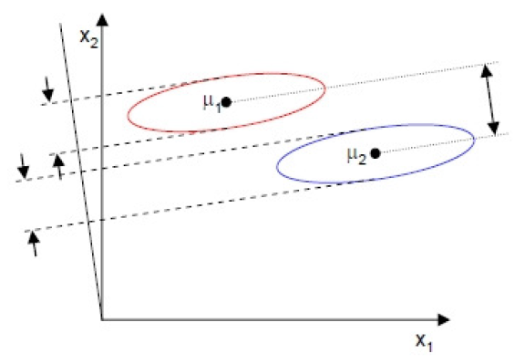
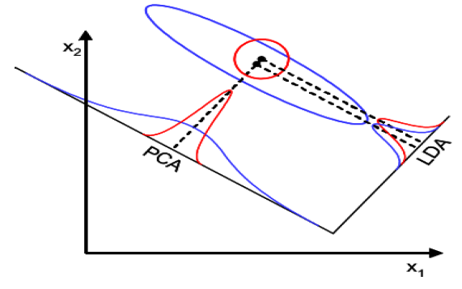

# Machine Learning 1

[TOC]

## 1. Introduction to Machine Learning

Machine learning is a field that lies at the intersection of statistics, probability, computer science, and optimization. The main goal is to explore **automatic methods for inferring models from data** (for example: finding structure, making predictions).

<span style='color:green'>Examples of learning tasks:</span>

- <span style='color:brown'>SUPERVISED LEARNING:</span> uses labeled data.
  - **Classification:** predicting a class or category to each example; note multi-label, probabilistic generalizations.
  - **Regression:** predicting a real value for each example; note multi-variable generalization.
- <span style='color:brown'>UNSUPERVISED LEARNING:</span> does not use or have data labels.
  - **Clustering:** discovering homogeneous groups (clusters) in data.
  - **Dimensionality reduction:** finding lower-dimensional data representations.
  - **Density estimation:** estimating the probabilistic mechanism that generates data.
  - **Novelty detection:** finding anomalous/novel/outlying data.
- <span style='color:brown'>SEMI-SUPERVISED LEARNING:</span> uses partly labeled data.
  - **Ranking:** ordering examples according to some criterion.
  - **Reinforcement:** delayed rewarding.
- <span style='color:brown'>TRANSFER LEARNING:</span> learning in a new task through the transfer of knowledge from a related task that has already been learned.

### Useful probability and statistics facts

- **<span style='color:brown'>Central Limit Theorem</span>:**

  If $X_1,\ldots,X_n$ are *independent identically distributed random variables*, with $\mathbb E[X_i]=\mu$ and $\text{Var}(X_i)=\sigma^2$, then the sample mean

$$
\frac{X_1+\ldots+X_n}{n}\sim\mathcal N\left(\mu,\frac{\sigma^2}{n}\right)
$$

​		approaches a normal distribution as $n\rightarrow\infty$.

- **<span style='color:brown'>Product rule</span>:**

  If $X_1,\ldots,X_n$ have a joint probability distribution $p(X_1,\ldots,X_n)$, then we can factorize the distribution as the product

$$
p(X_1,\ldots,X_n)=p(X_1)\prod_{i=2}^np(X_i|X_1,\ldots,X_{i-1}).
$$

- **<span style='color:brown'>Bayes Theorem</span>:**

$$
P(B_i|A)=\frac{P(A|B_i)P(B_i)}{\sum_jP(A|B_j)P(B_j)}=\frac{P(A|B_i)P(B_i)}{P(A)}.
$$


- **<span style='color:brown'>Bayes formula for densities</span>:**

  In a data analysis context, $\theta$ is a parameter vector and the following equality holds:

$$
\pi_{\text{POST}}(\theta|\text{data})=\frac{\pi_{\text{LIK}}(\text{data}|\theta)\cdot\pi_{\text{PRIOR}}(\theta)}{\int_{\Theta}\pi_{\text{LIK}}(\text{data}|\theta)\cdot\pi_{\text{PRIOR}}(\theta)d\theta}.
$$

​		This can also be expressed loosely as
$$
P(\theta|D)=\frac{P(D|\theta)P(\theta)}{P(D)}=\frac{P(D|\theta)P(\theta)}{\int_\Theta P(D|\theta)P(\theta)d\theta},
$$
​		where $D$ is the data. This expression gives rise to the notions of **likelihood**, **prior**, **posterior**, and **unconditional (expected likelihood)** distributions:

- $P(\theta)$: <u>prior probability</u>, confidence in $\theta$ before observing $D$.
- $P(D|\theta)$: <u>likelihood</u>, probability of observing $D$ if parameters are $\theta$.
- $P(D)$: <u>expected likelihood</u> of observing data $D$, also <u>unconditional</u>.
- $P(\theta|D)$: <u>posterior probability</u>, confidence in $\theta$ after observing $D$.


- **<span style='color:brown'>Conjugacy</span>:**

  **Definition:** Suppose a prior distribution $\pi_{\text{PRIOR}}(\theta)$ belongs to a class of parametrized distributions $\Pi$. Then the distribution is said to be **conjugate** with respect to a likelihood $\pi_{\text{LIK}}(\cdot|\theta)$ if the posterior distribution $\pi_{\text{POST}}(\theta|\cdot)\in\Pi$.

  Remember that $\pi_{\text{POST}}(\theta|\cdot)\propto\pi_{\text{LIK}}(\cdot|\theta)\pi_{\text{PRIOR}}(\theta).$ For example, Gaussian is conjugate to Gaussian, and Beta is conjugate to Binomial.

<span style='color:green'>Using the posterior:</span>
$$
\hat\theta_{\text{MAP}}:=\text{argmax}_{\theta\in\Theta}\{P(\theta|D)\}\text{: the value of }\theta\text{ that maximizes the posterior.}
\\
\hat\theta_{\text{ML}}:=\text{argmax}_{\theta\in\Theta}\{P(D|\theta)\}\text{: the value of }\theta\text{ that maximizes the likelihood.}
\\
\hat\theta_{\text{EV}}:=\mathbb{E}[P(\theta|D)]=\int_{\Theta}P(\theta|D)\cdot P(\theta)d\theta\text{: the expected value of theta.}
$$

### Inductive bias

**<span style='color:blue'>Example:</span>** complete the following series: $2,4,6,8,...$

**Answer 1:** 132 (model 1: $f(n)=n^4-10n^3+35n^2-48n+24$)

**Answer 2:** 10 (model 2: $f(n)=2n$)

How can we rule out the more complex model?

1. Supply more training data: $2,4,6,8,10,12,14,...$

2. Regularize: add penalty to higher-order terms.

3. Reduce the hypothesis space; for example, restrict to quadratic models.
   $$
   \text{Class of functions: }\mathcal F:=\{f_\theta:\mathcal X\rightarrow\mathcal Y\ |\ \theta\in\Theta\}.
   $$

So, the conclusions are this: based *only* on training data $D$, there is no means of choosing which function $f$ is better (generalitzation is not *guaranteed*). Thus, we must add control to the **fitting ability** of our methods (complexity control).
$$
\text{true error}(f)\leq\text{training error}(f)+\text{complexity of }f.
$$

<div style="page-break-after: always;"></div>

### Formulation of ML


$X$ are the measured variables, $Z$ are the unmeasured ones, $y$ is the true function and $y'$, which would be $\hat y$, is the modeled function.

#### Prediction vs. inference

**Prediction:** produce a good estimate for the predicted variable.

**Inference:**

1. Which predictors actually affect the target variable?
2. How strong are these dependencies?
3. Are these relationships positive or negative?

### Common Tasks

- **Regression:** The goal is to predict some quantitative outcome subject to probabilistic uncertainty.

- **Classification:** The goal is to obtain a model based on available **training data** (*known* examples) with high classification accuracy on  unseen *unknown* examples (**test data**), i.e. achieving good **generalization**.

- **Clustering:** The goal is to find homogeneous groups of data and set them apart accordingly. Looks like a very different task from regression or classification, but it's both of them with some added difficulty: it has an inherent large subjectivity.

**Why are these tasks stochastic?** 

We have a (complete) input data object $(x,z)$ and an output data object $y$. The true relationship is $f_c:\mathcal X\times\mathcal Z\rightarrow\mathcal Y$, that is $f_c(x,z)=y$. When we measure data about $f_c$, we measure only the $x$ portion of the input variables. Therefore, the relation between $x$ and $y$ becomes stochastic.

#### Setting up the tasks

There are (at least) two ways of setting up these tasks formally:

##### Optimization view

$$
\min_{\theta\in\Theta}E(\theta):=\frac{1}{n}\sum_{i=1}^nl(y_i,f_\theta(x_i))+\Omega(f_\theta).
$$

true error of $f_\theta\leq$ training error of $f_\theta$ + complexity of $f_\theta$ (empirical risk + regularizer)

$l(y_i,f_\theta(x_i))$ is called the *loss/error function*.

##### Statistics view

Use Bayes' formula to compute $P(\theta|\text{data})$ and choose one according to this (posterior) distribution.

Many times these two views can yield the same results (which is good!). An example would be LSQ $\equiv$ MaxLik+Gaussian.

The most general description of the data generation mechanism is in terms of the pdf $p(x,y)$ in the joint input-output space: this is the key to generalization.
$$
p(x,y)=p(y|x)\cdot p(x),\text{ where }p(x)=\int p(y,x)\ dy.
$$
Some techniques use $p(x)$, others do not. The important pdf is $p(y|x)$. *Discriminative* methods use only $p(y|x)$, while *generative* methods use the joint pdf $p(x,y)$.

**So, what is a Machine Learning algorithm/technique?**

A ML algorithm gets a dataset $D$ and returns a model of $D$ ( a representation of $D$ that either gives structure to $D$ or that allows to make predictions on unseen observations), together with an estimation of the model quality. The algorithm itself typically determines the model space $\mathcal F$ and the loss function $l$.

**And why are linear models so nice?**

We will begin our analyses with linear models and techniques. A model is linear when, up to an invertible mapping, it is **a linear function of its parameters**; $f_\theta(x)$ is linear when is depends linearly on $\theta$, but we do not say anything about $x$. For example, $f_\theta(x)=\sum_{i=0}^m\theta_i\sin(\exp(-x_i^2))$ is linear. A linear model:

- **Is analytically tractable:** we have closed-form solutions or fast convergent iterative methods for the solution.
- **Has a unique solution:** there are no local optima.
- **Is highly interpretable.**
- **Is amenable to inference:** we can ask (and answer) questions about the importance and weight on the target of the different variables.
- Has **user-defined fitting ability**, via the basis functions.
- Is capable of being **regularized:** complicated models can be penalized.

#### General form of a linear model

A linear model has a general expression as
$$
f(x;\theta)=g\left(\theta_0+\sum_{i=1}^h\theta_i\varphi_i(x)\right).
$$
The functions $\varphi_i$ are called **basis functions** (they constitute a *feature map*) and are non-linear wrt $x$. $g$ is a strictly monotonic function: in Neural Networks, this is called an **activation function**.

### On data pre-processing

Each problem requires a different approach in what concerns data cleaning and preparation. This pre-processing procedure is very important because it can have a deep impact on performance; it can easily take us a significant part of the time. So, the important things to take into account on data pre-processing are:

- Treatment of missing, anomalous, and incoherent or incorrect values.
- Coding of non-continuous or non-ordered variables.
- Possible elimination of irrelevant or redundant variables (*feature selection*).
- Creation of new variables that can be useful (*feature extraction*).
- Normalization of the variables (standardization).
- Transformations of the variables (for example, corrections of serious skewness and/or kurtosis)

Non-standard data (images, audio, text...) may need completely *ad hoc* treatments.

<div style="page-break-after: always;"></div>

## 2. Linear Data Visualization

### Dimensionality reduction

There are two main goals associated to these techniques:

- **Signal representation:** the goal is to represent the data accurately in a lower-dimensional space.
- **Signal classification:** the goal is to enhance the class-discriminatory information in the lower-dimensional space.

Unfortunately, there is no systematic way to generate non-linear transforms, so we will focus on **linear** methods for **feature extraction**:

- <span style='color:brown'>PCA</span>: Principal Components Analysis.
- <span style='color:brown'>FDA/LDA</span>: Fisher's Discriminant Analysis.
- <span style='color:brown'>ICA</span>: Independent Components Analysis.

### Principal Components Analysis

This feature extraction method is explained in the file `../AD/AD.pdf`.

### Fisher's Discriminant Analysis

FDA is a technique for **dimensionality reduction, supervised classification, feature extraction and data visualization**.

**<span style='color:blue'>Idea:</span>** projection of the data onto a lower dimensional linear space, such that the separability of projected data is maximized.

Fisher's idea is to regard **dot product** as the projection $y$ of some $x\in\R^p$ from classes $\omega_1$ or $\omega_2$, via a projection vector $w$: $y=w^Tx\in\R$. In order to find a good projection vector, we need to define a measure of separation between the projections:
$$
m_k=\frac{1}{n_k}\sum_{i\in\omega_k}x_i,\qquad k\in\{1,2\},
$$
where $n_1+n_2=n$ is the number of examples on every class. We then choose to maximize the *squared* distance between the projected means,
$$
(\mu_2-\mu_1)^2=(w^Tm_2-w^Tm_1)^2=(w^T(m_2-m_1))^2.
$$
However, the distance between the projected means is not a very good measure since it does not take into account the dispersion (**scatter**) within the classes. The problem is that the covariance matrices for each class are far from being diagonal. We actually want to look for the projection where examples from the same class are projected very close to one another and the projected means are as far apart as possible:



The solution (proposed by R. Fisher) is to maximize a function that represents the difference between the means, normalized by a measure of the within-class scatter:

1. $\forall k$ a class we define the scatter as

$$
s_k^2=\sum_{i\in\omega_k}\left(w^Tx_i-\mu_k\right)^2,\qquad k\in\{1,2\}.
$$

2. The total scatter is $s_1^2+s_2^2$.
3. Fisher's idea was to maximize the following function:

$$
J(w)=\frac{(\mu_2-\mu_1)^2}{s_1^2+s_2^2}.
$$

It can be shown that $J(w)$ can be rewritten as:
$$
J(w)=\frac{(\mu_2-\mu_1)^2}{s_1^2+s_2^2}=\frac{w^TS_Bw}{w^TS_Ws},
$$
where

- $S_B=(m_2-m_1)(m_2-m_1)^T$ is the **between-class scatter matrix** (rank 1).
- $S_W=\sum_{i\in\omega_1}(x_1-m_1)(x_1-m_1)^T+\sum_{i\in\omega_2}(x_1-m_2)(x_1-m_2)^T$ is the **within-class scatter matrix**.

To find the maximum of $J$ we derive and equal to zero,
$$
\frac{\part J}{\part w}=0,
$$
and upon solving we arrive at the following **generalized eigenvalue problem**:
$$
\left(S_W^{-1}S_B\right)w=J(w)w;
$$
solving it yields $\boxed{\hat w=S_W^{-1}(m_1-m_2),}$ known as **Fisher's Linear Discriminant** (1936), although it is not a discriminant but a specific choice for projection down to one dimension.

FDA generalizes very gracefully for $K$ class problems: the only restriction is that the maximum number of projection directions is $K-1$. FDA can also be derived as the Maximum Likelihood result for the case of Gaussian class-conditional densities with equal covariance matrices; in this case, it is known as LDA.

***WARNING!*** FDA is able to extract a maximum of $K-1$ projection directions, maybe insufficient for complex data. PCA is able to extract $d$ projection directions, but it is not clear how many are necessary.

<div style="page-break-after: always;"></div>

#### Counterparts

**When will FDA presumably fail?** If the classes are far from Gaussian, the FDA projections will not be able to preserve any complex structure; for an example, this image:


FDA will also fail when the discriminatory information is not in the mean but rather in the *variance* of the data (e.g., if $J(w)=0$); for example,



<div style="page-break-after: always;"></div>

## 3. Theory for regression and linear models (I).

### The regression framework

Given data $D=\{(x_n,t_n)\}_{n=1,\ldots,N}$, where $x_n\in\R^d,t_n\in\R$,

- **Statistics:** estimation of a continuous random variable $T$ conditioned on a random vector $X$.
- **Mathematics:** estimation of a real function $f$ based on a finite number of *noisy* examples $(x_n,f(x_n))$.

The departing statistical setting is $t_n=f(x_n)+\varepsilon_n$; a model is any approximation of $f$. We assume $\varepsilon_n$ are iid random variables such that $\mathbb E[\varepsilon_n]=0$ and $\text{Var}(\varepsilon_n)=\sigma^2<\infty$, and that $\varepsilon_n$ and $x_n$ are independent variables.

The **risk** of a model $y$ is
$$
R(y):=\int_\R\int_{\R^d}L(t,y(\boldsymbol{x}))p(t,\boldsymbol{x})\ d\boldsymbol{x}\ dt,
$$
where $L$ is a suitable **loss** function that satisfies:

- $L(t,y(\boldsymbol x))\geq0$
- $L(t,y(\boldsymbol x))=0\impliedby t=y(\boldsymbol x)$ (not necessarily in the other direction)
- $L(t,y(\boldsymbol x))$ does not increase when $|t-y(\boldsymbol x)|$ decreases.

$L$ is closely related to the distribution of the noise model $\varepsilon_n$.

<span style='color:blue'>**Example:**</span> if we assume for example that $\varepsilon_n\sim\mathcal N\left(0,\sigma^2\right)$, using a maximum likelihood argument it can be shown that the *right* loss function is the **square error**:
$$
L_{\text{SE}}(t,y(\boldsymbol x)):=(t-y(\boldsymbol x))^2.
$$
The **risk** is therefore
$$
R(y)=\int_\R\int_{\R^d}(t-y(\boldsymbol x))^2p(t|\boldsymbol x)p(\boldsymbol x)\ d\boldsymbol x\ dt
$$
If we enjoy complete freedom to choose $y$, the solution is:
$$
y^*(\boldsymbol x)=\int_\R tp(t|\boldsymbol x)\ dt=f(\boldsymbol x),
$$
known as the **regression function**. Since $\mathbb E[\varepsilon_n]=0$, we can alternatively express the regression setting by stating that $t$ is a continuous random variable such that $f(\boldsymbol x)=\mathbb E[t\ |\ X=\boldsymbol x]$.

**Claim:** $y^*(\boldsymbol x)=f(\boldsymbol x).$

**Proof:**
$$
y^*(\boldsymbol x)=\mathbb E[t\ |\ X=\boldsymbol x]=\mathbb E[f(\boldsymbol x)+\varepsilon\ |\ X=\boldsymbol x]=\\=\mathbb E[f(\boldsymbol x)\ |\ X=\boldsymbol x]+\mathbb E[\varepsilon\ |\ X=\boldsymbol x]=f(\boldsymbol x)+0=\\=f(\boldsymbol x).\qquad\qquad\qquad\qquad\qquad\qquad\qquad\qquad\ \square
$$
In a practical setting, we don't know $p(t|\boldsymbol x)$. Instead, we have a finite i.i.d. **data sample** of $N$ labeled observations $D=\{(\boldsymbol x_n,t_n)\}_{n=1,\ldots,N}$, where $\boldsymbol x_n\in\R^d,t_n\in\R$. Then, **intuition** tells us to solve for $y$
$$
\min_y\int_{\R^d}(f(\boldsymbol x)-y(\boldsymbol x))^2p(\boldsymbol x)\ d\boldsymbol x.
$$
This is equivalent to minimizing the risk function; we'll see this in the next part. For now, we must impose restrictions on the possible solutions $y$, this is, we must restrict the search space to a specific **class of functions** $\mathcal Y$.

We can compute an approximation to the true risk, called the **empirical risk**, by averaging the loss function on the available data $D$:
$$
R_{\text{emp}}(y):=\frac{1}{N}\sum_{n=1}^N(t_n-y(\boldsymbol x_n))^2.
$$
This quantity is also known as the **apparent error**. The **Empirical Risk Minimization (ERM)** principle stats that a learning algorithm should choose a hypothesis (model) $\hat y$ which minimizes the empirical risk among a predefined class of functions $\mathcal Y$:
$$
\DeclareMathOperator*{\argmax}{argmax}
\DeclareMathOperator*{\argmin}{argmin}
\hat y:=\argmin_{y\in\mathcal Y}R_{\text{emp}}(y).
$$
The quantity $R_{\text{emp}}(\hat y)$ is known as the **training error**. In theoretical ML, we are very much interested in:

- How this error fluctuates as a function of the data $D$.
- How far this error is from the true error, this is, to bound $|R_{\text{emp}}(\hat y)-R(y)|$; at the very least, to bound $|\mathbb E[R_{\text{emp}}(\hat y)]-R(y)|$.
- How far this error is from the best possible error, this is, to bound $|R_{\text{emp}}(\hat y)-R(y^*)|$; at the very least, to bound $|\mathbb E[R_{\text{emp}}(\hat y)]-R(y^*)|$.

### Bias-Variance analysis

Recall the assumption that $\varepsilon_n\sim\mathcal N(0,\sigma^2)$. In this case, using the square error, the risk can be decomposed as:
$$
R(y)=\int_\R\int_{\R^d}(t-y(\boldsymbol x))^2p(t,\boldsymbol x)\ d\boldsymbol x\ dt=\int_\R\int_{\R^d}(t-f(\boldsymbol x))^2p(t,\boldsymbol x)\ d\boldsymbol x\ dt\\+\int_{\R^d}(f(\boldsymbol x)-y(\boldsymbol x))^2p(\boldsymbol x)\ d\boldsymbol x=\sigma^2+\int_{\R^d}(f(\boldsymbol x)-y(\boldsymbol x))^2p(\boldsymbol x)\ d\boldsymbol x=\boxed{\sigma^2+\text{MSE}(y),}
$$
where $f$ is the **regression function**. Therefore, we arrive at $R(y)=\sigma^2+\text{MSE}(y)$. We can now *forget* about $\sigma^2$ and the risk and instead aim at minimizing the $\text{MSE}(y)$:
$$
\text{MSE}(y)=\int_{\R^d}(f(\boldsymbol x)-y(\boldsymbol x))^2p(\boldsymbol x)\ d\boldsymbol x.
$$
A **learning algorithm** for **regression** is a procedure that, given data $D$ and the search space $\mathcal Y$, outputs a model $y_D\in\mathcal Y$ that aims at minimizing $\text{MSE}(y)$.

Consider now one particular $\boldsymbol x_0$; different $D$ will produce different $y_D$ and therefore different predictions $y_D(\boldsymbol x_0)$. Let us concentrate on the quantity $(f(\boldsymbol x_0)-y(\boldsymbol x_0))^2$: we wish to eliminate the dependence on $D$. Therefore, we investigate its expected value, $\mathbb E\left[(f(\boldsymbol x_0)-y(\boldsymbol x_0))^2\right]$, taking over all possible $D$ of size $N$. If we develop a little more their formulas,
$$
\mathbb E\left[(f(\boldsymbol x_0)-y(\boldsymbol x_0))^2\right]=(f(\boldsymbol x_0)-\mathbb E[y_D(\boldsymbol x_0)])^2+\mathbb E\left[(y_D(\boldsymbol x_0)-\mathbb E[y_D(\boldsymbol x_0)])^2\right].
$$
We can interpret these summands as $f(\boldsymbol x_0)-\mathbb E[y_D(\boldsymbol x_0)]=\text{Bias}(y_D(\boldsymbol x_0))$, and $\mathbb E\left[(y_D(\boldsymbol x_0)-\mathbb E[y_D(\boldsymbol x_0)])^2\right]=\text{Var}(y_D(\boldsymbol x_0))$. Then, the formula is more clearly stated as
$$
\text{MSE}(y_D(\boldsymbol x_0))=\text{Bias}^2(y_D(\boldsymbol x_0))+\text{Var}(y_D(\boldsymbol x_0)),
$$
and the **risk** can be expressed as a sum of three summands:
$$
R(y_D(\boldsymbol x_0))=\sigma^2+\text{Bias}^2(y_D(\boldsymbol x_0))+\text{Var}(y_D(\boldsymbol x_0)).
$$
The derivation above depends on a particular point $\boldsymbol x_0$, so let us put it all back in place within their integrals:
$$
\text{Bias}^2(y_D)=\int_{\R^d}\text{Bias}^2(y_D(\boldsymbol x))p(\boldsymbol x)\ d\boldsymbol x,\\
\text{Var}(y_D)=\int_{\R^d}\text{Var}(y_D(\boldsymbol x))p(\boldsymbol x)\ d\boldsymbol x,\\
\boxed{R(y_D)=\sigma^2+\text{Bias}^2(y_D)+\text{Var}(y_D).}
$$

In general, an **underfit** model will have a big bias, while an **overfit** model will have a high variance. The *abilityi to fit* has a name: it's called the **complexity** of the function class. Both models that are more or less complex than needed will tend to have large prediction errors. In the former, this will be dominated by the variance term, while in the latter, it will be dominated by the (square) bias term.

<div style="page-break-after: always;"></div>

## 4. Regression theory and linear regression models (II)

Our departing statistical model still is
$$
t_n=f(\boldsymbol x_n)+\varepsilon_n,\ \boldsymbol x_n\in\R^d,\ t\in\R
$$
where $\varepsilon_n$ is a continuous rv such that $\mathbb E[\varepsilon_n]=0$ and $\text{Var}(\varepsilon_n)=\sigma^2$. Let's assume again that we further model $\varepsilon_n\sim\mathcal N\left(0,\sigma^2\right)$, and:
$$
f(\boldsymbol x)\approx y(\boldsymbol x;\boldsymbol\beta)=\sum_{i=0}^d\beta_ix_i=\boldsymbol\beta^T\boldsymbol x
$$
with $\boldsymbol x=(1,x_1,\ldots,x_d)^T$ and $\boldsymbol\beta=(\beta_0,\beta_1,\ldots,\beta_d)^T$. Suppose we have an iid sample of $N$ labeled observations $D=\{(\boldsymbol x_n,t_n)\}_{n=1,\ldots,N}$, where $\boldsymbol x_n\in\R^d,t_n\in\R$. Therefore, our statistical model is $t_n\sim\mathcal N\left(y(\boldsymbol x_n;\boldsymbol\beta),\sigma^2\right)$ or:
$$
p(t_n|\boldsymbol x_n;\theta)=\frac{1}{\sqrt{2\pi\sigma^2}}\exp\left(-\frac{1}{2\sigma^2}\left(t_n-\boldsymbol\beta^T\boldsymbol x_n\right)^2\right),
$$
with unknown parameters $\theta:=\{\beta_0,\beta_1,\ldots,\beta_p,\sigma^2\}$. Put $\boldsymbol t=(t_1,\ldots,t_N)^T$ and $X_{N\times(d+1)}$ the matrix of the $\boldsymbol x_n$. Define the **likelihood** as $\mathcal L(\theta):=P(\boldsymbol t|X;\theta)$. Let us maximize the log-likelihood:
$$
l(\theta):=\log\mathcal L(\theta)=\log\prod_{n=1}^Np(t_n|\boldsymbol x_n;\theta)=\sum_{n=1}^N\log{p(t_n|\boldsymbol x_n;\theta)}=\\
=-\frac{N}{2}\log\left(2\pi\sigma^2\right)-\frac{1}{2\sigma^2}\sum_{n=1}^N\left(t_n-\boldsymbol\beta^T\boldsymbol x_n\right)^2=\\
=-\frac{N}{2}\log\left(2\pi\sigma^2\right)-\frac{1}{2\sigma^2}(\boldsymbol t-X\boldsymbol\beta)^T(\boldsymbol t-X\boldsymbol\beta)=\\
=-\frac{N}{2}\log\left(2\pi\sigma^2\right)-\frac{1}{2\sigma^2}\|\boldsymbol t-X\boldsymbol\beta\|^2.
$$
If we derive this wrt $\boldsymbol\beta$ and $\sigma^2$, and set equal to zero, we get:
$$
\frac{\part l}{\part\boldsymbol\beta}=-\frac{1}{2\sigma^2}\left(-2X^T\boldsymbol t+2X^TX\boldsymbol\beta\right)=0\\
\frac{\part l}{\part\sigma^2}=-\frac{N}{2\sigma^2}+\frac{1}{2\sigma^4}(\boldsymbol t-X\boldsymbol\beta)^T(\boldsymbol t-X\boldsymbol\beta)=0.\\
$$
Therefore, we can calculate the estimates for both parameters:
$$
\boldsymbol{\hat\beta}=\left(X^TX\right)^{-1}X^T\boldsymbol t,\\
\hat\sigma^2=\frac{1}{N}(\boldsymbol t-X\boldsymbol{\hat\beta})^T(\boldsymbol t-X\boldsymbol{\hat\beta})=\frac{1}{N}\|\boldsymbol t-X\boldsymbol{\hat\beta}\|^2.
$$
Note that $\hat\sigma^2=R_{\text{emp}}(y_D)$, which is a **biased estimator** for $\sigma^2$. An unbiased estimator is
$$
\bar\sigma^2=\frac{N}{N-d}\hat\sigma^2.
$$
It's also known that $\boldsymbol{\hat\beta}$ is an unbiased estimator of $\boldsymbol\beta$ and that $\text{Var}(\boldsymbol{\hat\beta})=\left(X^TX\right)^{-1}\sigma^2$. All of this implies that $\boldsymbol{\hat\beta}\sim\mathcal N\left(\boldsymbol\beta,\left(X^TX\right)^{-1}\sigma^2\right)$.

The matrix $X^+=\left(X^TX\right)^{-1}X^T$ is known as the **Moore-Penrose pseudo-inverse** of $X$. It is the generalization of the notion of an inverse matrix to non-square matrices. It has the property that $X^+X=I$, although in general $XX^+\neq I$. However, both are symmetric.

**Theorem.** Let $X_{N\times M}$, with $N>M$. If the column vectors of $X$ are linearly independent, *i.e.*, if $\text{rank}(X)=M$, then:

1. The matrix $X^TX$ is symmetric and positive definite. In particular, it is non-singular.
2. The least squares problem

$$
\min_{\boldsymbol\beta\in\R^M}\|\boldsymbol t-X\boldsymbol\beta\|^2,
$$

​		has a unique solution.

3. This solution can be found solving the so-called Gauss' normal equations,

$$
\left(X^TX\right)\boldsymbol\beta=X^T\boldsymbol t
$$

​		for $\boldsymbol\beta$.

### Quality of the fit

- In statistics, $-2l=-2\log\mathcal L$ is called the **deviance**.
- In ML, this quality measure is the **square error**:

$$
N\log\left(2\pi\sigma^2\right)+\frac{1}{\sigma^2}\|\boldsymbol t-X\boldsymbol{\hat\beta}\|^2
$$

- A much better quantity to report is the $\text{NRMSE}$,

$$
\text{NRMSE}(\boldsymbol{\hat\beta})=\sqrt{\frac{\|\boldsymbol t-X\boldsymbol{\hat\beta}\|^2}{(N-1)\text{Var}(\boldsymbol t)}}.
$$

In statistics, $R^2=1-\text{NRMSE}^2$ is the proportion of the target variability *explained* by the model.

### Leaping forward: basis functions

Recall that a model is **linear** if up to an invertible function its parameters play a linear role in the model. For example,
$$
y(x;\boldsymbol\beta)=\sum_{j=0}^d\beta_jx^j,\ x\in\R
$$
is a polynomial on $x$, but also a linear model on $\boldsymbol\beta$.

A simple but powerful idea is the introduction of **basis functions**:
$$
y(\boldsymbol x;\boldsymbol w)=\sum_{j=0}^Mw_j\varphi_j(\boldsymbol x)=\boldsymbol w^T\boldsymbol\varphi(\boldsymbol x),
$$
where $\varphi_0(\boldsymbol x)=1,\boldsymbol\varphi(\boldsymbol x)=\left(1,\varphi_1(\boldsymbol x),\ldots,\varphi_M(\boldsymbol x)\right)^T,\boldsymbol w=\left(w_0,w_1,\ldots,w_M\right)^T$. This is still a **linear model**. Define $\boldsymbol t=\left(t_1,\ldots,t_N\right)^T$ as the vector of targets, and $\boldsymbol\varphi_{N\times(M+1)}$ as the matrix of the $\boldsymbol\varphi_{ij}=\varphi_j(\boldsymbol x_i),i=1,\ldots,N,j=1,\ldots,M$:
$$
\boldsymbol\varphi=\begin{pmatrix}
1 & \varphi_1(\boldsymbol x_1) & \varphi_2(\boldsymbol x_1) & \cdots & \varphi_M(\boldsymbol x_1) \\
1 & \varphi_1(\boldsymbol x_2) & \varphi_2(\boldsymbol x_2) & \cdots & \varphi_M(\boldsymbol x_2) \\
\cdots & \cdots & \cdots & \ddots & \cdots \\
1 & \varphi_1(\boldsymbol x_N) & \varphi_2(\boldsymbol x_N) & \cdots & \varphi_M(\boldsymbol x_N) \\
\end{pmatrix}.
$$
So, let us maximize the new log-likelihood: the Gauss' normal equations are
$$
\left(\boldsymbol\varphi^T\boldsymbol\varphi\right)w=\boldsymbol\varphi^T\boldsymbol t
$$
and their solution is
$$
\boldsymbol{\hat w}=\left(\boldsymbol\varphi^T\boldsymbol\varphi\right)^{-1}\boldsymbol\varphi^T\boldsymbol t=\boldsymbol\varphi^+\boldsymbol t,\\
\hat\sigma^2=\frac{1}{N}(\boldsymbol t-\boldsymbol\varphi\boldsymbol{\hat w})^T(\boldsymbol t-\boldsymbol\varphi\boldsymbol{\hat w})=\frac{1}{N}\|\boldsymbol t-\boldsymbol\varphi\boldsymbol{\hat w}\|^2.
$$

### Singular Value Decomposition

The direct computation of the pseudo-inverse of $\boldsymbol\varphi$ has two major drawbacks:

- When $M$ is large, $\boldsymbol\varphi^T\boldsymbol\varphi$ is a large $(M+1)\times(M+1)$ matrix; then, the computation of the required inverse $\left(\boldsymbol\varphi^T\boldsymbol\varphi\right)^{-1}$ can be costly.
- If $\boldsymbol\varphi^T\boldsymbol\varphi$ is singular, or close to, then the required inverse $\left(\boldsymbol\varphi^T\boldsymbol\varphi\right)^{-1}$ can be impossible, or numerically delicate.

**Theorem.** Every matrix $X_{N\times M}$ can be expressed as $X=U\Delta V^T$, with $U\in\mathcal M_N(\R)$,$V\in\mathcal M_M(\R)$,$\Delta\in\mathcal M_{N\times M}(\R)$ diagonal. The columns of $U$ are the eigenvectors of $XX^T$, and the columns of $V$ are the eigenvectors of $X^TX$.

Let $\text{rank}(X)=r\leq\min(N,M)$. Then exactly $r$ elements $\lambda_k$ in the diagonal of $\Delta$ are strictly positive; the remaining elements are null. These $\lambda_k>0$ are called the **singular values** and correspond to the square roots of the positive eigenvalues of $XX^T$ (same as $X^TX$).

Sometimes an *economy* size decomposition is delivered: If $X$ is $N\times M$ with $N>M$, then only the first $M$ columns of $U$ are given and $\Delta$ is $M\times M$.

#### SVD for least squares

Given the least squares problem
$$
\min_{\boldsymbol w\in\R^M}\|\boldsymbol t-X\boldsymbol w\|^2,
$$
the solution can be obtained with the SVD as:

- Compute the economy size SVD of $X=U\Delta V^T$.
- Solve for $\boldsymbol w$ as $\boldsymbol{\hat w}=V\text{diag}\left(\lambda_k^{-1}\right)U^T\boldsymbol t$, where only the $\lambda_k>0$ are considered.

### Regularized least squares

The maximum likelihood framework can yield unstable parameter estimates, specially when

- the explanatory variables are highly correlated;
- there is an insufficient number of observations $(N)$ relative to the number of predictors (basis functions $M+1$ or dimensions $d+1$).

In the context of regression with Gaussian noise (square error), it is quite common to penalize the parameter vector. Define the **penalized empirical error** as:
$$
R_{\text{emp}}(y(\cdot;\boldsymbol w)):=\|\boldsymbol t-\boldsymbol\varphi\boldsymbol w\|^2+\lambda\|\boldsymbol w\|^2,\ \lambda>0.
$$
If we set its derivative wrt $\boldsymbol w$ equal to zero
$$
-2\boldsymbol\varphi^T\boldsymbol t+2\boldsymbol\varphi^T\boldsymbol\varphi\boldsymbol w+2\lambda\boldsymbol w=0,
$$
we solve for $\boldsymbol w$ and we get
$$
\boxed{
\boldsymbol{\hat w}=(\boldsymbol\varphi^T\boldsymbol\varphi+\lambda I)^{-1}\boldsymbol\varphi^T\boldsymbol t.
}
$$
This is known as **Tikhonov** or $L^2$ **regularization** in ML. Perhaps it's best known as **ridge regression** in statistics, where it's usually explained as a "penalized log-likelihood". This can also be derived from Bayesian statistics arguments. Tikhonov regularization has some advantages:

- Pushing the length of the parameter vector $\|\boldsymbol w\|$ to $0$ allows the fit to be under explicit control with the regularization parameter $\lambda$.
- The matrix $\boldsymbol\varphi^T\boldsymbol\varphi$ is positive semi-definite; therefore $\boldsymbol\varphi^T\boldsymbol\varphi+\lambda I$ is guaranteed to be positive definite (hence non-singular), for all $\lambda>0$.

$$
\boxed{
\textbf{Bayesian derivation:}\\
\begin{matrix}
D\text{ data}\\
\boldsymbol\theta\text{ parameter vector}
\end{matrix}
\Bigg\} \argmax_{\theta\in\Theta}P(\theta\vert D)=\frac{P(D\vert\theta)P(\theta)}{P(D)}
\sim\argmax_{\theta\in\Theta}P(D\vert\theta)P(\theta)\sim\\
\sim\argmax_{\theta\in\Theta}\ln(P(D\vert\theta)P(\theta))\sim\argmax_{\theta\in\Theta}\left\{\ln P(D\vert\theta)+\ln P(\theta)\right\}\sim\\

\sim\argmin_{\theta\in\Theta}\left\{-\ln P(D\vert\theta)-\ln P(\theta)\right\}
}
$$

We change names of $\theta=w$, for it is fancier. If we assume that the $w\sim\mathcal N\left(0,\sigma^2\text{Id}\right)$, then $-\ln P(w)=\frac{\|w\|^2}{2\sigma^2_w}$ and then, observe that $-\ln\mathcal L$ is the mean square error,
$$
\boxed{
\ldots\argmin_{w\in W}\left\{-\ln\mathcal L-\ln P(w)\right\}=\argmin_{w\in W}\left\{\|t-\varphi w\|^2+\frac{\|w\|^2}{2\sigma^2_w}+C\left(d,\sigma_w^2\right)\right\}\sim\\
\sim\argmin_{w\in W}\left\{\|t-\varphi w\|^2+\lambda\|w\|^2\right\},\ \lambda>0.
}
$$
This is all nice, but how do we control the fit explicitly?

- Regularization allows the specification of models that are more complex than needed because it limits the effective complexity.
- Instead of trial-and-error on complexity, we can set a large complexitr and adjust the $\lambda$.

And how do we set the value of $\lambda$? Using a technique called **Leaving-one-out cross validation (LOOCV)**, because

- In this case, $\lambda$ is a very forgiving parameter; we usually perform a log search.
- There is a closed efficient formula for the LOOCV for **linear models**.

To get to the best model we can, we follow this steps:

1. Choose a (large) set of values $\Lambda$.
2. For every $\lambda\in\Lambda$,
   1. Solve for $\hat w=\left(\boldsymbol\varphi^T\boldsymbol\varphi+\lambda I\right)^{-1}\boldsymbol\varphi^T\boldsymbol t$.
   2. Compute the **hat matrix** $H:=\boldsymbol\varphi\boldsymbol\varphi^+\equiv\boldsymbol\varphi\left(\boldsymbol\varphi^T\boldsymbol\varphi+\lambda I\right)^{-1}\boldsymbol\varphi^T$.
   3. Compute the LOOCV of $y(\cdot)=\hat{\boldsymbol w}^T\boldsymbol\varphi(\cdot)$ in $D$ as

$$
\texttt{LOOCV}(y)=\frac{1}{N}\sum_{n=1}^N \left(\frac{t_n-\hat{\boldsymbol w}^T\boldsymbol\varphi(x_n)}{1-h_{nn}}\right)^2.
$$

3. Choose the model with the lowest LOOCV.

A very popular method is **Generalized Cross-Validation (GCV)**:
$$
\DeclareMathOperator{\tr}{tr}
\texttt{GCV}(y)=\frac{1}{N}\frac{\sum_{n=1}^N\left(t_n-\hat{\boldsymbol w}^T\boldsymbol\varphi(x_n)\right)^2}{\left(1-\frac{\tr(H)}{N}\right)^2},
$$
which is a more stable computation for the LOOCV. Note that $\lambda$ is needed to compute both $\hat{\boldsymbol w}$ and $H$.

### LASSO Regression

The LASSO (**Least Absolute Shrinkage and Selection Operator**) regression is $L^1-$regularized linear regression. The choice for the regularizer is $\|\boldsymbol w\|_1$ and we get:
$$
\renewcommand{\mbs}{\boldsymbol}
R_{\text{emp}}(y(\cdot;\mbs w))=\|\mbs t-\mbs\varphi\mbs w\|^2+\tau\|\mbs w\|_1,\quad\tau>0.
$$
This turns out to be equivalent to
$$
R_{\text{emp}}(y(\cdot;\mbs w))=\|\mbs t-\mbs\varphi\mbs w\|^2,\quad\text{subject to }\|\mbs w\|_1\leq\tau.
$$
In ridge regression, as the penalty $\lambda$ is increased, all coefficients are reduced while still remaining non-zero. In the LASSO regression, increasing the $\tau$ penalty causes more and more of the coefficients to be driven to zero. As the dimension $d$ increases, the multidimensional $L^1-$spheres have an increasing number of corners, and so it is highly likely that some coefficients will be set equal to zero. Hence, the LASSO regression model performs **shrinkage** and therefore, **feature selection**.

The LASSO loss function is no longer quadratic, but it is still convex. The **minimization problem** tied to LASSO regression is a special **quadratic programming (QP)** problem, for which the **Least Angle Regression (LARS)** procedure is used. It exploits the special structure of the problem, and provides an efficient way to compute the solutions for all possible values of $\tau>0$ (the **regularization path**).

### Conclusions

We have introduced **linear models** as linear combinations of non-linear **basis functions (BF)**:

<span style='color:lime'>ADVANTAGES:</span>

- We can represent non-linear functions of the data using linear fitting techniques; we have the freedom to choose the form of the BFs.
- The fit can be under tight explicit control by regularization.
- The computations can be very efficient, no need to refit for LOOCV.
- Interpretability of the model is rather high.

<span style='color:red'>LIMITATIONS:</span> the most important weak point is the BFs.

- Many interesting BFs scale very poorly with dimension (polynomials, Fourier series, splines, ...)
- Our BFs are not flexible; they are data-independent.
- As a consequence, their number may be very high, which in turn leads to unstability (because of low significance of the coefficients).

<div style="page-break-after: always;"></div>

The solution is to **develop basis functions with parameters** such that:

- This BFs scale well with dimension (inner products, distances, ...)
- They are **data-dependent**, because of the parameters.
- As a consequence, their number might be much lower, and the coefficients will be significant.
- Unfortunately, the new parameters will play a **non-linear role** in the model: their optimization is plagued with local optima.

<div style="page-break-after: always;"></div>

## 5. Classification theory and linear classification models (I). Bayesian decision theory.

### Introduction: Bayes' formula

**Discrete Random Variables.** Let $A$ be a discrete r.v. with probability mass function (*pmf*) $P_A$. We use the shorthand notation $P(a)$ to mean $P_A(A=a)$. Similarly, we write $P(b\vert a)$ to mean $P_{B\vert A}(B=b\vert A=a)$, etc, where
$$
P(b\vert a)=\frac{P(b,a)}{P(a)},\ P(a)>0.
$$
Let $\mathcal A=\{a_1,\ldots,a_n\},\mathcal B=\{b_1,\ldots,b_m\}$ be the possible values that $A$ and $B$ can take, respectively. Then, $\forall a\in\mathcal A$,
$$
P(a)=\sum_{i=1}^m P(a,b_i)=\sum_{i=1}^m P(a\vert b_i)P(b_i).
$$
Since $P(a,b)=P(b,a)$, it follows that, for any $a\in\mathcal A,b\in\mathcal B$
$$
P(b\vert a)=\frac{P(a\vert b)P(b)}{\sum_{b'\in\mathcal B} P(a\vert b')P(b')},\quad\text{with }\sum_{b'\in\mathcal B}P(b\vert a)=1.
$$
**Continuous Random Variables.** Let $X,Y$ two continuous r.v. with pdfs $p_X,p_Y$ and joint density $p_{XY}$. We use the shorthand notation $p(x)$ to mean $p_X(X=x)$, etc.
$$
p(x)=\int_{\mathbb R}p(x,y)\ dy;\quad p(y)=\int_{\mathbb R}p(x,y)\ dx.
$$
Therefore,
$$
p(y\vert x)=\frac{p(x\vert y)p(y)}{\int_{\mathbb R}p(x\vert y)p(y)\ dy},\quad\text{with }\int_{\mathbb R}p(y\vert x)\ dy=1.
$$
**Observation.** *Mixed random variables.*

Suppose $X$ is a continuous r.v. and $Y$ is a discrete r.v. with values in $\{y_1,\ldots,y_m\}$. In this case, $p(\cdot\vert y_i)$ is a continuous r.v. and $P(\cdot\vert x)$ is a discrete r.v. Moreover,
$$
P(y_j\vert x)=\frac{p(x\vert y_j)P(y_j)}{\sum_{i=1}^m p(x\vert y_j)P(y_j)},\qquad\text{ with }\sum_{j=1}^m P(y_j\vert x)=1.
$$

### Decision rules

We are interested in determining the class or category of objects of nature according to $\Omega$, a discrete r.v. with values $\{\omega_1,\omega_2\}$ that represent the two possible classes. The prior probabilities are $P(\omega_1),P(\omega_2)$. How should we classify objects?

**Decision Rule 1.** We don't measure any variable. We have no information other than "a new object comes".
$$
\boxed{\texttt{If }P(\omega_1)>P(\omega_2)\texttt{ then class of object is }\omega_1\texttt{ else class is }\omega_2.}
$$
This rule classifies all objects into the same class; therefore, it will eventually classify an object into the wrong class. Thus, the **probability of error** of this rule is
$$
P_e(\texttt{rule1})=\min\{P(\omega_1),P(\omega_2)\}.
$$
This rule is useful only if $P(\omega_1)<<P(\omega_2)$ or if $P(\omega_2)<<P(\omega_1)$. This is the optimum rule when no information is measured.

**Discrete feature measuring.** Suppose now that $X$ is a discrete r.v. taking values in $\mathcal X=\{x_1,\ldots,x_d\}$ that measures a **feature** of objects. Now, $P(\omega_i\vert x)=\frac{P(x\vert\omega_i)P(\omega_i)}{P(x)}$ is the **posterior** probability that an object with measured feature $x$ belongs to class $\omega_i,\ i\in\{1,2\}$. Moreover, $P(x)=P(x\vert\omega_1)P(\omega_1)+P(x\vert\omega_2)P(\omega_2)$.

Upon observing $x$, the Bayes formula converts **prior** class probabilities $P(\omega_i)$ into **posterior** probabilities $P(\omega_i\vert x)$. How should we classify objects now?

**Decision Rule 2.** We now measure a feature $x$ of the object coming forth.
$$
\boxed{\texttt{If }P(\omega_1\vert x)>P(\omega_2\vert x)\texttt{ then class of object is }\omega_1\texttt{ else class is }\omega_2.}
$$
The probability of error for this rule is
$$
P_e(\texttt{rule2})=\sum_{i=1}^d \min\{P(\omega_1\vert x_i),P(\omega_2\vert x_i)\}P(x_i).
$$
This rule is known as the **Bayes rule** or **classifier**.

**Lemma.** For all $a,b,c,d\in\mathbb R$, $\min(a,b)+\min(c,d)\leq\min(a+c,b+d)$.

**Proposition.** $P_e(\texttt{rule2})\leq P_e(\texttt{rule1}).$

*Proof:*
$$
\begin{split}
\sum_{i=1}^d \min\{P(\omega_1\vert x_i),P(\omega_2\vert x_i)\}P(x_i)=\\
=\sum_{x\in\mathcal X}\min\{P(\omega_1\vert x)P(x),P(\omega_2\vert x)P(x)\}=\\
=\sum_{x\in\mathcal X}\min\{P(x\vert\omega_1)P(\omega_1),P(x\vert\omega_2)P(\omega_2)\}\leq\\
\leq \min\left\{\sum_{x\in\mathcal X}P(x\vert\omega_1)P(\omega_1),\sum_{x\in\mathcal X}P(x\vert\omega_2)P(\omega_2)\right\}=\\
= \min\left\{P(\omega_1)\sum_{x\in\mathcal X}P(x\vert\omega_1),P(\omega_2)\sum_{x\in\mathcal X}P(x\vert\omega_2)\right\}=\\
=\min\left\{P(\omega_1),P(\omega_2)\right\}\square
\end{split}
$$
Equality holds only if $P(x\vert\omega_1)=P(x\vert\omega_2),\ \forall x\in\mathcal X$.

<div style="page-break-after: always;"></div>

**Continuous feature measuring.** The next step is to consider a r.v. $X$ with pdf $p(x)$ that measures a *continuous* feature of an object. Let $\mathcal P$ be the support of $p$, i.e. $\mathcal P=\{x\in\mathbb R\vert p(x)>0\}$. In this setting, $p(x\vert\omega_i),\ i\in\{1,2\}$ are the conditional densities of $x$ for every class.

**Proposition.** $P_e(\texttt{rule2})\leq P_e(\texttt{rule1}).$

*Proof:*
$$
\begin{split}
\int_\mathcal{P} \min\{P(\omega_1\vert x),P(\omega_2\vert x)\}p(x)\ dx=\\
\int_\mathcal{P}\min\{P(\omega_1\vert x)p(x),P(\omega_2\vert x)p(x)\}\ dx=\\
\int_\mathcal{P}\min\{p(x\vert\omega_1)P(\omega_1),p(x\vert\omega_2)P(\omega_2)\}\ dx\leq\\
\min\left\{\int_\mathcal{P}p(x\vert\omega_1)P(\omega_1)\ dx,\int_\mathcal{P}p(x\vert\omega_2)P(\omega_2)\ dx\right\}=\\
\min\left\{P(\omega_1)\int_\mathcal{P}p(x\vert\omega_1)\ dx,P(\omega_2)\int_\mathcal{P}p(x\vert\omega_2)\ dx\right\}=\\
\min\left\{P(\omega_1),P(\omega_2)\right\}\square
\end{split}
$$
Equality holds only if $p(\cdot\vert\omega_1)=p(\cdot\vert\omega_2)$.

#### The Bayes classifier

The Bayes classifier can be extended in two ways:

1. Consider a vector $X=(X_1,\ldots,X_d)^T$ of continuous r.v. with pdf $p(\boldsymbol x)=p(x_1,\ldots,x_d)$ that measures $d$ continuous features.
2. Consider a finite set of classes $\Omega$, a discrete r.v. with values $\omega_1,\ldots,\omega_K$, that represent the possible classes ($K\geq2$).

Therefore, we have new probabilities $p(\boldsymbol x\vert\omega_i),P(\omega_i\vert\boldsymbol x),1\leq i\leq K$. The new Bayes rule says:

**Decision rule.**
$$
\boxed{\texttt{The class }\hat\omega(\boldsymbol x)\texttt{ of object }\boldsymbol x\texttt{ is }\omega_k\texttt{ when }k=\argmax_{i=1,\ldots,K}P(\omega_i\vert\boldsymbol x).}
$$
The sets $\mathcal R_k=\{\boldsymbol x\vert\hat\omega(\boldsymbol x)=k\}$ are called **regions**, and depend on the specific classifier. It is worth noting they form a partition of the total space, which is in general thought of as $\mathbb R$ or, in the vector setting, $\mathbb R^d$.

We now want to see that the Bayes classifier is **optimal** in terms of probability of error. To do this, let us assume a classifier with regions $\mathcal{R_1,R_2}$. Then,
$$
\begin{split}
P_e=P(\boldsymbol x\in\mathcal R_2,\omega_1)+P(\boldsymbol x\in\mathcal R_1,\omega_2)=\\P(\boldsymbol x\in\mathcal R_2\vert\omega_1)P(\omega_1)+P(\boldsymbol x\in\mathcal R_1\vert\omega_2)P(\omega_2)=\\
\int_\mathcal{R_2}p(\boldsymbol x\vert\omega_1)P(\omega_1)\ d\boldsymbol x+\int_\mathcal{R_1}p(\boldsymbol x\vert\omega_2)P(\omega_2)\ d\boldsymbol x\geq\\
\int_\mathcal{P}\min\left\{p(\boldsymbol x\vert\omega_1)P(\omega_1),p(\boldsymbol x\vert\omega_2)P(\omega_2)\right\}\ d\boldsymbol x=\\
P_e(\texttt{Bayes})\square
\end{split}
$$
So, if any other classifier has a smaller error, the Bayes classifier is optimal.

<div style="page-break-after: always;"></div>

The Bayes classifier can also have a **rejection class** (illustrated here for two classes); if we fix $\varepsilon\in(0,1)$,
$$
\begin{split}
\texttt{if }P(\omega_1\vert\boldsymbol x)-P(\omega_2\vert\boldsymbol x)>\varepsilon\texttt{ then class of object }\boldsymbol x\texttt{ is }\omega_1\\
\texttt{else if }P(\omega_1\vert\boldsymbol x)-P(\omega_2\vert\boldsymbol x)<\varepsilon\texttt{ then class of object }\boldsymbol x\texttt{ is }\omega_2\\
\texttt{else do not classify.}\hspace{9.82cm}
\end{split}
$$
For every feature vector $\boldsymbol x$ we take one of three possible **actions**.

Consider a finite set of actions $A=\{a_1,\ldots,a_m\}$. For each $a_i\in A$, denote by $l(a_i\vert\omega_j)$ the **loss** for choosing $a_i$ when $\boldsymbol x$ is known to be in $\omega_j$. This is a simplified setting in which this loss does not depend on $\boldsymbol x$.

<span style='color:blue'>Example:</span> Let $m=K+1$ and let $a_i$ stand for *"classify $\boldsymbol x$ into class $\omega_i$"* for $1\leq i\leq K$; let $a_{K+1}$ stand for *"do not classify $\boldsymbol x$"*. A possible set of losses is:
$$
l(a_i\vert\omega_j)=\begin{cases}
1,\quad\text{for }1\leq i,j\leq K,\ i\neq j;\\
0,\quad\text{for }1\leq i\leq K,\ i=j;\\
\frac{1}{2},\ \ \ \text{for }i=K+1,\ 1\leq j\leq K.
\end{cases}
$$
This example suggests that a decision not to classify is less costly than a misclassification.

#### The notion of risk

**Definition.** *Conditional risk.* For a given feature vector $\boldsymbol x$, define the conditional risk of an action as:
$$
r(a_i\vert\boldsymbol x):=\sum_{j=1}^K l(a_i\vert\omega_j)P(\omega_j\vert\boldsymbol x).
$$
**Definition.** *Decision rule, Total risk.* A decision rule is any function $a:\mathcal P\to A$ from the support of the probability density function $\mathcal P$ to the action set $A$ that assigns an action $a(\boldsymbol x)$ to every $\boldsymbol x$ such that $p(\boldsymbol x)>0$. The total risk of a decision rule is
$$
\newcommand{\b}{\boldsymbol}
R(a):=\mathbb E_{\b X}[r(a(\b x)\vert\b x)]=\int_\mathcal{P} r(a(\b x)\vert\b x)p(\b x)\ d\b x.
$$
We are interested in the decision rule that minimizes the total risk. Consider the rule
$$
\hat a(\boldsymbol x)=\argmin_{1\leq j\leq m} r(a_j\vert\boldsymbol x).
$$
You may recognize it as the Bayes rule. Given that this rule minimizes the argument of the integral for every possible $\boldsymbol x$, it follows that the Bayes rule has the lowest possible risk. The value $R(\hat a)$ is called the **Bayes risk** and is the minimum risk possible in global terms.

#### 0/1 losses

In many applications the 0/1 loss is used, usually in absence of more precise information:
$$
l_{ij}=\begin{cases}
0,\quad\text{if }i=j;\\
1,\quad\text{if }i\neq j.
\end{cases}
$$
Consider $K$ classes, and actions $a_i:\texttt{classify }\b x\texttt{ into }\omega_i$. Then, the conditional risk for each action is
$$
r\left(a_i\vert\b x\right)=\sum_{j=1}^K l_{ij}P\left(\omega_j\vert\b x\right)=\sum_{j=1,i\neq j}^K P\left(\omega_j\vert\b x\right)=
1-P\left(\omega_i\vert\b x\right).
$$

#### Discriminant functions

Functions of the form $g_k:\mathcal P\to\mathbb R$ are a useful tool to build an abstract classifier. An object $\b x$ is assigned to class $\omega_i$ when $g_i(\b x)$ is the highest among the values $g_1(\b x),\ldots,g_K(\b x)$. For example,

- $g_k(\b x)=P(\omega_k\vert\b x).$
- $g_k(\b x)=P(\omega_k)p(\b x\vert\omega_k).$
- $g_k(\b x)=-r(a_k\vert\b x).$

If $g_k$ is a discriminant function, then so is $h\circ g_k$, for any strictly monotonic function $h$. For two classes, we can use a single discriminant function, called a **dichotomizer**:

1. Define $g(\b x):=g_1(\b x)-g_2(\b x).$
2. Assign $\b x$ to class $\omega_1$ if $g(\b x)>0$ and to class $\omega_2$ if $g(\b x)<0$.

#### The Gaussian Distribution

A normally distributed $d-$variate random vector $X=\left(X_1,\ldots,X_d\right)^T$ has a pdf like
$$
\DeclareMathOperator{\cov}{Cov}
\DeclareMathOperator{\var}{Var}
p(\b x)=\frac{1}{(2\pi)^\frac{d}{2}\|\Sigma\|^\frac{1}{2}}\exp\left(-\frac{1}{2}(\b x-\b\mu)^T\Sigma^{-1}(\b x-\b\mu)\right),
$$
where $\b\mu$ is the **mean vector** and $\Sigma_{d\times d}=\left(\sigma_{ij}^2\right)$ is the real symmetric and positive definite **covariance matrix**.

- $\mathbb E[X]=\b\mu$ and $\mathbb E\left[(X-\b\mu)(X-\b\mu)^T\right]=\Sigma$.
- $\cov\left[X_i,X_j\right]=\sigma_{ij}^2$ and $\var\left[X_i\right]=\sigma_{ii}^2$.

As $X\sim\mathcal N\left(\b\mu,\Sigma\right)$, then $X_i,X_j$ are statistically independent $\iff\cov\left[X_i,X_j\right]=0$. In general, only $\implies$ holds.

The quantity $d(\b x,\b\mu)=\sqrt{(\b x-\b\mu)^T\Sigma^{-1}(\b x-\b\mu)}$ is called the **Mahalanobis distance**. What is behind the choice of a multivariate Gaussian distribution for a class?

- We want to have a **prototype object**, which is modeled by the mean vector.
- Also, the **noise modeling** is easy because in a multivariate Gaussian, this is modeled by the covariance matrix.
- Even though, it is very important to take into account that the number of parameters of the multivariate Gaussian is $\frac{d(d+1)}{2}+d$, for dimension $d$.

The surfaces of equal probability, $d(\b x,\b\mu)=\text{const}$ are **hyperellipsoids**. The principal directions or components (PC) of the hyperellipsoids are given by the eigenvectors $u_i$ of $\Sigma$, which satisfy $\Sigma u_i=\lambda_iu_i$, for $\lambda_i>0$. The lengths of the hyperellipsoids along these axes are proportional to $\sqrt{\lambda_i}$, the **singular values** associated with $u_i$. Note that as $\Sigma$ is positive definite, all $\lambda_i>0$.

##### Properties

- **Simplified forms:** if the $X_i$ are statistically independent, then $p(\b x)=\prod_{i=1}^dp(x_i)$, $\Sigma$ is diagonal and the PCs are axis-aligned.
- **Analytical properties**, for example, any moment $\mathbb E\left[X^p\right]$ can be expressed as a function of $\b\mu$ and $\Sigma$.
- **Central limit theorem**, the mean of $d$ i.i.d. random variables tends to a normal distribution, as $d\to\infty$.
- **Linear transformation invariance**, the distribution of a linear transformation of the coordinate system remains normal.

## 6. Classification theory and linear classification models (II).

### Generative Bayesian classifiers

#### Discriminant functions for the Gaussian density

We showed that the Bayes rule minimizing the probability of error could be formulated in terms of a family of **discriminant functions**:
$$
\boxed{
\texttt{assign the feature vector }\b x\texttt{ to class }\omega_k\texttt{ whenever }g_k(\b x)\texttt{ is the largest, }1\leq k\leq K.
}
$$
When $X_{\vert\Omega=\omega_k}\sim\mathcal N\left(\b\mu_k,\Sigma_k\right)$, this family can be reduced to very simple expressions. Using Bayes rule and the natural logarithm, the discriminant function for class $\omega_k$ becomes
$$
g_k(\b x)=\ln\left[P\left(\omega_k\right)p\left(\b x\vert\omega_k\right)\right]=\ln{P\left(\omega_k\right)}-\ln\left[(2\pi)^\frac{d}{2}\|\Sigma_k\|^\frac{1}{2}\right]-\frac{1}{2}(\b x-\b\mu_k)^T\Sigma_k^{-1}(\b x-\b\mu_k).
$$
Erasing constant terms,
$$
g_k(\b x)=\ln{P(\omega_k)}-\frac{1}{2}\left(\ln\|\Sigma_k\|-(\b x-\b\mu_k)^T\Sigma_k^{-1}(\b x-\b\mu_k)\right).
$$
This expression is called a **quadratic discriminant function**, and the **decision boundaries** $g_i(\b x)=g_j(\b x)$ are general hyper-quadrics in $d-$dimensional space. The resulting classifier out of the class of discriminant functions together with the decision rule is called **Quadratic Discriminant Analysis (QDA)**.

- If we assume that <span style='color:red'>all class-conditional distributions $p(\b x\vert\omega_k)$ have the **same covariance** matrix $\Sigma$</span>, after removing all terms that do not depend on $k$ or $\b x$ we get:

$$
g_k(\b x)=\ln{P(\omega_k)}+\b\mu_k^T\Sigma^{-1}\b x-\frac{1}{2}\b\mu_k^T\Sigma^{-1}\b\mu_k.
$$
Reorganizing terms we obtain $g_k(\b x)=\b w_k^T\b x+w_{k0}$, where
$$
\begin{matrix}
\b w_k & = & \Sigma^{-1}\b\mu_k,\\
w_{k0} & = & -\frac{1}{2}\b\mu_k^T\Sigma^{-1}\b\mu_k+\ln{P(\omega_k)}.
\end{matrix}
$$
This is because $\Sigma^{-1}$ is a symmetric matrix for being the inverse of a symmetric matrix. These are **linear discriminant functions** (linear in $\b x$) and the **decision boundaries** are hyperplanes if $d-$dimensional space.

- If we further assume that <span style='color:red'>all $X_i,X_j$ pairs are **statistically independent**</span>, that is, $\Sigma$ is a diagonal matrix, we get:

$$
g_k(\b x)=\ln{P(\omega_k)}-\frac{1}{2}\sum_{i=1}^d\frac{(\mu_{ki}-x_i)^2}{\sigma_i^2}.
$$
- If we further assume that <span style='color:red'>all $X_i$ have the **same variance** $\sigma^2$</span> (for example, standardizing all variables), that is $\Sigma=\sigma^2I_d$, we get:

$$
g_k(\b x)=\ln{P(\omega_k)}-\frac{1}{2\sigma^2}\|\b\mu_k-\b x\|^2.
$$
- If we further assume that <span style='color:red'>all classes have the **same prior distribution**</span>, $P(\omega_k)=\frac{1}{K}$, we get:

$$
g_k(\b x)=-\|\b\mu_k-\b x\|^2.
$$

In all cases, we have a **minimum-distance** classifier in $\mathbb R^d$: 

- In the general case (some covariance matrices are different), the classifier uses a different Mahalanobis distance (a fully-weighted Euclidean distance) from $\b x$ to each class. This is called **Quadratic Discriminant Analysis (QDA)**.
- In case all covariance matrices are equal, the classifier uses the same Mahalanobis distance from $\b x$ to all classes. This is called **Linear Discriminant Analysis (LDA)**.
- In case all covariance matrices are diagonal, the classifier uses a simply-weighted Euclidean distance from $\b x$ to all classes.
- In case all covarianve matrices are a multiple of the identity matrix, the classifier uses an unweighted Euclidean distance from $\b x$ to all classes.

#### <span style='color:blue'>A numerical example</span>

Derive a linear discriminant function for the two-class classification problem defined by the following Gaussian class-conditional densities:
$$
\b\mu_1=(0,0,0)^T,\b\mu_2=(1,1,1)^T,\Sigma_1=\Sigma_2=\text{diag}\left(\frac{1}{4},\frac{1}{4},\frac{1}{4}\right),P(\omega_2)=2P(\omega_1).
$$
**Solution:** since all the $X_i,X_j$ are statistically independent ($i\neq j$) and have the same variance $\sigma^2=\frac{1}{4}$, that is $\Sigma=\frac{1}{4}I$, we get:
$$
g_1(\b x)=\ln{P(\omega_1)}-\frac{1}{2}\frac{\|\b\mu_1-\b x\|^2}{\sigma^2}=\ln{\frac{1}{3}}-\frac{1}{2}\frac{\|(0,0,0)-\b x\|^2}{\frac{1}{4}},\\
g_2(\b x)=\ln{P(\omega_2)}-\frac{1}{2}\frac{\|\b\mu_2-\b x\|^2}{\sigma^2}=\ln{\frac{2}{3}}-\frac{1}{2}\frac{\|(1,1,1)-\b x\|^2}{\frac{1}{4}}.
$$
Then we can build an optimal **dichotomizer**:
$$
g(\b x)=g_1(\b x)-g_2(\b x),\quad\b x=(x_1,x_2,x_3)^T
$$
and the decision rule is
$$
\boxed{
\texttt{assign }\b x\texttt{ to }\omega_1\texttt{ when }g(\b x)>0,\texttt{and to }\omega_2\texttt{ when }g(\b x)<0.
}
$$
Substituting, $g(\b x)=-\ln{2}-2\|\b x\|^2+2\|(1,1,1)-\b x\|^2$, which results in
$$
(x_1+x_2+x_3)>^?\frac{3}{2}-\frac{1}{4}\ln{2}\approx1.32.
$$
The **prediction** for the test example $\b x^*=(0.1,0.7,0.8)^T$ is $\b x^*\in\omega_2$, given that $0.1+0.7+0.8>1.32$.

#### Computations in practice

In practical situations, only an i.i.d. data sample $S$ is available. Let $S_k\subset S$ be the subset of observations known to belong to class $\omega_k$. Then $S_1,\ldots,S_K$ is a partition of $S$. We can use **unbiased estimates** for the vector means and for the class priors:
$$
\hat{\b\mu}_k=\frac{1}{\vert S_k\vert}\sum_{\b{x}\in S_k}\b x,\quad\hat P(\omega_k)=\frac{\vert S_k\vert}{\vert S\vert}.
$$
If we know (or assume) that covariance matrices are **different** (we wish to use QDA):
$$
\hat\Sigma_k=\frac{1}{\vert S_k\vert-1}\sum_{\b{x}\in S_k}(\b x-\hat{\b\mu}_k)(\b x-\hat{\b\mu}_k)^T.
$$
Otherwise, if we know (of assume) that covariance matrices are **equal** (we wish to use LDA):
$$
\hat\Sigma_{\text{pooled}}=\frac{1}{\vert S_k\vert-K}\sum_{k=1}^K(\vert S_k\vert-1)\hat\Sigma_k.
$$

#### Discussion

Bayesian classifiers are optimal when the class-conditional densities and priors are known; the methods are well-principled, fast and reliable. For Gaussian classes, we get a quadratic classifier $-$ QDA (if all covaraince matrices are equal, a linear classifier, LDA); using a specific distance function corresponds to certain statistical assumptions:

- If the class-conditional densities are far from the assumptions, the model will be poor.
- Even if the class-conditional densities are Gaussian, the parameters should be reliably estimated (particularly for QDA).
- Once we use sample statistics instead of population parameters, we lose optimality.

The question whether these assumptions hold can rarely be answered in practice; in most cases we are limited to posing and answering the question *"does this classifier give satisfactory predictions or not?"*.

#### Regularized Discriminant Analysis

If $d>\vert S_k\vert$ for some $k$, QDA cannot be applied, because the class covariance matrix $\hat\Sigma_k$ is singular. If $d>N$, neither QDA nor LDA can be used, because both $\hat\Sigma_k$ and $\hat\Sigma_{\text{pooled}}$ are singular. These problems can be overcome by applying **regularization**:
$$
\hat\Sigma_k(\lambda,\gamma):=(1-\gamma)\left[(1-\lambda)\hat\Sigma_k+\lambda\hat\Sigma_{\text{pooled}}\right]+\frac{\gamma}{d}\tr\left[\hat\Sigma_k(\lambda)\right]I_d,
$$
where $\hat\Sigma_k(\lambda)=(1-\lambda)\hat\Sigma_k+\lambda\hat\Sigma_{\text{pooled}}$. LDA is $(\lambda,\gamma)=(1,0)$ and QDA is $(\lambda,\gamma)=(0,0)$.

#### Pros & cons

**Pros:**

- Adaptable to all class-conditional distributions (not only Gaussian), even with mixed variables.
- Very resistant to overfitting the data sample.
- Accepts class priors and losses for misclasiffications.

**Cons:**

- Assumption of Gaussianity may be far from true.
- Needs sufficient examples epr class if we wish to use QDA.
- Requires matrix inversions (costly or numerically delicate).

### The Naive-Bayes classifier

We showed that the 0/1 loss Bayes rule minimizing the probability of error could be formulated in terms of discriminant functions $g_k(\b x)=P(\omega_k)P(\b x\vert\omega_k)$, for $k=1,\ldots,K$. We can expand the conditional probability to be
$$
P(\omega_k)P(\b x\vert\omega_k)=P(\omega_k)P(X_1=x_1\wedge X_2=x_2\wedge\ldots\wedge X_d=x_d\vert\omega_k)=\\
=P(\omega_k)P(X_1=x_q\vert\omega_k)\prod_{j=2}^d P(X_j=x_j\vert\omega_k,X_1=x_1\wedge\ldots\wedge X_{j-1}=x_{j-1}),
$$
and if we assume $X_1,\ldots,X_d$ are pairwise independent *given the class*, this is equal to
$$
\DeclareMathOperator*{\supequiv}{\equiv}
\ldots=P(\omega_k)P(X_1=x_1\vert\omega_k)\prod_{j=2}^d P(X_j=x_j\vert\omega_k)=P(\omega_k)\prod_{j=1}^d P(X_j=x_j\vert\omega_k)\supequiv^{\text{def}}\boxed{\text{NB}_k(\b x)}.
$$

#### Extensions

Multiplying numbers smaller than 1, we can easily get numeric errors in a computer, so we want to ease the computations. To do this, we can numerically extend (and ease) the classifier by taking logarithms as such
$$
\text{NB}_k(\b x)=\ln{P(\omega_k)}+\sum_{j=1}^d \ln{P(X_j=x_j\vert\omega_k)}
$$
**How do we deal with continuous variables?** We have two options:

1. Assume a particular pdf for the variable and estimate its parameters from the data.
2. Discretize the variable and treat is as discrete.

#### Null empirical probabilities

In test examples $\b x^*$ it may happen that some variable $X_j$ has a value $x_j^*$ **not present in the sample** used to create the classifier, hence $\hat P(X_j=x_j\vert\omega_k)=0$ and we are in trouble. One way to avoid this kind of situations is to use the **Laplace correction**:
$$
\newcommand{\card}[1]{\text{card}(#1)}
\hat P_L(X_j=x_j\vert\omega_k)=\frac{\card{\{\b x\in S_k: X_j=x_j\}}+p}{\card{S_k}+p},\ p\in\mathbb N.
$$

Here $p$ is the "weight" assigned to the prior probability and $V_k$ is the number of differents values of variable $k$.

### The kNN classifier

**Definition.** *Metric.* Let $X$ be a set. A metric in $X$ is a two-parameter function $d:X\times X\to\mathbb R^+\cup\{0\}$ satisfying the following properties $\forall x,y,z\in X$:

1. $d(x,y)=0\iff x=y$
2. $d(x,y)=d(y,x)$
3. $d(x,y)\leq d(x,z)+d(z,y)$

A pair $(X,d)$ is a metric space.

**Decision rule.** *The 1NN technique.* The 1NN technique classifies any $x\in X$ in the same class of the "nearest neighbour" of $x$ in $S$, that is
$$
\boxed{
\textsf{The class of }x\textsf{ is the class of }\argmin_{x'\in S\setminus\{x\}}d(x,x').
}
$$

**Decision rule.** *The kNN technique.* The kNN technique considers the $k\geq1$ "nearest neighbours" of $x$ in $S$ and votes for the most represented class:
$$
\boxed{
\textsf{The class of }x\textsf{ is the majority class among its }k\textsf{ closest elements in }S.
}
$$
In this rule, ties may happen. These are broken randomly. There are no ties for two-class problems and odd $k$.

**Theorem (Cover & Hart, 1965).** *Asymptotic analysis of the 1NN technique.* Call $\varepsilon_\text{1NN}$ the probability of error of 1NN and $\varepsilon_B$ be the Bayes error. Then, as $N\to\infty$,
$$
\varepsilon_B\leq\varepsilon_\text{1NN}\leq\varepsilon_B\left(2-\varepsilon_B\frac{K}{K-1}\right)\leq2\varepsilon_B.
$$
In particular, for two-class problems,
$$
\varepsilon_B\leq\varepsilon_\text{1NN}\leq2\varepsilon_B(1-\varepsilon_B).
$$

<div style="page-break-after: always;"></div>

## 7. Classification theory and linear classification models (III).

### Discriminative classifiers

#### Maximum Likelihood (ML) framework (I)

#### Generalized Linear Methods

Generalized linear models are a very general and classical technique for fitting **linear models**. They are the genuine representatives of **discriminative methods**. The main difference between discriminative and generative methods is that using generative methods, we can generate new data from the parameter estimation we have previously done, while in discriminative methods we neither can't or are interested in doing so.

These methods work for many **target types**:

- Binary (two-class) and nominal (multi-class).
- Proportions and counts.
- Ordinal (ordered classes).
- Continuous target variables.

They admit very **general predictors**. Categorical variables are binarized.

**Definition.** *Generalized linear model.* A GLM is a linear predictor of a convenient function $h$ of the conditional expected value of the target variable. Mathematically,
$$
h(\mathbb E[T_n\vert X_n])=\b\beta^TX_n+\beta_0.
$$
This function $h$ is typically smooth (of class $\mathcal C^k$ for some $k\geq2$) and globally invertible. It's called the **link function**. We optimize the $\b\beta$ and $\beta_0$ parameters directly, without any assumptions of the distribution of the $\b x$. The target variable rows $T_n$ are taken as independent and drawn from a distribution of the **exponential family**: Poisson, Gaussian, Bernoulli, Gamma, ...

The modeler chooses a suitable distribution for $T_n$ given $X_n$:

1. If we are predicting a real continuous value, we will usually use the Gaussian distribution; hence, $h$ is the identity function. This is called **linear regression**.
2. If we are in a two-class problem, we will use the Bernoulli distribution, with link function $h=\logit$. This method is called **logistic regression**.
3. If we want to predict a counter, we will usually use the Poisson distribution, with link function $h=\ln$. This is called **Poisson regression**.

This generality comes at a cost: in general we need an iterative procedure for the optimization of the $\b\beta$ and $\beta_0$ parameters. A popular procedure is to set it up as a Maximum Likelihood problem and use a preferred numerical optimization method (e.g. Newton-Rhapson).

##### Logistic regression

We are in the case of binary classification ($K=2$). We **model** the posterior probability for class $\omega_1$ as:
$$
P(\omega_1\vert\b x)=g\left(\b\beta^T\b x+\beta_0\right),
$$
where $g(z)=\frac{\exp(z)}{1+\exp(z)}=\frac{1}{1+\exp(-z)}$ is the **logistic function**. Obviously, $P(\omega_2\vert\b x)=1-P(\omega_1\vert\b x)=1-g\left(\b\beta^T\b x+\beta_0\right)$.

The logistic function is a $\mathcal C^\infty$ function $g:\mathbb R\to(0,1)$. This function is a bijection, with inverse
$$
\DeclareMathOperator{\logit}{\text{logit}}
g^{-1}(z)=\ln{\left(\frac{z}{1-z}\right)}\supequiv^\text{def}\logit(z)
$$
for $z\in(0,1)$. This is called the **logit function**, and looks like this:

<center>
    <figure>
        
    </figure>
</center>

Each $T_n\sim B(p_n)$, where $p_n=g\left(\b\beta^TX_n+\beta_0\right)$,
$$
\implies P(T_n\vert X_n,\b\beta)=\begin{cases}p_n,\quad T_n=1\ (X_n\in\omega_1)\\
1-p_n,\quad T_n=0\ (X_n\in\omega_2)\end{cases}=p_n^{T_n}(1-p_n)^{(1-T_n)}.
$$
Notice that $g\left(\b\beta^T X_n+\beta_0\right)=\mathbb E[T_n]=p_n$. Hence, we are identifying $p_n$ with $P(\omega_1\vert X_n)$.

###### Interpretation of the model

The main thing to remember about logistic regression is that "The log of the odds is a linear function of the predictors". Since $P(\omega_1\vert X)=g\left(\b\beta^T X+\beta_0\right)$, we have
$$
\ln{\left(\frac{P(\omega_1\vert X)}{P(\omega_2\vert X)}\right)}=\ln{\left(\frac{P(\omega_1\vert X)}{1-P(\omega_1\vert X)}\right)}=\logit{(P(\omega_1\vert X))}=\b\beta^T X+\beta_0.
$$

###### Parameter obtaining

Suppose we have an i.i.d. sample of $N$ labeled observations $S=\{(\b x_n,t_n)\}_{n=1,\ldots,N}$, where $\b x_n\in\mathbb R^n,t_n\in\{0,1\}$.

The first thing we notice is that we have $d+1$ parameters to fit. In the "equivalent" case of  generative methods (LDA), we had $\frac{d(d+1)}{2}+2d$ parameters. So, this cases scales better (linearly) than LDA did (quadratically). We re-write $P(\omega_1\vert X)=g(\b\beta^T X)$, with
$$
X=(1,X_1,\ldots,X_d)^T,\quad\b\beta=(\beta_0,\beta_1,\ldots,\beta_d)^T.
$$
Now we see the obtaining of the parameters from a Maximum Likelihood perspective:
$$
\newcommand{\bbeta}{\b\beta}
\newcommand{\bx}{\b x}
\begin{split}
l(\bbeta)=\ln{\mathcal L(\bbeta)}=\ln{P(\{t_n\}_{n=1}^N\vert\{\bx_n\}_{n=1}^N,\bbeta)}=\\

\ln{\prod_{n=1}^N P(t_n\vert\bx_n,\bbeta)}=\sum_{n=1}^N\ln P(t_n\vert\bx_n,\bbeta)=\\

\sum_{n=1}^N\ln{\left(g\left(\bbeta^T\bx_n\right)^{t_n}\left(1-g\left(\bbeta^T\bx_n\right)\right)^{(1-t_n)}\right)}=\\

\sum_{n=1}^N\ln{\left((p_n)^{t_n}(1-p_n)^{(1-t_n)}\right)},\quad p_n=g\left(\bbeta^T\bx_n\right).
\end{split}
$$

Now,
$$
\begin{split}
(p_n)^{t_n}(1-p_n)^{(1-t_n)}=\left(\frac{p_n}{1-p_n}\right)^{t_n}(1-p_n)=\\
\left(\exp{\left(\bbeta^T\bx_n\right)}\right)^{t_n}\left(1+\exp{\left(\bbeta^T\bx_n\right)}\right)^{-1}.
\end{split}
$$
Therefore,
$$
\newcommand{\parenth}[1]{\left(#1\right)}
\newcommand{\bracketh}[1]{\left[#1\right]}
\boxed{l(\bbeta)=\sum_{n=1}^N\bracketh{t_n\bbeta^T\bx_n-\ln{\parenth{1+\exp{\parenth{\bbeta^T\bx_n}}}}}}
$$

When we set the derivative of this expression equal to zero, we are not able to isolate the parameter vector $\bbeta$. Hence, we need an iterative method, such as Newton-Raphson.

###### Newton-Raphson

As the Maximum Likelihood of the logistic regression does not have a closed-form solution, we iterate over $k$ to obtain a good enough approximation to the parameter vector $\bbeta$:
$$
\newcommand{\partder}[2]{\frac{\partial #1}{\partial #2}}
\begin{split}
\bbeta^{k+1}=\bbeta^k-\parenth{\partder{^2l}{\bbeta\partial\bbeta^T}}^{-T}\parenth{\partder{l}{\bbeta}}=\\

\bbeta^k+\parenth{X^TWX}^{-1}X^T\parenth{\b t-\b p}=\\

\parenth{X^TWX}^{-1}X^TWz,\\z=X\bbeta^T+W^{-1}\parenth{\b t-\b p}
\end{split}
$$

All of this because
$$
\partder{l}{\bbeta}=X^T\parenth{\b t-\b p},\quad\partder{^2l}{\bbeta\partial\bbeta^T}=-X^TWX.
$$
Here, $X$ is the data matrix of the $\{\bx_n\}$, $W$ is a diagonal matrix such that $w_{ii}=p_i(1-p_i)$, for $i=1,\ldots,N$, and $\b t=\parenth{t_1,\ldots,t_N}^T,\b p=\parenth{p_1,\ldots,p_N}^T$. When all of this is put into place, we are left with the following algorithm, called **Iterated Reweighted Least Squares (IRLS)**:

1. Initialize $\beta_0\leftarrow\ln{\parenth{\frac{P(\omega_1)}{1-P(\omega_1)}}}$ and $\beta_i\leftarrow0$, for $i=1,\ldots,d$. (This is the *null model*)
2. Iterate the following until convergence:
   1. Update $\b p\leftarrow\parenth{p_1,\ldots,p_N}$, where $p_n=g\parenth{\bbeta^T\bx_n}$.
   2. Update $W^{-1}\leftarrow\text{diag}\parenth{\frac{1}{p_n(1-p_n)}}$, for $n=1,\ldots,N$.
   3. Update $z\leftarrow X\bbeta^T+W^{-1}\parenth{\b t-\b p}$.
   4. Update $\bbeta\leftarrow\parenth{X^TWX}^{-1}X^TWz$.
3. Return $\hat\bbeta$.

###### Deviance and AIC

In the context of GLM,
$$
-2l(\hat\bbeta)=-2\ln{\mathcal L(\hat\bbeta)}\sim\chi^2_{v=N-d-1}
$$
is called the **deviance** (in ML, this is the **error**). The **null deviance** is the deviance of the null model, and the **residual deviance** is the deviance of the proposed model. We can also define, for linear models, the **Akaike Information Criterion**, which is the deviance with a complexity penalization, $-2l(\hat\bbeta)+2d$. Actually, this penalization $2d\approx2\|\hat\bbeta\|_0$ is a rudimentary form of **regularization**.

###### Interpreting the coefficients

$$
\newcommand{\logodds}[1]{\text{LOGODDS}(#1)}
\newcommand{\odds}[1]{\text{ODDS}(#1)}
\logodds{\bx_0}=\ln{\parenth{\frac{P(\omega_1\vert\bx_0)}{P(\omega_2\vert\bx_0)}}}=\bbeta^T\bx_0+\beta_0,\\

\odds{\bx_0}=\frac{P(\omega_1\vert\bx_0)}{P(\omega_2\vert\bx_0)}=\exp{\parenth{\bbeta^T\bx_0+\beta_0}}.
$$

Define $\b1_i=\parenth{0,\ldots,1^{i)},\ldots,0}^T$, so $\bx_0+\b1_i=\parenth{x_{01},\ldots,x_{0i}+1,\ldots,x_{0N}}^T$. Then, we can interpret the coefficient in position $i$ using the following relation between odds:
$$
\frac{\odds{\bx_0+\b1_i}}{\odds{\bx_0}}=\exp{\parenth{\bbeta^T\parenth{\bx_0+\b1_i-\bx_0}}}=\exp{(\beta_i)}.
$$

##### Poisson Regression

In many statistical studies, one tries to relate a count to some scientific variables. When there is no upper natural bound to this count, the logistic regression is not appropiate, and hence, the **Poisson regression** appears as a good alternative. This model relies on the Poisson distribution, a discrete distribution $X\sim\text{Pois}(\lambda)$ with probability mass function
$$
P(X=k)=\exp{(-\lambda)}\frac{\lambda^k}{k!},\quad\lambda\in\mathbb R^+,k\in\mathbb N.
$$
We consider independent Poisson random variables $T_1,\ldots,T_N$ with $T_n\sim\text{Pois}(\lambda_n)$. We know that $\mathbb E[T_n]=\lambda_n$. We have an i.i.d. sample of $N$ observations $\bx_n\in\mathbb R^d$ and a corresponding sample $t_1,\ldots,t_N$, where each $t_n$ is drawn from $T_n$. Our idea heare is to model $\lambda_n$ as $\exp{\parenth{\bbeta^T\bx_0+\beta_0}}$, with link function $\ln$. Then, the Poisson regression model is $T_n\sim\text{Pois}\parenth{\exp{\parenth{\bbeta^T\bx_n+\beta_0}}}$, or $\ln{\lambda_n}=\bbeta^T\bx_n+\beta_0$.

If we want to estimate the parameter vector using maximum likelihood, we proceed like the previous case for Logistic regression, and we arrive at
$$
l(\bbeta)=\sum_{n=1}^N\bracketh{-\exp{\parenth{\bbeta^T\bx_n}+t_n\bbeta^T\bx_n-\ln{(t_n!)}}}
$$
Again, this expression has no closed form solution for $\bbeta$ once we derive and set it equal to zero; however, we can still use Newton-Raphson, because $-l$ is a convex function.

#### Maximum Likelihood framework (II)

<div style="page-break-after: always;"></div>

## 8. Artificial Neural Networks (I): The Multilayer Perceptron (MLP)

An (artificial) **neuron** is an abstract computing unit that gets an **input vector**, combines this vectors with a vector of local parameters (called **weights**) and sometimes with other local information, and then **outputs** a scalar quantity. It's usually represented like this:

<center>
    <figure>
        
    </figure>
</center>

The output can be delivered as part of the input of another neuron or to the neuron itself (self connection).

**Reminder:** a directed graph (DG) is a structure composed by a set of nodes and a set of labeled directed segments that connect the nodes.

An **artificial neutal network (ANN)** is a parallel and distributed information-processing structure that takes the form of a DG, where the nodes are neurons and the labels correspond to the weights.

A **layer** is a collection of neurons:

- Sharing a common input vector (usually computing the same function).
- Not connected with one another.

The **output layer** in an ANN is the last in the direction of the arrows. All other layers are called **hidden**. A **hidden neuron** is a neuron in a hidden layer. An ANN is **recurrent** if its graph contains cycles; otherwise, it is a **feed-forward** network. A recurrent network represents a dynamical system; a feed-forward network represents a single function.

The simplest choice of an ANN is a linear combination of the inputs:
$$
y(\bx)=\sum_{i=1}^d w_ix_i+w_0
$$
This represents just a **single neuron**. Recall that we previously defined (in Chapter 1) a linear model as a model that, up to an invertible map, is linear on its parameters. Then, this previously defined ANN is a linear model. It can be extended to multiple outputs:
$$
y_k(\bx)=\sum_{i=1}^d w_{ki}x_i+w_{k0},\quad k=1,\ldots,m
$$
Now, this represents a **layer** of neurons. Finally, if we add a non-linearity to the output:
$$
y_k(\bx)=g\parenth{\sum_{i=1}^dw_{ki}x_i+w_{k0}},\quad k=1,\ldots,m
$$
This still represents a single neuron layer and a linear model, all performing the linear combination and the computation of $g$. Now, we compact the notation.

1. Define $\bx:=\parenth{1,x_1,\ldots,x_d}^T$ and $\b w_k:=\parenth{w_{k0},w_{k1},\ldots,w_{kd}}^T$. We now have:

$$
y_k(\bx)=g\parenth{\sum_{i=0}^d w_{ki}x_i}=g\parenth{\b w^T\bx},\quad1\leq k\leq m
$$

2. Let the weight matrix $W_{(d+1)\times m}$ gather all the weight vectors by columns. We introduce the notation $g\bracketh{\cdot}$ to mean that $g$ is applied component-wise. The network we now have computes, then,

$$
y(\bx)=g\bracketh{W^T\bx}
$$

The **activation function** $g$ is often a sigmoidal one: this is defined as a function that satisfies:

- Being differentiable.
- Having a non-negative (or non-positive) bell-shaped first derivative.
- Having horizontal asymptotes in $\pm\infty$.

The most commonly used sigmoidal functions are:

- The <span style='color:blue'>logistic</span> family:

$$
g_{\beta}^\text{log}(z)=\frac{1}{1+\exp{(-\beta z)}}\in(0,1),\ \beta>0
$$

- The <span style='color:blue'>hyperbolic tangent</span> family:

$$
g_\beta^\text{tanh}(z)=\frac{\exp{(\beta z)}-\exp{(-\beta z)}}{\exp{(\beta z)}+\exp{(-\beta z)}}\in(-1,1),\ \beta>0
$$

### How to train a single layer ANN: the Delta Rule

We wish to fit $y(\bx)=g\parenth{\b w^T\bx}$ to a set of learning examples $\{(\bx_1,t_1),\ldots,(\bx_N,t_N)\}$, where $\bx_n\in\mathbb R^d,t_n\in\mathbb R$. In order to do this, we define the (empirical) **mean-square error** of the network as
$$
E(\b w)=\frac{1}{2}\sum_{n=1}^N(t_n-y(\bx_n))^2=\frac{1}{2}\sum_{n=1}^N\bracketh{t_n-g\parenth{\sum_{i=1}^d w_ix_{n,i}+w_0}}^2
$$
Let $f:\mathbb R^r\to\mathbb R$ be a differentiable function; we wish to minimize it by making changes in its variables. Then, the increment in each variable is proportional to the corresponding derivative: $x_i(t+1):=x_i(t)+\Delta x_i(t)$, with
$$
\Delta x_i(t)=-\alpha\left.\partder{f}{x_i}\right\vert_{\bx=\bx(t)},\alpha>0,i=1,\ldots,r
$$
In our case, the function to be minimized is the empirical error and the variables are the weights $\b w$ of the network:
$$
\Delta w_i(t)=-\alpha\left.\partder{E(\b w)}{w_j}\right\vert_{\b w=\b w(t)},\alpha>0,j=0,\ldots,d\\

\partder{E(\b w)}{w_j}=-\sum_{n=1}^N(t_n-y(\bx_n))\cdot g'\parenth{\b w^T\bx_n}\cdot x_{n,j}
$$
This $t_n-y(\bx_n)$ is called the **delta**, and $\b w^T\bx_n$ is called the **net input**. Then, combining the two equations above,
$$
\Delta w_j(t)=\alpha\sum_{n=1}^N(t_n-y(\bx_n))\cdot g'\parenth{\b w(t)^T\bx_n}\cdot x_{n,j}
$$
When $g$ is the indentity, we get the **$\alpha-$LMS Learning Rule**:
$$
\Delta w_j(t)=\alpha\sum_{n=1}^N(t_n-y(\bx_n))\cdot x_{n,j}=\alpha\sum_{n=1}^N(t_n-\b w(t)^T\bx_n)\cdot x_{n,j}
$$
This technique represents a **linear regressor** where the regression coefficients are estimated iteratively. This is a form of learning, but it is **not incremental**: we need all the examples from the beggining. This is also usually called **batch learning**.

We are so sure the iterations get to a minimum because the mean-square error function is convex in $\b w$: it defines a convex hyper-paraboloidal surface with a single **global minimum** $\b w^*$. The constant $\alpha$ controls the stability and speed of convergence. If chosen sufficiently small, the gradient descent procedure asymptotically converges towards $\b w^*$, regardless of the initial vector $\b w(0)$. A sufficient condition on $\alpha$ is $0<\alpha<\frac{2}{\lambda_\max}$, where $\lambda_\max$ is the largest eigenvalue of the input self-correlation matrix $\mathbb E\bracketh{\bx\bx^T}\approx XX^T$. In practice, one may use $\alpha<\frac{2}{\sum_{n=1}^N\|\bx_n\|^2}$, since $\lambda_\max<\tr\parenth{\mathbb E\bracketh{\bx\bx^T}}\approx\tr\parenth{XX^T}=\sum_{n=1}^N\|\bx_n\|^2$.

In the **on-line version** of the delta rule, we also begin with $\b w(0)$ arbitrary and apply:
$$
\Delta w_j(t)=\alpha_t\parenth{t_{n(t)}-y\parenth{\bx_{n(t)}}}x_{n(t),j}
$$
At each step $t$, the example $n(t)$ is drawn at random from $\{1,\ldots,N\}$. It can be shown that if $\sum_{t\geq0}\alpha_t=\infty$ and $\sum_{t\geq0}\alpha^2_t<\infty$, then $\b w(t)$ converges to the **global minimum** $\b w^*$ in the mean square sense:
$$
\lim_{t\to\infty}\left\|\b w(t)-\b w^*\right\|^2=0
$$
One such procedure is to take $\alpha_t=\frac{\alpha}{t+1}$, with initial $\alpha>0$.

### Towards non-linear models

How could we obtain a model that is non-linear in the parameters (a **non-linear** model)? We depart from the basic linear model:
$$
y_k(\bx)=g\parenth{\sum_{i=1}^dw_{ki}x_i+w_{k0}},\ k=1,\ldots,m
$$
where $g$ is a sigmoidal function. If we apply any non-linear function to the weights, we are just transforming them into another set of weights, and the model is still linear of the parameters. Then, suppose we apply non-linear functions to the input data:
$$
y_k(\bx)=g\parenth{\sum_{i=0}^h w_{ki}\phi_i(\bx)},\ k=1,\ldots,m
$$
This is a generalization of the previous case, which we can recover by setting $h=d$ and $\phi_i(\bx)=x_i$, with $\phi_0(\bx)=1$.

**<span style='color:red'>Approach 1</span>.** Make $\Phi=(\phi_0,\ldots,\phi_h)$ a set of predefined functions. For example, $d=1$ and polynomial fitting. Consider the problem of fitting the function
$$
p(x)=w_0+w_1x+\cdots+w_hx^h=\sum_{i=0}^h w_ix^i
$$
to $x_1,\ldots,x_N\in\mathbb R$, which is a special case of linear regression, where the set of **regressors** is $1,x,x^2,\ldots,x^h$. Therefore $\phi_i(\bx)=x^i$. The weights here can be estimated by standard techniques (ordinary least squares).

What if we have a multivariate input $\bx=(x_1,\ldots,x_d)^T$? The corresponding polynomial is:
$$
p(x)=w_0+\sum_{i_1=1}^dw_{i_1}x_{i_1}+\sum_{i_1=1}^d\sum_{i_2=i_1+1}^dw_{i_1i_2}x_{i_1}x_{i_2}+\cdots
$$
The number of possible regressors grows like $h\choose d+h$. So many regressors (while holding $N$ fixed) causes increasing troubles for estimating parameters: it is mandatory to have more observations than regressors ($h$ must be less than $N$). Also, the statistical significance of the weights decreases with $h$ and increases with $N$.

**<span style='color:green'>Approach 2</span>.** Why not try to engineer **adaptive regressors**? By adapting the regressors to the problem, it is reasonable to expect that we shall need a much smaller number of them for a correct fit.

The basic neural network idea is to **duplicate over and over the model**:
$$
y_k(\bx)=g\parenth{\sum_{i=0}^h w_{ki}\phi_i(\bx)},k=1,\ldots,m,
$$
where 
$$
\phi_i(\bx)=g\parenth{\sum_{j=0}^d v_{ij}x_j},
$$
with $\phi_0(\bx)=1,x_0=1$. With one duplication we have created **another layer of neurons**. It is clear that we can play this game as many times as we want, further extending this to any number of **hidden layers** we want. So, to summarize this:

- We have a new set of regressors $\Phi(\bx)=(\phi_0(\bx),\ldots,\phi_h(\bx))^T$, which are adaptive via the $\b v_i$ parameters (called the non-linear parameters).
- Once the new regressors are fully specified (i.e., the $\b v_i$ parameters are estimated), the remaining task is linear (via the $\b w_k$ paremeters).
- What kind of network gives rise to this function if we keep duplicating? The **Multilayer Perceptron** or **MLP**.
- Under other choices for the regressors, other networks are obtained. For example, the standard **RBF (Radial Basis Functions) network** with parameters $\b\mu_i$:

$$
\phi_i(\bx)=\exp{\parenth{-\frac{\|\bx-\b\mu_i\|^2}{2\sigma_i^2}}}.
$$

### Error functions for classification

In **classification** we model the posteriors $P(\omega_k\vert\bx)$. In two-class problems, we model by creating an ANN with one output neuron ($m=1$) to represent $y(\bx)=P(\omega_1\vert\bx)$ and thus $1-y(\bx)=P(\omega_2\vert\bx)$.

Suppose we have a set of learning examples $S=\{(\bx_n,t_n)\}_{n=1,\ldots,N}$, where $\bx_n\in\mathbb R^d,t_n\in\{0,1\}$ (assume $S$ is i.i.d.). We take the convention that $t_n=1$ means $\bx_n\in\omega_1$ and $t_n=0$ means $\bx_n\in\omega_2$, to **model**:
$$
P(t\vert\bx)=\begin{cases}y(\bx)\ \ \ \qquad\text{if }\bx\in\omega_1\\ 1-y(\bx)\quad\text{if }\bx\in\omega_2\end{cases}
$$
which is conveniently expressed as $P(t\vert\bx)=y(\bx)^t(1-y(\bx))^{1-t}$. This is a **Bernoulli distribution**. Assuming an i.i.d. sample, the **likelihood function** is:
$$
\mathcal L=\prod_{n=1}^Ny(\bx_n)^{t_n}(1-y(\bx_n))^{1-t_n}
$$
So, which error should we use? Let us define and minimize (again) the negative log-likelihood as the **error**:
$$
E:=-\ln{\mathcal L}=-\sum_{n=1}^N\bracketh{t_n\ln{y(\bx_n)}+(1-t_n)\ln{\parenth{1-y(\bx_n)}}},
$$
popularly known as **cross-entropy**. This is the **error function we should use in binary clasiffication**.

The case for more than two classes, $K>2$, is obtained analogously, though with a bit more work. The error function for the multiclass classification problem turns out to be:
$$
E:=-\sum_{n=1}^N\sum_{k=1}^Kt_{n,k}\ln{y_k(\bx_n)},
$$
known as the **Generalized Cross-Entropy**.

### Training MLPs: An introduction to the backpropagation algorithm for regression

(adaptation to binary/multiclass classification)

A <span style='color:blue'>regression MLP</span> of $c$ hidden layers is a function $F:\mathbb R^d\to\mathbb R^m$ made up of pieces $F_1,\ldots,F_m$ of the form:
$$
F_k(\bx)=g{\parenth{\sum_{j=0}^{H_c}w_{kj}^{(c+1)}\phi^{(c)}_j(\bx)}},\quad k=1,\ldots,m
$$
where, for every $l=1,\ldots,c$, $W^{(l)}=\bracketh{w_{ji}^{(l)}}$ is the matrix of weights connecting layers $l-1$ and $l$ ($w_{ji}^{(l)}$ is the weight of the $i-$th input of the $j-$th neuron in layer $l$), $H_l$ is the number of neurons in layer $l$ (its **size**) and $\phi_j^{(l)}$ is the $j-$th basis function in layer $l$,
$$
\phi_j^{(l)}(\bx)=g{\parenth{\sum_{i=0}^{H_{l-1}}w_{ji}^{(l)}\phi_i^{(l-1)}(\bx)}},\quad l=1,\ldots,c
$$
with $\phi_i^{(0)}(\bx)=x_i,\ \phi_0^{(l)}(\bx)=1,\ H_0=d$. In particular, $x_0=1$.

The goal in **regression** is to minimize the empirical error of the network on the training data sample $S=\{(\bx_n,\b t_n)\}_{n=1,\ldots,N}$, where $\bx_n\in\mathbb R^d,\ \b t_n\in\mathbb R^m$. This empirical error is
$$
E_\text{emp}(\b\omega):=\frac{1}{2}\sum_{n=1}^N\sum_{k=1}^m\parenth{t_{nk}-F_k(\bx_n)}^2,
$$
where $\b\omega$ is the vector of all network weights. Some mathematical concernings about this function:

- $E$ is a continuous function if $g$ is so.
- $E$ is differentiable if $g$ is so.
- $g$ is usually of class $\mathcal C^\infty$.

If we want to apply, for example, **gradient descent**, we need to compute the partial derivative of the error w.r.t. every weight. This, as you may already know, is called the **gradient vector**,
$$
\nabla E_\text{emp}(\b\omega)=\parenth{\partder{E_\text{emp}(\b\omega)}{w_{ji}^{(l)}}}_{l,i,j}
$$
There exists a reasonably efficient algorithm for computing this gradient vector: the **backpropagation algorithm**. But, before we get to this, let us first define some redundant notation that will ease computations: 

- First of all, we consider a MLP where, for notational simplicity, we define:

$$
z_j^{(l)}:=g{\parenth{a_j^{(l)}}}:=g{\parenth{\sum_iw_{ji}^{(l)}z_i{^{(l-1)}}}},\ z_j^{(0)}=x_j
$$

- Also, note that $E_\text{emp}$ is the sum of the (independent) errors for every I/O example $(\bx_n,\b t_n)$:

$$
E_\text{emp}(\b\omega)=\sum_{n=1}^N\frac{1}{2}\sum_{k=1}^m\parenth{t_{nk}-F_k(\bx_n)}^2:=\sum_{n=1}^NE_\text{emp}^{(n)}(\b\omega)
$$

Therefore,
$$
\partder{E_\text{emp}(\b\omega)}{w_{ji}^{(l)}}=\sum_{n=1}^N\partder{E_\text{emp}^{(n)}(\b\omega)}{w_{ji}^{(l)}}
$$
As we are using the gradient descent method, the updating formula for the weights is:
$$
w_{ji}^{(l)}(t+1):=w_{ji}^{(l)}(t)-\alpha\left.\partder{E_\text{emp}(\b\omega)}{w_{ji}^{(l)}}\right\vert_{\b\omega=\b\omega(t)}
$$
Please note that there are better methods than gradient descent, albeit this is a fair starting point.

Now, suppose we present $\bx_n$ to the network and compute all the neuron's outputs $z_j^{(l)}$; this is known as **forward propagation**. Now,
$$
\Delta^nw_{ji}^{(l)}:=\partder{E_\text{emp}^{(n)}(\b\omega)}{w_{ji}^{(l)}}=\partder{E_\text{emp}^{(n)}(\b\omega)}{a_j^{(l)}}\cdot\partder{a_j^{(l)}}{w_{ji}^{(l)}}=\delta_j^{(l)}\cdot z_i^{(l-1)}
$$
where we have defined $\delta_j^{(l)}:=\partder{E_\text{emp}^{(n)}(\b\omega)}{a_j^{(l)}}$. Note that, for $l=c+1$, this $\delta$ is exactly the $\delta$ from the Delta Rule for single-layer ANN training. The algorithm to update the weights is the following:

**BACKPROPAGATION ALGORITHM (BPA):**

- set initial values for the weights $w_{ji}^{(l)}$.
- **repeat:**
  - **for** $n$ **in** $[N]:=\{1,\ldots,N\}$
    - **Forward step:** present $\bx_n$ to the network and compute the outputs $z_i^{(l)}$ of all units.
    - **Backward step:** compute the deltas $\delta_j^{(l)}$ of all units, from $l=c+1$ down to $l=1$:
      - **if** $l=c+1$ **then** $\delta_j^{(l)}:=g'{\parenth{a_j^{(c+1)}}}\cdot\parenth{z_j^{(c+1)}-t_{nj}}$
      - **if** $l<c+1$ **then** $\delta_j^{(l)}:=g'{\parenth{a_j^{(l)}}}\sum_q\delta_q^{(l+1)}w_{qj}^{(l+1)}$
    - Set $\Delta^nw_{ji}^{(l)}:=\delta_j^{(l)}\cdot z_i^{(l-1)}$.
  - **end**
  - Update the weights as $w_{ji}^{(l)}(t+1):=w_{ji}^{(l)}(t)+\alpha\sum_{n=1}^N\Delta^nw_{ji}^{(l)}$.
- **until** convergence **or** max. epochs

We now set the activation functions to be the examples we have considered: if $g=g_{\beta}^\text{log}(z)$, then
$$
g'=\parenth{g_{\beta}^\text{log}(z)}'=\beta g_{\beta}^\text{log}(z)\bracketh{1-g_{\beta}^\text{log}(z)},
$$
and we obtain
$$
g'{\parenth{a_j^{(c+1)}}}=\beta g{\parenth{a_j^{(c+1)}}}\parenth{1-g{\parenth{a_j^{(c+1)}}}}=\beta z_j^{(c+1)}(1-z_j^{(c+1)}),\\
g'{\parenth{a_j^{(l)}}}=\beta g{\parenth{a_j^{(l)}}}\parenth{1-g{\parenth{a_j^{(l)}}}}=\beta z_j^{(l)}\parenth{1-z_j^{(l)}}.
$$
Analogously for $g_\beta^\text{tanh}(z)$, where we have
$$
\parenth{g_\beta^\text{tanh}(z)}'=\beta^2\parenth{1-\parenth{g_\beta^\text{tanh}(z)}^2}.
$$

#### Relation between backpropagation and order methods

Let $\b\omega(t)$ represent a vector with **all** network weights at time $t$. When training an MLP, the minimization of $E_\text{emp}$ using the BPA involves a sequence of weight iterates $\{\b\omega(t)\}_{t=0}^\infty$, where $t$ indicates iterations through $S$, the so-called **epochs**.

A basic algorithm finds the next weights using the relation
$$
\b\omega(t+1):=\b\omega(t)-\alpha(t)\nabla E_\text{emp}(\b\omega(t)).
$$
The role of the BPA is to compute the elements of $\nabla E_\text{emp}(\b\omega(t))$ at each iteration, recursively and rather efficiently. But how do we choose this parameter $\alpha$? Let us present a theorem that shines little light onto this:

**General convergence theorem.** Let $\lambda_k$ be the eigenvalues of the Hessian matrix of the empirical error, $\nabla^2E_\text{emp}(\b\omega(t))$ for a given $\b\omega(t)$, a matrix we assume to be positive definite. Then, if $\lvert1-\alpha\lambda_k\rvert<1$ for all $k$, $\b\omega(t)$ tends towards a local minimum of $E_\text{emp}(\b\omega(t))$ as $t\to\infty$.

Observations on this theorem:

- Recall that $\nabla^2E_\text{emp}(\b\omega)$ is the Hessian matrix, with elements $\partder{^2E_\text{emp}(\b\omega)}{\b\omega_i\part\b\omega_j}$.
- It is straightforward to see that $\alpha<\frac{2}{\lambda_\max}$ is a sufficiently small $\alpha$ *(but it is not a necessary condition)*.
- Too large values of $\alpha$ show fast convergence but a tendency to oscillate.
- Too small values of $\alpha$ show slow convergence.

A generic (iterative) **minimization algorithm** would be:

- Choose an initial point $x_0$; set $t=0$.
- Select a search direction $\b p_t$.
- Select a step size $\alpha_t$, and set $\bx_{t+1}:=\bx_t-\alpha_t\b p_t$.
- Return to 2, unless a convergence criterion has been met.

Suppose that $f:\mathbb R^r\to\mathbb R$ we wish to minimize (we assume it is differentiable and analytic). A **first order** Taylor expansion around the current point $\bx_t$ is:
$$
f(\bx)\approx f(\bx_t)+\nabla f(\bx_t)^T\parenth{\bx-\bx_t}=\hat f(\bx)
$$
A simple minimization algorithm is to set $\bx_{t+1}:=\bx_t-\alpha_t\nabla f(\bx_t)$ for $\alpha_t>0$, since
$$
\begin{split}
\hat f(\bx_{t+1})=\\
f(\bx_t)+\nabla f(\bx_t)^T\parenth{\bx_{t+1}-\bx_t}=\\
f(\bx_t)+\nabla f(\bx_t)^T\parenth{\bx_t-\alpha_t\nabla f(\bx_t)-\bx_t}=\\
f(\bx_t)-\alpha_t\nabla f(\bx_t)^T\nabla f(\bx_t)=\\
f(\bx_t)-\alpha_t\|\nabla f(\bx_t)\|^2<\\
f(\bx_t)
\end{split}
$$
provided that $\nabla f(\bx_t)\neq0$ and $\alpha_t>0$ is small enough. Therefore we derive a **learning rule**:
$$
\b\omega(t+1):=\b\omega(t)-\alpha_t\nabla E_\text{emp}(\b\omega(t)).
$$
We have recovered the **gradient descent** method. But, this Taylor expansion gives no clue on how to choose $\alpha_t>0$. In ANNs, there are two common strategies:

- Use a **constant** small $\alpha>0$ or  a **variable** $\alpha_t=\frac{\alpha_0}{t+1},\ \alpha_0>0$.
- Perform a costly **line search** to find $\alpha_t=\argmin_\alpha{f{\parenth{\bx_t-\alpha\nabla f(\bx_t)}}}$.

A perhaps better strategy than all of this is to use a second-order Taylor expansion around the current point $\bx_t$:
$$
f(\bx)\approx f(\bx_t)+\nabla f(\bx_t)^T\parenth{\bx-\bx_t}+\frac{1}{2}\parenth{\bx-\bx_t}\nabla^2f(\bx_t)\parenth{\bx-\bx_t}=\hat f{(\bx)},
$$
where $\nabla^2f(\bx_t)$ is the Hessian matrix of $f$ evaluated at $\bx_t$. Provided $\nabla^2f(\bx_t)$ is positive definite, this time the minimum of $\hat f(\bx)$ occurs at the $\bx$ satisfying the zero-derivative condition:
$$
\nabla f(\bx_t)+\nabla^2f(\bx_t)\parenth{\bx-\bx_t}=0
$$
This leads to the minimization step $\bx_{t+1}:=\bx_t-\parenth{\nabla^2f(\bx_t)}^{-1}\nabla f(\bx_t)$. This **second-order** method is known as a **Newton method**. Note that there is no need for a learning rate $\alpha_t$ here, sinze the inverse of the Hessian determines both the step size and the search direction. However, this method has some practical drawbacks:

- It requires the Hessian to be positive definite, otherwise there is no unique minimum.
- It requires the exact computation of the Hessian at every iteration.
- It requires a matrix inversion at every iteration.
- The knowledge of the local curvature provided by the Hessian is only useful very close to $\bx_t$.

To avoid this drawbacks, we will replace the Hessian matrix with an approximation: let's see **quasi-Newton** methods.

In quasi-Newton methods, the inverse of the Hessian matrix is directly approximated, leading to
$$
\bx_{t+1}:=\bx_t-\alpha_tM_t\nabla f(\bx_t),\text{ where }M_t\approx\parenth{\nabla^2f(\bx_t)}^{-1}.
$$
The most common variant is the **BFGS method**, suggested independently by Broyden, Fletcher, Goldfarb and Shanno. In BFGS, the positive definite estimate of the inverse Hessian does not require matrix inversion and uses **only gradient information**, supplied by the BPA:

- A positive definite matrix $M_0$ is chosen (usually, the identity matrix $I$).
- The search direction is set to $M_t\nabla f(\bx_t)$.
- A **line search** is performed along this direction to find $\alpha_t$.
- $\bx_{t+1}:=\bx_t-\alpha_tM_t\nabla f(\bx_t)$.
- $M_{t+1}$ is set, according to some conditions:

We impose a quasi-Newton condition: $M_{t+1}$ has to satisfy the *secant equation*,
$$
M_{t+1}\parenth{\bx_{t+1}-\bx_t}=\nabla f(\bx_{t+1})-\nabla f(\bx_t)
$$
If we define $s_t:=\bx_{t+1}-\bx_t$ and $y_t:=\nabla f(\bx_{t+1})-\nabla f(\bx_t)$, the secant equation is $B_{t+1}s_t=y_t$. Then, the approximation of the Hessian is updated by summing two matrices, $U_t$ and $V_t$, of rank one. As we want to maintain the positive definiteness of $M_t$, we can choose $U_t=\beta uu^T,\ V_t=\gamma vv^T$. If we impose the secant equation and choose $u=y_t,v=M_ts_t$, we can obtain
$$
\beta=\frac{1}{y_t^Ts_t},\quad\gamma=\frac{1}{s_t^TM_ts_t}.
$$
Finally, substituting  in the formula for $M_{t+1}$, we can set it to be
$$
M_{t+1}=M_t+\beta uu^T+\gamma vv^T=M_t+\frac{1}{y_t^Ts_t}y_ty_t^T+\frac{1}{s_t^TM_tS_t}M_ts_ts_t^TM_t^T.
$$

### Tricks of the trade: sensible choices when implementing and training MLPs

First of all, let us present the R function `nnet`:

```R
nnet(x, y, weights, size, Wts, mask,
     linout = FALSE, entropy = FALSE, softmax = FALSE,
     censored = FALSE, skip = FALSE, rang = 0.7, decay = 0,
     maxit = 100, Hess = FALSE, trace = TRUE, MaxNWts = 1000,
     abstol = 1.0e-4, reltol = 1.0e-8, ...)
```

This function fits **single-hidden-layer neural networks**, using the following parameters:

- `x` as the inputs
- `y` as the targets
- `weights` as an optional weights vector for the inputs, in case we want to give more importance to some of them
- `size` as the size of the hidden layer (i.e. the number of neurons)
- `Wts` as an optional initialization for the network weights
- `mask` is an optional bitmask to interpret which variables to take into account in the inputs
- `linout`, `entropy` and `softmax` are three boolean parameters that can be set to true (only one at once) to train the network for the following purposes:

|                            | softmax | entropy | linout |
| -------------------------- | ------- | ------- | ------ |
| **Classification $(K=2)$** | FALSE   | TRUE    | FALSE  |
| **Classification $(K>2)$** | TRUE    | FALSE   | FALSE  |
| **Regression**             | FALSE   | FALSE   | TRUE   |

- `skip` lets us say if there are any connections from the input directly to the output layer
- `decay` is a regularization parameter
- The other parameters can be easily understood

The output layer of a feed-forward neural network is schematized like this:

|                            | number of neurons | activation function | $y_k,k=1,\ldots,m$    |
| -------------------------- | ----------------- | ------------------- | --------------------- |
| **Classification $(K=2)$** | 1                 | logistic            | $P(\omega_1\vert\bx)$ |
| **Classification $(K>2)$** | $K$               | softmax             | $P(\omega_k\vert\bx)$ |
| **Regression**             | $m$               | identity            | $f_k$                 |

Given that $f_k$ is the $k-$th component of the function to learn.

**On-line vs. Batch learning:**

**On-line** training is much faster, but the notion of convergence is unexistent. Even though, it is much faster than batch, particularly in large redundant datasets, and often results in better solutions. It can also track changes in the data.

**Batch** training, on the other hand, is much better understood as the notion of convergence does exist. It can be accelerated using second-order information, and it is not sensitive to the ordering of the training examples, which on-line learning is.

As of today, we call **mini-batches** (different) subsets of training observations used in consecutive epochs.

**Activation function:** It is known experimentally that an MLP trains much faster (as in, reaches an optimum in less iterations) if the activation function is anti-symmetric, $g(-z)=-g(z)$. This is the case for the $\tanh$.

**Target values:** these should not be the asymptotic values of the activation function, but they should leave a margin. For example, in a two class problem, it is better to encode class 0 as 0.05 and class 1 as 0.95 than to encode them as 0 and 1.

**Input values:** these should be preprocessed so that:

- their mean value is zero and their standard deviation is 1 (**standardized**)
- they are uncorrelated (perhaps using **PCA**)

**Initial weights:** these should be small and zero-centered, to avoid initially driving the neurons into saturation.

#### Number of hidden neurons

While the number of inputs and outputs are dictated by the problem, the number of hidden neurons is not directly related to the application domain. This largely remains an unsolved problem.

- A small number may not be sufficient and provoke **underfitting** of the model.
- A large number may be too much and provoke **overfitting** of the model.

There exist many methods to set this number: constructive (for example, **cascade correlation**), pruning or destructive (for example, **optimal brain damage**), golden searches, ...

But, arguably a good and recommendable method, as it is more principled and arguably faster, is to use a large number (to **overfit** the model) and **regularize** the network. In `nnet`, we set the decay parameter and we can then perform cross-validation on it. There's more on ANN regularization and neuron dropout in the `articles` directory of this repository.

So, there are two simple and common ways to find the best single-hidden-layer network architecture:

- Explore different number of hidden units, without regularization.
- Fix a large number of hidden units and explore different regularization values.

What should not be done is both at once. It is usually a waste of computing resources.

<div style="page-break-after: always;"></div>

## 9. Artificial Neural Networks (II): RBF Networks

### Introduction

RBFs have their roots at exact function interpolation in mathematics. Its formulation as a single-hidden-layer neural network came later. In a RBF model, the output of a neuron is determined by the **distance** between the input and the neuron's parameter vector, called its **center** or **prototype**. This latter fact has two important consequences:

1. It allows to give a precise interpretation to the network output: it will be a **linear combination of similarities**. This similarities will be calculated from the distances using the activation function.
2. It allows to design training algorithms other than BPA, which will be **de-coupled**, meaning there will be different ways for establishing the parameters of the hidden layer (non-linear part) and the output layer (linear part).

But what is **exact function interpolation**? The setting is the following: we have a set of data points $\bx_n$ who all live in $\mathbb R^d$, and a set of real numbers $t_n$. Given this, we want a function $h:\mathbb R^d\to\mathbb R$ such that
$$
h(\bx_n)=t_n,\quad\bx_n\in\mathbb R^d,t_n\in\mathbb R,n=1,\ldots,N
$$
In our case, we will express $h$ as a combination of **basis functions** like the following:
$$
\phi_n(\bx):=\phi{\parenth{\|\bx-\bx_n\|}}
$$
Each data point $\bx_n$ acts as a prototype. This combination will be linear with respect to the basis functions:
$$
h(\bx)=\sum_{n=1}^N w_n\phi_n(\bx)=\sum_{n=1}^N w_n\phi\parenth{\|\bx-\bx_n\|},
$$
which we will force to be exact for all the data points: $h(\bx_n)=t_n$. The function $\|\cdot\|$ is any norm in $\mathbb R^d$, and most often an **Euclidean norm** (a norm heir of a scalar product). Because of the norm, the $\phi_n$ are functions that exhibit **radial contours** of constant value **centered** at the data points $\bx_n$. In matrix notation,
$$
\begin{pmatrix}
\phi_1(\bx_1) & \phi_2(\bx_1) & \cdots & \phi_N(\bx_1)\\
\phi_1(\bx_2) & \phi_2(\bx_2) & \cdots & \phi_N(\bx_2)\\
\vdots & \vdots & \ddots & \vdots\\
\phi_1(\bx_N) & \phi_2(\bx_N) & \cdots & \phi_N(\bx_N)
\end{pmatrix}
\begin{pmatrix}w_1\\ w_2\\ \vdots\\ w_N\end{pmatrix}
=
\begin{pmatrix}t_1\\ t_2\\ \vdots\\ t_N\end{pmatrix}\\
\ \\
\b\Phi\b w=\b t
$$
Note that $\b\Phi$ is a symmetric matrix, as $\|\bx_i-\bx_j\|=\|\bx_j-\bx_i\|$. Assuming that this matrix is non-singular, $\b w$ can be found as $\b w=\b\Phi^{-1}\b t$. This can be done, for example, using $\b\Phi=LU$ decomposition. There exist some sufficient conditions on $\phi$ as to make sure that $\b\Phi$ is invertible, known as **Micchelli's theorem**. These sufficient conditions include:

- $\phi(z)=\exp{\parenth{-\frac{z^2}{\sigma^2}}}$ (Gaussian RBF)
- $\phi(z)=\parenth{z^2+\sigma^2}^\alpha,\alpha\in\mathbb R^*<1$
- $\phi(z)=z^3$
- $\phi(z)=z^2\ln{z}$

If the interpolation problem has image in $\mathbb R^m$ (i.e., $t_n\in\mathbb R^m$), the generalization is straightforward:
$$
h_k(\bx)=\sum_{n=1}^N w_{kn}\phi_n(\bx)=\sum_{n=1}^N w_{kn}\phi\parenth{\|\bx-\bx_n\|},\quad 1\leq k\leq m
$$
that we will force to be exact for all the data points: $h_k(\bx_n)=t_{nk}$. This problem leads to
$$
\b\Phi W=T
$$
solved again by simple matrix inversion as $W=\b\Phi^{-1}T$.

### Regularization

Very often, in Machine Learning, the exact function interpolation setting is **not attractive** at all:

- High number of interpolation points $N$ means **complex** and **unstable** solutions.
- The outputs $t_n$ depend stochastically on the inputs $\bx_n$. So, if we have **exact** solutions, we will be victims of **overfitting**.
- The interpolation matrix $\b\Phi$ can be singular or ill-conditioned.
- The inversion of $\b\Phi$ grows as $O\parenth{N^3}$. For symmetric positive definite matrices, Cholesky decomposition takes some $\frac{N^3}{3}$ steps.

We are in need of a tighter **control of complexity** of our solution. Enter **regularization**.

From previous lectures we know that regularization penalizes the size of the weight matrix,
$$
E_\text{emp}(W)=\frac{1}{2}\sum_{n=1}^N\sum_{k=1}^m\parenth{t_{nk}-h_k(\bx_n)}^2+\frac{\lambda}{2}\sum_{k=1}^m\|\b w_k\|^2,
$$
which results in $W=\parenth{\b\Phi+\lambda I_N}^{-1}T$; the value of $\lambda>0$ is proportional to the amount of noise in the data. Another way of obtaining much simpler solutions is to use a **subset** of the data points to center the basis functions; more generally, they can be centered at a **very carefully selected** set of points in $\mathbb R^d$. With these two modifications (regularization and lowering the number of centers), we can get into **RBF networks**.

### RBF networks

The so-called **RBf network** is of the form:
$$
h_k(\bx)=\sum_{i=0}^H w_{ki}\phi_i(\bx)=\sum_{i=0}^H w_{ki}\phi\parenth{\|\bx-\b c_i\|},\quad 1\leq k\leq m,
$$
which is a **two-layer neural network**:

- The first (hidden) layer of $H\ll N$ neurons computes the basis functions $\phi_i(\bx)$ centered at the vectors $\b c_i$.
- A constant basis function $\phi_0(\bx)=1$ compensates for the difference between the mean values of the output and the targets.

A very popular choice for the $\phi_i$ is a simple Gaussian:
$$
\phi_i(\bx)=\exp{\parenth{-\frac{\|\bx-\b c_i\|^2}{\sigma_i^2}}}.
$$
The new matrix $\Phi_{N\times(H+1)}$ is sometimes known as the **design matrix**; now the weight matrix is
$$
W=\parenth{\Phi^T\Phi}^{-1}\Phi^TT.
$$
If the original $\Phi_{N\times N}$ matrix was non-singular, then the matrix $\Phi^T_{N\times(H+1)}\Phi_{N\times(H+1)}$ is also non-singular (this is a very important result). Note that this solution is not regularized: if we do regularize it, we get that
$$
W=\parenth{\Phi^T\Phi+\lambda I_{H+1}}^{-1}\Phi^TT.
$$
**RBF network training** is typically performed in a decoupled way:

1. The first stage finds $H,\{\b c_i\},\{\sigma_i^2\}$ using a **clustering** algorithm such as k-means.
2. The second stage finds $W$ by any of the usual (linear) methods:
   - Solution using the Moore-Penrose pseudo-inverse (via the SVD), for **regression**.
   - Solution using IRLS (logistic regression), for **binary classification**.

<div style="page-break-after: always;"></div>

## 10. Ensemble methods: Random Forests

**Ensemble methods** are learning methods that learn by training a number of **better-than-chance individual learners** and then combine their predictions. This methods have a number of advantages:

- They provide **more accurate models** by combining the output of multiple local "experts".
- A complex problem can be decomposed into multiple sub-problems that are easier to understand and solve (**divide-and-conquer**).
- We often train many models and feel we can get more by **combining a number of them**. In this way, computational efforts are not wasted.

We should use ensemble learning methods when we can design better-than-chance individual learners that are **independent from each other**. How do we combine the multiple individual outputs of each learner to get a unique answer?

- For the **classification** task, we use **plurality voting**: the class that has the most votes is the answer.
- For the **regression** task, we **average** all the answers (usually with the arithmetic mean).

**Regression:** call $\mathcal E$ the ensemble, $\mathcal L_i$ the $i-$th individual learner, $1\le i\le L$; fix an input vector $\bx$ and let $\varepsilon_i:=\mathbb E\bracketh{\lvert f(\bx)-\mathcal L_i(\bx)\rvert}$, where $f$ is the function we want to learn:

1. The **expected MSE for a randomly chosen individual learner** is:

$$
\frac{1}{L}\sum_{i=1}^L \varepsilon_i^2
$$

2. The **expected MSE for the ensemble** is:

$$
\parenth{\frac{1}{L}\sum_{i=1}^L\varepsilon_i}^2
$$

Using Cauchy-Schwarz inequality, we can prove that
$$
\parenth{\frac{1}{L}\sum_{i=1}^L\varepsilon_i}^2\le\frac{1}{L}\sum_{i=1}^L\varepsilon_i^2
$$
In particular, if the individual learners are independent, the reduction in expected error would be $\frac{1}{L}$. In practice this is not the case, because the individual learners are normally trained **out of the same data**. Thus, they will tend to have correlated errors, and then the improvement will be smaller.

**Classification:** to ease the problem, let us assume the following:

- The number of classifiers $L$ is odd and we have $K\ge2$  class labels.
- Each classifier gives the correct class with probability $p$ for any $\bx$.
- The classifier outputs are independent.

Then, the majority vote will give an accurate class label if at least $\lfloor\frac{L}{2}\rfloor+1$ classifiers give correct answers. The majority ($50\%+1$) of votes is necessary and sufficient for a correct decision in the case of $K=2$, and is a sufficient condition (but not a necessary one) for $K>2$. Thus, the real accuracy of an ensemble using plurality when $K>2$ could be greater than the majority vote accuracy.

Consider $K=2$. The **accuracy** of the ensemble is:
$$
a_\mathcal E:=\sum_{i=\left\lfloor\frac{L}{2}\right\rfloor+1}^L {L\choose i}p^i(1-p)^{L-i}
$$
The **Condorcet Jury Theorem** states that:

1. If $p>\frac{1}{2}$, then $a_\mathcal E$ is monotonically increasing and $a_\mathcal E\to1$ as $L\to\infty$.
2. If $p<\frac{1}{2}$, then $a_\mathcal E$ is monotonically decreasing and $a_\mathcal E\to0$ as $L\to\infty$.
3. If $p=\frac{1}{2}$, then $a_\mathcal E=\frac{1}{2}$ for any $L$.

**<u>CART algorithm</u>**

The **CART** (Classification And Regression Tree) algorithm generates a classification tree using the **Gini score Gain**: how often a randomly chosen example would be incorrectly labeled if it were labeled according to the empirical probability distribution of the classes. Mathematically, the Gini score is:
$$
\text{Gini}(S):=\sum_{k=1}^K p_k(S)\parenth{1-p_k(S)}=1-\sum_{k=1}^K p_k^2(S)
$$
being $p_k(S)$ the fraction of examples in $S$ labeled with class $k$. Note that if a variable completely characterizes the class (perfectly separates $S$ into the labeled classes), then $\text{Gini}(S)=1-1^2=0$, which is a "pure" scenario. If the probability distribution is uniform, then the Gini score achieves its maximum value, $1-\frac{1}{K}$.

The **Gini Gain of a discrete variable** $S$ is an impurity-based criterion that measures the divergence between probability distributions of the class labels. It is mathematically calculated as
$$
\text{GiniGain}(S):=\text{Gini}(S)-\sum_{v=1}^V\frac{\vert S_v\vert}{\vert S\vert}\text{Gini}(S_v),
$$
assuming $S_v$ are the elements of $S$ with value $v$. If $S$ is a continuous variable, we sort the data rows and bin-split: we calculate the Gini score for the binary question "do the elements have a value greater than $\mu_i$?", with $\mu_i=\frac{\text{value in row }i\ +\ \text{value in row }i+1}{2}$, for $i=1,\ldots,\vert S\vert-1$. In this way, we get a binary tree.

CART can also build regression trees, albeit it does not use the Gini score for that matter, but tries to maximize the **RSS gain** (Residual Sum of Squares) at each step. In this sense, both classification and regression trees built by CART follow a greedy algorithm.

### Methods for constructing ensembles

We want to make the individual learners in the ensemble be the least correlated possible. There have been a lot of ways proposed to do this, such as:

- **Subsampling the training examples**
- Manipulating the features
- Manipulating the targets: for example, make each individual learner be an expert of classificating observations in a particular class.
- Changing the learning parameters
- ...

Or a combination of the above. We will delve into subsampling of the training examples. The most common way to do this is by **Bootstrap Resampling**.

#### Bootstrap Resampling

Assuming we have a data set $D=\{(\bx_1,t_1),\ldots,(\bx_N,t_N)\}$, we draw **bootstrap resamples** $D_1^*,\ldots,D_B^*$ of size $N$ by sampling $D$ with replacement and then fit a model to each of the $D_b^*$. A statistic $\hat\theta=\theta(D)$ can be estimated in the usual ways. For example,
$$
\bar\theta^*=\frac{1}{B}\sum_{b=1}^B\theta_b^*,\quad\var{(\theta^*)}=\frac{1}{B-1}\sum_{b=1}^B\parenth{\theta_b^*-\bar\theta^*}^2
$$
are the **mean** and **variance** of the bootstrap distribution of $\hat\theta$, and $\theta^*_b:=\theta(D_b^*)$. An estimation for the **bias** of $\hat\theta$ is $\bar\theta^*-\hat\theta$.

If we want to **subsample the training set**, we might use a method created by Leo Breiman (1996) called **Bagging** (**B**ootstrap **agg**regat**ing**): this creates an ensemble by training individual classifiers on bootstrap resamples of the training set. The procedure is the following:

1. Generate a bootstrap sample from a sample of size $N$ ($N$ independent draws with replacement).
2. Train a predictor $y_b^*$ on every bootstrap resample $D_b^*$.
3. Repeat the process until you have $B$ resamples and predictors.

What is the expected size of a bootstrap resample? Well, in a data set with $N$ examples, each has a probability of not being chosen over all the $N$ choosings of
$$
\parenth{1-\frac{1}{N}}^N,
$$
so the probability of being chosen at least once is
$$
p(N):=1-\parenth{1-\frac{1}{N}}^N.
$$
If $N\to\infty$,
$$
\lim_{N\to\infty}p(N)=1-\exp{(-1)}\approx0.632.
$$
The perturbation in the training set due to bootstrap resampling causes different methods to be built, particularly if the classifier is unstable. A modelling method is **unstable** if a small change in the training data (e.g., order of presentation, addition or deletion of data) can lead to a radically different model. This is typical of **overfit** models: they have a **low bias** and a **high variance**. Examples of these include **decision trees** and **neural networks**. Using the bagging procedure, we can dramatically **reduce the variance** of unstable methods of the same type, leading to improved prediction capabilities, at the price of keeping or increasing the bias (although not much).

Now, we can see that for bagging we do not need new data to estimate the prediction error of a model. We can do so by calculating what's called the **Out-of-bag error (OOB)**. To calculate this, we use data that is not in the bootstrap resamples: define

- $\mathbb I(z)$ as the indicator function of boolean condition $z$.
- $D^{-n}\subseteq\{1,\ldots,B\}$ as the set of indices of the resamples that do not contain observation $\bx_n$,

$$
D^{-n}=\{i\in\{1,\ldots,B\}:\bx_n\not\in D_i^*\}.
$$

- $y_b^*$ as the model fitted to $D_b^*$.

Then, the OOB error (**validation error**) is calculated using
$$
\text{Err}^*:=\frac{1}{N}\sum_{n=1}^N\frac{1}{\lvert D^{-n}\rvert}\sum_{b\in D^{-n}}\mathbb I\bracketh{t_n\neq y_b^*(\bx_n)}.
$$
Similarly, the **resubstitution** (aka training) error is estimated as:
$$
\bar e^*:=\frac{1}{N}\sum_{n=1}^N\frac{1}{\lvert D^n\rvert}\sum_{b\in D^n}\mathbb I\bracketh{t_n\neq y_b^*(\bx_n)},
$$
where $D^n=\{1,\ldots,B\}\setminus D^{-n}$. The **0.632-bootstrap estimate** is defined by:
$$
\text{Err}^{(0.632)}:=0.368\bar e^*+0.632\text{Err}^*.
$$
Intuitively, this pulls the OOB bootstrap estimate down toward the training error, thereby reducing its likely upward bias.

### Random Forests

Random Forests (Breiman, 2001) are an ensemble method similar to bagging, where the individual learners are **decision trees**, with additional randomization:

- We first generate bootstrap resamples an build a tree for each one. But, the trees are built in a more random fashion than normal decision trees:
  - Their **diversity** is increased (they are *decorrelated*) by the following procedure: every time a split is considered in a tree (an *internal node*), a subset of $m\ll p$ predictors is randomly chosen from the whole predictor pool. Then, the split is only allowed to use one predictor of those $m$ (the best one in terms of Gini gain). The default values are $\sqrt p$ for classification and $\frac{p}{3}$ for regression; these are due to L. Breiman also. If we used $m=p$, we would be directly using **bagging**.

So, we have two basic hyperparameters: $B$, the number of trees, and $m$, the number of local features chosen at each split of every tree; both can be optimized via the out-of-bag error. Construction of the random forest is fast, since just a few features are explored per tree.

Random Forests usually outperform both the individual predictors and direct bagging. They can be also used to **estimate variable relevance**:

- For each tree, the OOB prediction error is computed.
- Then again after permuting each predictor variable.
- The difference between the two is averaged over all trees, and normalized by its standard deviation:
  - $\text{raw}_b(j):=\text{OOB}(b,j)-\text{OOB}(b),1\le b\le B$.
  - $\text{imp}_j:=\frac{1}{B}\sum_{b=1}^B\text{raw}_b(j)$

If we have a probabilistic classifier, instead of bagging we could average the probabilities for each class in an ensemble, and then assign the class with the highest probability.