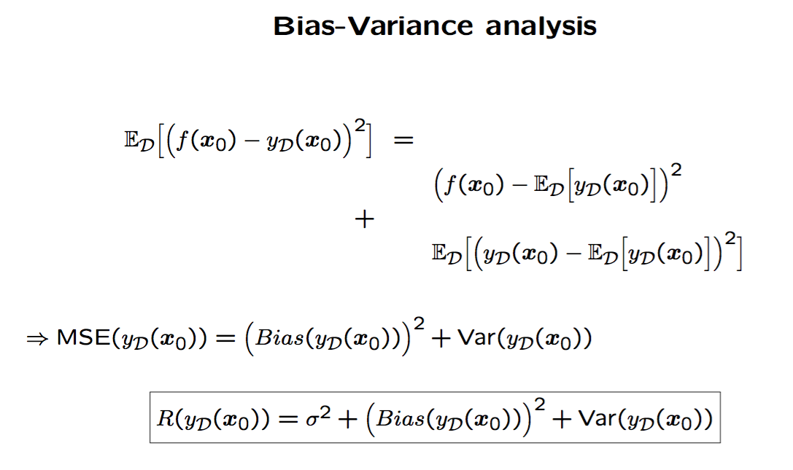

###  Underfitting/Overfitting and Bias/Variance

```{r}
set.seed(222)
par(mfrow=c(1, 1))
```

First we are going to do a simple modeling in one dimension with polynomials
of different degrees: we are going to observe the underfitting/overfitting phenomenon

Suppose we have a process which generates data in the form of a sine + some **noise** $\epsilon$:

$t = sin(2 \pi x) + \epsilon$, where $\epsilon \sim N(0, 0.04)$

The function $f(x) = sin(2 \pi x)$ is the best possible solution (the regression function)
we therefore aim at getting close to this function using only a limited sample of $N$ data pairs $(x,t)$

If we can assume that our target function is continuous, then the polynomials are a good choice for our function class:

We start with a simple linear model: $y(x) = \beta_0 + \beta_1 x$

and progressively add higher terms:

$y(x) = \beta_0 + \beta_1 x + \beta_2 x^2 + ... + \beta_M x^M$

These additional terms will improve the fit to the training data (reduce the empirical error), but at the expense of a steady increase in complexity

Let's build our target function and sample:

```{r}
library(polynom)

# sample size
N <- 10

# this is the (unknown) target function and the best solution to our problem
f <- function(x) sin(2 * pi * x)  

# generate the x according to a uniform distribution p(x)
x <- runif(N)                     

# generate the t according to a gaussian conditional distribution p(t|x)
t <- f(x) + rnorm(N, sd=0.2)      # note stdev (sd) = sqrt(var) = sqrt(0.04) = 0.2
```


Plot the available data sample (what we observe) and the deterministic part $f$  (unknown in practice, and the best possible solution = the regression function)
```{r}
plot(data.frame(x, t),ylim=c(-1.25,1.25))
curve(f, type="l", col="green", add=TRUE)
```

Luckily for us, fitting polynomials is easy in R with the `poly()` function; e.g. this is a 1-degree polynomial (a line)

```{r}
polyfit <- lm(t ~ poly(x, 1, raw=TRUE))
```


We will be analysing this summary output next session ... though probably you can understand many things
```{r}
summary(polyfit)
```

Today we are not so interested in how to optimize the model *coefficients*, but in optimizing the *degree* (a.k.a. _model selection_) and, particularly, in the effect of changing the degree on the modeling

Let us see how our fit is:

```{r}
p <- polynomial(coef(polyfit))                           # this is the polynomial of degree 1 that we just fit
p
```

```{r}
plot(data.frame(x, t),ylim=c(-1.25,1.25))
curve(f, type="l", col="green", add=TRUE)
points(data.frame(x, predict(polyfit)), col="red")    # and these are its predictions on same data
fp <- as.function(p)
curve(fp, col="red", add=TRUE)                         # and the polynomial as a function (i.e., a model)
```


Now let us fit a bunch of polynomials of different degrees
```{r}
par(mfrow=c(2, 3))

for (i in c(1, 2, 3, 4, 6, 9)) 
{
  plot(data.frame(x, t), xlab=paste("Poly fit of degree", i), ylab="f(x)",ylim=c(-1.25,1.25))
  curve(f, type="l", col="green", add=TRUE)
  polyfit <- lm(t ~ poly(x, i, raw=TRUE))
  p <- as.function(polynomial(coef(polyfit)))
  curve(p, col="red", add=TRUE)
}
```

We can see that adding more polynomial terms improves the fit. The limit case is for the 9th polynomial (degree 9, having 10 coefficients) which is able to interpolate the data (it passes through every data point)

**So ... which one is better?**  (million dollar question!)

In terms of training error, the 9th polynomial (because it shows 0 error)
In terms of complexity, the 1th polynomial (because it has fewer coefficients)

**_The best is the one with a better trade-off between training error and complexity_**

We saw in class that there are at least two ways of characterizing this trade-off: Vapnik's theorems (using VC-dimension) and Bias/Variance analysis (due to Geman & Geman). In this session we focus on the Bias/Variance trade-off.

#### Bias/Variance analysis

Let's do a Bias/Variance analysis first (notice that, without the green line, we still do not know which polynomial is underfitting/overfitting the data)

As a reminder the definitions from the lecture:

\

So basically: 

* $Bias(y_{\cal D}(x_0))^2 = (f(x_0) - {\mathbb E}[y_{\cal D}(x_0)])^2$ which is essentially the expected (square) deviation of our prediction at $x_0$ and the best possible prediction (given by $f(x_0)$).

* $Var(y_{\cal D}(x_0)) = {\mathbb E}\left[ (y_{\cal D}(x_0) - {\mathbb E}[y_{\cal D}(x_0)])^2 \right]$ which is essentially the variability of our prediction as a function of the used data sample (**independent of the underlying function!**)

Instead of computing these expectations, we will approximate them using the Monte Carlo method; that is, sample new datasets, compute the predictions and approximate these quantities by averaging over the different samples.

***

To show Bias, let us concentrate on the 1st polynomial: we generate 10 independent datasets and model as before, keeping the degree constant to 1

```{r}
par(mfrow=c(2, 5))

for (i in 1:10)
{
  x <- runif(N)                 
  t <- f(x) + rnorm(N, sd=0.2)
  
  plot(data.frame(x, t), xlab=paste("Poly fit of degree 1\ndata sample", i),
       ylab="f(x)",xlim=c(0,1),ylim=c(-1.25,1.25))
  curve(f, type="l", col="green", add=TRUE)
  polyfit <- lm(t ~ poly(x, 1, raw=TRUE))
  p <- as.function(polynomial(coef(polyfit)))
  curve(p, col="red", add=TRUE)
}
```

We can see two things:

1. the model is quite stable (therefore it has **low Variance**)
2. the model is quite bad on average (therefore it has **high Bias**)

To show Variance, let us concentrate on the 6th polynomial: we generate 10 independent datasets and model as before keeping the degree constant to 6:

```{r}
par(mfrow=c(2, 5))

for (i in 1:10) {
  x <- runif(N)                 
  t <- f(x) + rnorm(N, sd=0.2)
  
  plot(data.frame(x, t), xlab=paste("Poly fit of degree 7\ndata sample", i), ylab="f(x)",xlim=c(0,1),ylim=c(-1.25,1.25))
  curve(f, type="l", col="green", add=TRUE)
  polyfit <- lm(t ~ poly(x, 7, raw=TRUE))
  p <- as.function(polynomial(coef(polyfit)))
  curve(p, col="red", add=TRUE)
}
```

We can see two things:

1. the model is quite unstable (therefore it has **high Variance**)
2. the model is quite good *on average* (therefore it has **low Bias**)

***

In practice, we cannot generate many different data samples ... so we cannot compute Bias and Variance.

What are we going to do? How can we avoid overfitting/underfitting? (note that most often the real danger is in overfitting; this is because many ML methods tend to be very flexible, i.e., they are able to represent complex models)

There are several ways to control this:
  
1. Get more training data (typically out of our grasp)
2. Use (that is, sacrifice!) part of the data for validation
3. Use an explicit complexity control (aka regularization)

Let's see the effect of more training data first. Let us fit a 9th-polynomial for different data sizes:

```{r}
par(mfrow=c(2, 2))

for (N in c(10, 25, 50, 100)) {
  x <- runif(N)                 
  t <- f(x) + rnorm(N, sd=0.2)
  
  plot(data.frame(x, t), xlab=paste("Training data size:", N), ylab="f(x)",xlim=c(0,1),ylim=c(-1.25,1.25))
  curve(f, type="l", col="green", add=TRUE)
  polyfit <- lm(t ~ poly(x, 9, raw=TRUE))
  p <- as.function(polynomial(coef(polyfit)))
  curve(p, col="red", add=TRUE)
}
```

So getting more data increasingly reduces the chances of overfitting for the same model.
More technically, the chance of overfitting is "moved ahead"; this means that as we get more data, only very complex models will have a possibility to overfit

Now let us use part of the data for validation (this is what _cross-validation_ does, although in a more systematic way: we will see this in a future lab session)

We are going to generate the same plot as before, but this time we will be computing the prediction error on the validation data, which we create as an independent (and larger) sample

Let us generate **training data** again:
```{r}
N <- 10
x <- runif(N)                     # generate the x according to a Uniform distribution p(x)
t <- f(x) + rnorm(N, sd=0.3)      # generate the t according to a Gaussian conditional distribution p(t|x)
```

Generate **validation data** (note generation mechanism **MUST be the same**):
```{r}
N.val <- 1000
x.val <- runif(N.val)                     # generate the x according to a uniform distribution p(x)
t.val <- f(x.val) + rnorm(N.val, sd=0.3)  # generate the t according to a Gaussian conditional distribution p(t|x)
val <- data.frame(x=x.val, t=t.val)
```

We are going to keep track of prediction errors (both in *training* and *validation* sets) in an `errors` matrix:
```{r}
errors <- matrix (nrow=6, ncol=3)
colnames(errors) <- c("Degree","TR.NRMSE","VA.NRMSE")
degrees <- c(1, 2, 3, 4, 6, 9)
```

Same loop as before, but this time we keep track of training *and* validation error 
notice we plot true $f$ (in green), along with validation data

This time we switch to a much better assessment of error: the NRMSE, which is a root normalized MSE:

$$
NRMSE({\pmb \beta}) = \sqrt{\frac{||{\pmb t} - X {\pmb \beta}||^2}{(N-1) Var[{\pmb t}]}}
$$

```{r}
par(mfrow=c(2, 3))
for (i in 1:length(degrees))
{
  plot(data.frame(x.val, t.val), xlab=paste("Polynomial prediction of degree", degrees[i]), ylab="f(x)",ylim=c(-1.25,1.25), col="black")
  curve(f, type="l", col="green", add=TRUE)
  polyfit <- lm(t ~ poly(x, degrees[i], raw=TRUE))
  
  # fill in degree, training error and validation error (both are NRMSEs)
  errors[i, "Degree"] <- degrees[i]
  errors[i, "TR.NRMSE"] <- sqrt( sum(polyfit$residuals^2) / ((N-1)*var(t)) )
                                
  predictions <- predict(polyfit, newdata=val)
  errors[i, "VA.NRMSE"] <- sqrt( sum((t.val - predictions)^2) / ((N.val-1)*var(t.val)) )
  
  points(data.frame(x.val, predict(polyfit, newdata=val)), col="red") # these are the predictions on validation data
}
```

Inspect the results

```{r}
errors
```

Which degree yields the lowest error on validation data? Degree 3 looks good here.

Notice how the error on training data keeps decreasing and at the same time complexity (indicated by the degree) keeps increasing

Sadly, this method (known as the 'holdout') does not always work so well.
Moreover, both training and validation data samples should be large at the same time ...

On top of that, we depend on fortunate/unfortunate data splits (which leads us to __re-sampling methods__)

The third method (using explicit complexity control, a.k.a. **regularization**) will actually be the topic of the next lab session, so we defer analysis for then
