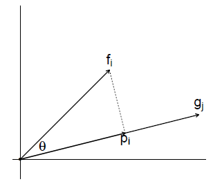
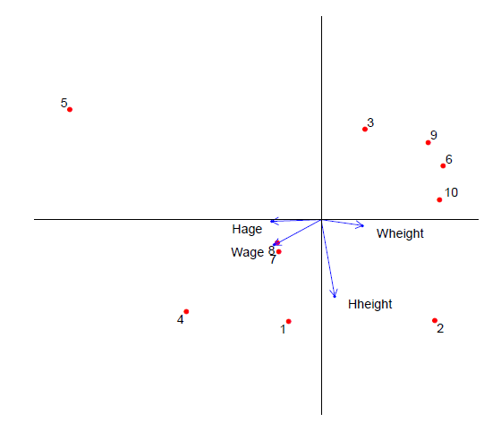

**Anàlisi** de Dades

[TOC]

## 1. Introducció i pre-processament de dades

### 1.1. Introducció

Estudiarem dos tipus de dades en aquest curs:

- Conjunts de dades multivariades (moltes observacions i moltes variables).
- Sèries temporals (variables que s'observen de manera repetida en el temps, diàriament, setmanalment, mensualment, etc).

Les sub-disciplines de l'estadística dedicades a l'anàlisi de dades així són **l'anàlisi multivariat** i **l'anàlisi de sèries temporals**, i tractarem ambdues tècniques en aquest curs.

### 1.2. Pre-processament

Generalment no es recomana ajustar models estadístics directament sobre *datasets* sense processar. Existeixen moltes tècniques de <span style='color:blue'>netejat de dades</span> i <span style='color:blue'>pre-processament</span> que ajuden a assegurar la qualitat de les dades i que faciliten una anàlisi amb més sentit. El pre-processament presenta diverses característiques importants:

- Conversió de l'arxiu de dades a un format adequat.
- Evitar duplicacions.
- Comprovar l'existència de <span style='color:blue'>dades mancants</span>, *<span style='color:blue'>outliers</span>* i <span style='color:blue'>zeros</span>.
- Comprovar si s'han de fer transformacions sobre les dades.

### 1.3. Valors mancants

**Treballant amb valors mancants:** N'existeixen? Com estan codificats? Quin percentatge de les dades falta? Es concentren els valors mancants en algunes variables o individus?

#### Classificació dels valors mancants

1. *Missing Completely At Random* (MCAR):
   - Hi ha valors mancants, però es pot intentar veure un *dataset* hipotètic d'individus observats completament.
   - Si les observacions són una mostra aleatòria d'aquestes dades ideals, aleshores les dades mancants són MCAR.
   - Les observacions que falten són també observacions aleatòries d'aquest *dataset*.
   - Descartar els valors mancants no és molt problemàtic si no n'hi ha gaires.
2. *Missing At Random* (MAR):
   - La probabilitat que un resultat falti per una variable particular pot dependre de les altres dades observades (per exemple d'altres variables que sí que han estat observades).
   - Condicionat a les dades observades, aquesta probabilitat pot no dependre dels valors de la variable.
3. *Missing Not At Random* (MNAR):
   - La probabilitat d'un valor mancant depèn en els valors de la variable en consideració, inclús després de controlar les relacions amb altres variables rellevants.

#### Opcions d'actuació

##### Esborrar dades mancants

Si esborrem les dades mancants, la mida de la mostra es redueix, i perdem poder per detectar efectes interessants. La inferència estadística podria estar esbiaixada si les dades mancants no són MCAR.

##### Imputació de dades mancants

###### Imputació per la mitjana

Se substitueixen els valors mancants per la mitjana de les observacions. Això atenua l'efecte de la variable explicativa sobre la variable resposta.


###### Imputació per regressió

Se substitueixen els valors mancants per el valor de la recta de regressió. Es podria subestimar la variància real de les dades.


###### Imputació per regressió estocàstica

Es substitueixen els punts pels valors de la regressió lineal més un soroll tret de $\mathcal{N}(0,s_e^2)$.


###### Imputació múltiple

S'aplica molts cops la imputació per regressió estocàstica i es fa cada cop la recta de nou. Finalment, el valor se substitueix per la mitjana de tots aquests.


### 1.4. Zeros

Tractar zeros és una operació delicada, ja que es poden confondre els zeros per valors mancants (per exemple, com fa MS Excel amb les cel·les en blanc). Per tant, és molt important la manera de codificar les dades, i resulta essencial utilitzar un **codi especial a la base de dades** per indicar si la dada és, en efecte, mancant. Per exemple, en `R`, fem servir ` NA` pels valors mancants. 

### 1.5. *Outliers*

Podem tenir *outliers* univariats, bivariats, o multivariats. Els dos primers els podem identificar amb diagrames univariants i bivariants, però per detectar els multivariats és més complicat.

**Com s'actua sobre els *outliers*?**

- Primer cal comprovar si el valor correspon a una mesura correcta o és clarament errònia o impossible. Per exemple, es pot consultar a la gent que ha generat les dades en qüestió.
- Depenent de la tècnica estadística utilitzada, un *outlier* pot ser problemàtic o no. Si es considera problemàtica l'existència d'*outliers*, es pot considerar una transformació de les dades per atenuar-ne l'efecte.

Per tant, es fa l'anàlisi amb i sense els *outliers*, i es comparen resultats.

### 1.6. Transformacions

En estadística s'utilitzen molt les transformacions de les variables aleatòries. Per quins motius s'utilitzen?

- Per reduir els efectes dels *outliers*.
- Per fer una distribució més simètrica.
- Per produir homoscedasticitat.
- Per aconseguir normalitat aproximada.
- Per eliminar una restricció que opera sobre les dades
- ...

**<span style='color:green'>Transformacions comunes</span>:**

- $y=\ln(x)$ (zeros no permesos).
- $y=\sqrt{x}$ (zeros permesos).
- Transformació *logit* per probabilitats $y=\ln\left(\frac{p}{1-p}\right).$
- Substituir les observacions pel seu rang (?) /// la seva posició (?).
- Transformació de la potència $y=x^a$.
- Transformació de Box-Cox.

#### Transformació de Box-Cox

La transformació de Box-Cox es pot utilitzar per aconseguir normalitat aproximada en una variable aleatòria. La seva expressió analítica és
$$
y_i^{(\lambda)}=\begin{cases}\frac{y_i^\lambda-1}{\lambda}\ \ \quad\lambda\neq0\\ \ln(y_i)\quad\lambda=0\end{cases}.
$$
El valor òptim de $\lambda$ s'aconsegueix per màxima versemblança.

## 2. Àlgebra de matrius aplicada a l'anàlisi multivariant

### Resum de vectors i matrius

- **Norma-2:** $\|x\|_2=\sqrt{x^Tx}=\sqrt{\sum_{i=1}^dx_i^2};\|\alpha x\|_2=|\alpha|\cdot\|x\|_2.$
- **Producte escalar:** $<x,y>_2=x^Ty=x_1y_1+\cdots+x_dy_d;<x,y>=0\iff x\perp y.$
- **Angle:** $\cos{\theta}=\frac{<x,y>_2}{\|x\|_2\cdot\|y\|_2}.$
- **Descomposició espectral i SVD:**

### Matrius bàsiques a l'anàlisi multivariant

- **Matriu de dades:** $X_{n\times p}.$
- **Vector de mitjana mostral:** $\boldsymbol m_{p\times1}=\left(\frac{1}{d}\boldsymbol 1^TX\right)^T.$
- **Matriu de dades centrades:** $X_c=X-\boldsymbol 1_{n\times1}\boldsymbol m^T=\left(I-\frac{1}{n}\boldsymbol1\boldsymbol1^T\right)X.$
- **Matriu centradora:** $H=I-\frac{1}{n}\boldsymbol1\boldsymbol1^T\implies X_c=HX.$
- **Matriu de dades estandaritzades:** $X_s=X_cD^{-1}$, on $D_s=\text{diag}(s_1,\ldots,s_p)$ és la matriu de les desviacions típiques de les columnes de $X$. Per tant, $X_s=HXD_s^{-1}.$
- **Matriu de covariàncies mostrals:** $S=\frac{1}{n-1}X_c^TX_c.$
- **Matriu de correlacions mostrals:** $R=D_s^{-1}SD_s^{-1}=\frac{1}{n-1}D_s^{-1}X^TH^THXD_s^{-1}=\frac{1}{n-1}X_s^TX_s.$

#### Distàncies importants a l'anàlisi multivariant

- **Euclidiana:**

$$
\delta_{rs}=\sqrt{(x_s-x_s)^T(x_r-x_s)}=\left(\sum_{i=1}^p|x_{ri}-x_{si}|^2\right)^\frac{1}{2}.
$$


- **Distància de Mahalanobis:**

$$
\delta_{rs}=\left((x_r-x_s)^TS^{-1}(x_r-x_s)\right)^\frac{1}{2}.
$$

- **Distància de Minkowski:**

$$
\delta_{rs}=\left(\sum_{i=1}^p|x_{ri}-x_{si}|^\lambda\right)^\frac{1}{\lambda}.
$$

## 3. Anàlisi de components principals (PCA)

Els objectius principals de l'**Anàlisi de components principals (PCA)** són:

- Reduir el nombre de variables.
- Una visualització de la matriu de dades a través d'un *biplot*.

### Teoria de la PCA

Busquem combinacions lineals de les variables originals,
$$
F_1=a_{11}X_1+a_{12}X_2+\cdots+a_{1p}X_p\\
F_2=a_{21}X_1+a_{22}X_2+\cdots+a_{2p}X_p\\
\vdots\\
F_p=a_{p1}X_1+a_{p2}X_2+\cdots+a_{pp}X_p\\
$$
tals que satisfacin:

- $F_1,F_2,\ldots,F_p$ no correlades.
- $\text{Var}(F_1)$ màxima.
- $\text{Var}(F_1)\geq\text{Var}(F_2)\geq\cdots\geq\text{Var}(F_p)$.
- $a_{i1}^2+a_{i2}^2+\cdots+a_{ip}^2=1.\qquad(-1\leq a_{ij}\leq1)$

Tots els coeficients i valors propis es poden obtenir de la **descomposició espectral** de la matriu de covariàncies, $S=AD_\lambda A^T$. Les **components principals** s'obtenen calculant
$$
\begin{matrix}
F_p & = & X_c & A.\\
(n\times p) & & (n\times p) & (p\times p)
\end{matrix}
$$
Els valors propis corresponen a les variàncies de les components principals perquè
$$
\frac{1}{n-1}F_p^TF_p=\frac{1}{n-1}(X_cA)^TX_cA=\frac{1}{n-1}A^TX_c^TX_cA=A^TSA=A^TAD_\lambda A^TA=D_\lambda.
$$
Una manera alternativa de fer PCA és utilitzant la **descomposició en valors singulars (SVD)** de la matriu de dades centrada, $X_c=UDA^T$. Les components principals aleshores es calculen amb $F_p=X_cA=UD$. Els valors singulars al quadrat es relacionen amb la variància dels components principals perquè
$$
\frac{1}{n-1}F_p^TF_p=\frac{1}{n-1}(UD)^TUD=\frac{1}{n-1}D^2=D_\lambda.
$$
Aquesta aproximació és molt convenient per construir *biplots*.

### *Biplots*

Un *biplot* és una eina molt útil per explorar gràficament dades multivariants. És una generalització multivariant de l'*scatterplot*, però difereix d'aquest en alguns aspectes:

- Típicament té més de dos eixos.
- Els eixos no són perpendiculars, sinó que tendeixen a ser oblics.
- La matriu de dades es representa de manera aproximada, no exacta.

Un *biplot* és una visualització de les files i columnes d'una matriu que és òptima en termes de mínims quadrats.

Per fer un *biplot* d'una matriu, primer l'hem de factoritzar
$$
X_{n\times p}=F_{n\times r}G_{r\times p}^T\qquad(1)
$$
en el producte d'una matriu de **marcadors de files**, $F$, i una matriu de **marcadors de columnes**, $G$. Aquesta factorització també existeix en un scatterplot ordinari,
$$
X_{n\times2}=X_{n\times2}I_{2\times2}.
$$
La factorització $(1)$ no és única; amb qualsevol aplicació lineal invertible $T$ tenim
$$
X_{n\times p}=F_{n\times r}TT^{-1}G_{r\times p}^T=\tilde F_{n\times r}\tilde G_{r\times p}^T.\qquad(2)
$$

#### *Biplots* i el producte escalar

En un *biplot*, els valors de les dades s'aproximen amb el **producte escalar ordinari** entre dos vectors:



Veiem que, efectivament,
$$
\cos\theta=\frac{\|p_i\|}{\|f_i\|}=\frac{f_i^Tg_j}{\|f_i\|\cdot\|g_i\|},\quad \|p_i\|=\frac{f_i^Tg_j}{\|g_j\|},\quad x_{ij}\approx f_i^Tg_j=\|p_i\|\cdot\|g_j\|.
$$

#### *Biplots* a la PCA

La PCA dóna un *biplot* de la matriu de dades centrades. S'obté representant conjuntament les dues primeres components principals (les primeres dues columnes de $F_p$) i els dos primers vectors propis (primeres dues columnes de $G_s$). Les files de $F_p$ es representen normalment amb punts, i les files de $G_s$ amb fletxes. Les coordenades $F_p$ s'anomenen <span style='color:blue'>coordenades principals</span>, i les coordenades $G_s$ s'anomenen <span style='color:blue'>coordenades estàndar</span>. Aquestes últimes compleixen $G_s^TG_s=I$.

Es pot fer un escalat alternatiu del *biplot*. Utilitzant $D_s$ la matriu diagonal amb les desviacions típiques de les components principals,
$$
X_c=F_pD_s^{-1}D_sG_s^T=F_sD_sG_s^T=F_sG_p^T,\\ G_p=G_sD_s.
$$
Aquest *biplot* representa les <span style='color:blue'>components principals estandaritzades</span>, $F_s=F_pD_s^{-1}$. Tenim, per tant, dos *biplots*:

- $X_c=F_pG_s^T$ (*biplot* de <span style='color:blue'>forma</span>)
- $X_c=F_sG_p^T$ (*biplot* de <span style='color:blue'>covariància</span>)

En general, els *biplots* de forma es centren en la **representació de distàncies**, mentre que els *biplots* de covariància es centren en representar la **estructura de correlació**.

#### Propietats dels *biplots*

- En el *biplot* de forma, les distàncies euclidianes entre punts aproximen les distàncies euclidianes entre files de la matriu de dades.
- En el *biplot* de covariància:
  - Les distàncies euclidianes entre punts aproximen les distàncies de Mahalanobis entre files de la matriu de dades.
  - La longitud d'una fletxa aproxima la desviació típica de la variable corresponent.
  - L'angle entre dues fletxes aproxima la correlació entre les variables corresponents.

#### *Biplots* a R

Amb aquestes instruccions

```R
plot(F[, 1], F[, 2], pch = 19)
points(G[, 1], G[, 2], pch = 2, col = "blue")
arrows(0, 0, G[, 1], G[, 2])
```

podem representar el següent *biplot*:



### Quantes components utilitzem?

Els criteris a considerar són els següents:

- El **percentatge de variància explicada**; volem que sigui $>80\%$.
- El **mòdul del valor propi corresponent**; volem valors propis $>\bar\lambda$.
- L'**scree-plot**; ens dona una visualització gràfica dels valors propis, és a dir, de quanta variància explica cada component.
- Tests de significància amb els valors propis.

Si ho plantegem matemàticament,
$$
\text{tr}(S)=\text{tr}(AD_\lambda A^T)=\text{tr}(D_\lambda),\\
\sum_{i=1}^p\text{Var}(X_i)=\sum_{i=1}^p\text{Var}(F_i)=\sum_{i=1}^p\lambda_i,
$$

| Component             | $F_1$                     | $F_2$                                 | $\cdots$ | $F_p$                         |
| --------------------- | ------------------------- | ------------------------------------- | -------- | ----------------------------- |
| **Variància**         | $\lambda_1$               | $\lambda_2$                           | $\cdots$ | $\lambda_p$                   |
| **Fracció**           | $\lambda_1/\sum\lambda_i$ | $\lambda_2/\sum\lambda_i$             | $\cdots$ | $\lambda_p/\sum\lambda_i$     |
| **Fracció acumulada** | $\lambda_1/\sum\lambda_i$ | $(\lambda_1+\lambda_2)/\sum\lambda_i$ | $\cdots$ | $\sum\lambda_i/\sum\lambda_i$ |

#### Tipus de PCA

Hi ha dos tipus de PCA. Els càlculs es poden basar en

- La **matriu de covariàncies** $S$:
  - No és invariant respecte l'escala de mesura.
  - La variable amb variància més gran domina.
- La **matriu de correlacions** $R$:
  - És invariant respecte l'escala de mesura.
  - Totes les variables contribueixen de la mateixa manera.

#### Interpretació

Les components es poden interpretar amb l'ajuda dels coeficients de les variables, de les correlacions entre variables i components, i amb el *biplot*. Si l'objectiu és tenir una imatge de la matriu de dades, aleshores la interpretació de les components podria no ser necessària.

### Sobre la bondat d'ajust

Dels valors propis de l'anàlisi, es pot calcular la bondat d'ajust total d'una solució $k$-dimensional. També es pot calcular la bondat d'ajust per cada fila i columna de la matriu de dades. La bondat d'ajust de les variables també es pot calcular com l'$R^2$ en una regressió sobre les components principals.

## 4. Escalament Multidimensional (MDS)

### Introducció

**Objectiu:** en base a certa informació respecte les **distàncies** (o similituds) entre $n$ objectes, volem construir una configuració d'$n$ punts en un espai de dimensió baixa (un <span style='color:blue'>mapa</span>).

#### Terminologia

- Proximitat
- Similaritat ($s_{rs}$)
- dissimilaritat/dissimilitud o **distància** ($d_{rs}$)

Una mesura de **similaritat** $s$ satisfà les següent propietats:

- $s(A,B)=s(B,A).$
- $s(A,B)>0.$
- $s(A,B)$ augmenta quan $A$ i $B$ s'assemblen més.

Una mesura de **distància** $\delta$ satisfà les següents propietats:

- $\delta(A,B)=\delta(B,A).$
- $\delta(A,B)\geq0.$
- $A=B\implies\delta(A,B)=0.$

Una funció de distància $\delta$ s'anomena una **mètrica** si, a més de les propietats de distància, satisfà les següents propietats addicionals:

- $A=B\impliedby\delta(A,B)=0.$
- La desigualtat triangular: $\delta(A,B)\leq\delta(A,C)+\delta(C,B).$

### Mesures de dissimilaritat

S'utilitzen bastant les distàncies introduïdes amb anterioritat a l'apartat 2, que són les següents:

- **Euclidiana:**

$$
\delta_{rs}=\sqrt{(x_s-x_s)^T(x_r-x_s)}=\left(\sum_{i=1}^p|x_{ri}-x_{si}|^2\right)^\frac{1}{2}.
$$

​		Cal notar que la distància Euclidiana generalitza fàcilment a $p$ variables, sent la distància de Minkowski per $\lambda=p$.

- **Distància de Mahalanobis:**

$$
\delta_{rs}=\left((x_r-x_s)^TS^{-1}(x_r-x_s)\right)^\frac{1}{2}.
$$

- **Distància de Minkowski:**

$$
\delta_{rs}=\left(\sum_{i=1}^p|x_{ri}-x_{si}|^\lambda\right)^\frac{1}{\lambda}.
$$

A l'escalat multidimensional mètric, la configuració dels punts s'obté **directament** de les distàncies. Al MDS no-mètric, només és important l'ordre de les distàncies. Tenim diverses opcions per escalar les distàncies i intentar representar les dades:

- $d_{rs}\approx\delta_{rs}:$ escalament clàssic.
- $\delta_{rs}\approx f(\delta_{rs})$ amb $f(\delta_{rs})=\alpha+\beta\delta_{rs}:$ escalament mètric.
- $\delta_{rs}=f(\delta_{rs})$ amb $f(\delta{rs})$ monòtona qualsevol: escalament no-mètric.

### MDS mètric

També es coneix com **escalament clàssic** o **anàlisi de les coordenades principals (PCO)**. Donats $n$ objectes amb dissimilaritats $\delta_{rs}$ volem trobar punts a l'espai euclidià tals que $d_{rs}\approx\delta_{rs}$. L'aplicació més clàssica és, donada una matriu de distàncies entre ciutats, construïr un mapa de la seva disposició.

Sigui $X$ la matriu de coordenades amb la solució, i $x_r,x_s$ dues files de $X$. Fem $\delta^2_{rs}=(x_r-x_s)^T(x_r-x_s)$. Sigui $B$ una matriu de producte interior, amb
$$
b_{rs}=x_r^Tx_s.
$$
Assumirem que la solució està centrada a l'origen, és a dir, que
$$
\sum_{r=1}^nx_{ri}=0.
$$
Si fem
$$
d^2_{rs}=x_r^Tx_r+x_s^Tx_s-2x_r^Tx_s,\\
b_{rs}=x_r^Tx_s=-\frac{1}{2}\left(d^2_{rs}-x_r^Tx_r-x_s^Tx_s\right),\\
b_{rs}=-\frac{1}{2}\left(d^2_{rs}-\frac{1}{n}\sum_{s=1}^nd^2_{rs}-\frac{1}{n}\sum_{r=1}^nd^2_{rs}+\frac{1}{n^2}\sum_{r=1}^n\sum_{s=1}^nd^2_{rs}\right).
$$
Definim $a_{rs}=-\frac{1}{2}d^2_{rs}$, és a dir que $b_{rs}=a_{rs}-a_{r*}-a_{*s}+a_{**}$, i això forma una matriu $A$ tal que
$$
B=HAH,\ H=I-\frac{1}{n}\boldsymbol1\boldsymbol1^T,
$$
i també $B=XX^T$. Volem aproximar $B$ en un espai de dimensió baixa, i ho farem indirectament, via la matriu de productes escalars.

- Sigui $B$ una matriu qualsevol $n\times n$ simètrica que volem aproximar, pel teorema espectral real diagonalitza en una base de vectors propis ortogonals amb valors propis reals,

$$
B=VD_\lambda V^T=\sum_{i=1}^n\lambda_iv_iv_i^T,
$$

​		amb $D_\lambda=\text{diag}(\lambda_1,\ldots,\lambda_n)$ i $V=(v_1,\ldots,v_n)$. Si aproximem $B$ per
$$
\tilde B:=V_{(*,1:k)}D_{\lambda(1:k,1:k)}\left(V_{*,1:k}\right)^T,
$$
​		tenim l'aproximació de rang $k$ per mínims quadrats de $B$.

- Teníem $B=XX^T=VD_\lambda V^T$. Aleshores, les coordenades de la solució són $\boxed{X=VD_\lambda^\frac{1}{2}.}$
- ***IMPORTANT!*** Sempre hi haurà un valor propi nul, i la solució està aniuada en les solucions de dimensió superior.

#### Algorisme per l'escalament clàssic

1. Calculem la matriu de distàncies.
2. Calculem $a_{rs}=-\frac{1}{2}\delta^2_{rs}.$
3. Centrem dues vegades $A$ per obtenir $B=HAH.$
4. Calculem la descomposició espectral de $B$.
5. La solució és $X=VD_\lambda^\frac{1}{2}$.

**Bondat d'ajust:** com de bé aproximem la matriu de distàncies?
$$
\frac{\sum_{i=1}^P\lambda_i}{\sum_{i=1}^{n-1}\lambda_i}.
$$
Si $B$ no és positiva semi-definida,
$$
\frac{\sum_{i=1}^P\lambda_i}{\sum_{i=1}^{n-1}\vert\lambda_i\vert},\qquad\text{ o }\qquad\frac{\sum_{i=1}^P\lambda_i}{\sum_{\lambda_i>0}\lambda_i}.
$$
**Definició:** una matriu de distàncies s'anomena **euclidiana** si existeix una configuració de punts a l'espai euclidià tals que les seves distàncies vénen donades per $D$. És a dir, per alguna $p$ existeixen punts $x_1,x_2,\ldots,x_n$ tals que $d_{rs}^2=(x_r-x_s)^T(x_r-x_s)$.

**Teorema:** una matriu de distàncies $D$ és euclidiana si i només si $B$ ($=HAH$, com s'ha definit prèviament) és positiva semi-definida.

#### Similitud de les dades

A vegades, les dades es donen en forma de **similituds** $c_{rs}$. En una matriu de similitud $C$ es compleix $c_{rs}=c_{sr}$ i $c_{rs}\leq c_{rr}$. Aquestes es poden convertir en distàncies fent $\delta_{rs}=\sqrt{c_{rr}-2c_{rs}+c_{ss}}$. Si $C$ és positiva semi-definida, aleshores la matriu de distàncies obtinguda serà euclidiana.

### MDS no-mètric

Definim el factor d'**estrés** de l'escalament com
$$
\text{STRESS}(\delta,X)=\sqrt{\frac{\sum_{r\neq s}^n(f(\delta_{rs})-d_{rs})^2}{\sum_{r\neq s}d^2_{rs}}},
$$
i la minimització d'aquest factor com
$$
\text{stress}(\Delta,\hat X)=\min_{\text{all }X}\text{STRESS}(\Delta,X).
$$
Minimitzem la funció objectiu numèricament, començant des de certa configuració inicial.

#### Procediment

1. Triem una mesura de la distància.
2. Triem una transformació monòtona $f$.
3. Escollim un algorisme per minimitzar el factor d'estrés.

Per no quedar atrapats en òptims locals, experimentem amb diverses configuracions inicials, i comparem el factor d'estrés entre solucions $1,2,3,\ldots,k-$dimensionals.

Per saber si l'escalament és adient, podem mirar diverses coses:

- Diagrama bivariant de $\delta_{rs}$ vs. $d_{rs}$.
- Representació del factor d'estrés contra el nombre de dimensions.
- Degeneració; quants punts hi ha amb les mateixes $d_{rs}$.
- Càlcul dels residus $d_{rs}-f(\delta_{rs})$.

### Exemples

## 5. Anàlisi de correspondències

### Introducció

**Objectiu:** estudiar les relacions entre variables categòriques, i donar-ne una visualització útil.

Existeixen dos tipus d'anàlisi de correspondències:

- <span style='color:blue'>Anàlisi de correspondències simple</span> (CA): dues variables categòriques.
- <span style='color:blue'>Anàlisi de correspondències múltiple</span> (MCA): diverses variables categòriques.

### Perfils

Utilitzarem la següent notació:

- $N$ serà la **taula de contingència** $I\times J$.
- $P=\frac{N}{n}$, amb $n=\boldsymbol1^TN\boldsymbol1$. Notem que $\boldsymbol1^TP\boldsymbol1=1.$
- $P$ és, per tant, una matriu de probabilitats (la **matriu de correspondència**).
- Les **masses de les files** són:

$$
r_i=\sum_{j=1}^Jp_{ij},\quad\boldsymbol r=P\boldsymbol1,\quad D_r=\text{diag}(\boldsymbol r).
$$

- Les **masses de les columnes** són:

$$
c_j=\sum_{i=1}^Ip_{ij},\quad\boldsymbol c=P^T\boldsymbol1,\quad D_c=\text{diag}(\boldsymbol c).
$$

**Definició:** un perfil és un vector d'elements no-negatius que sumen 1.

Una taula de contingència es pot convertir en una matriu de perfils (perfils fila i perfils columna). Els perfils fila $R$ (resp. columna $C$) s'obtenen sumant els elements d'una fila de $P$ i dividint entre el total:
$$
R=D_r^{-1}P,\quad C=D_c^{-1}P^T.
$$
Les masses de columnes i files resulten ser, doncs, mitjanes ponderades dels perfils:
$$
\boldsymbol r^TD_r^{-1}P=\boldsymbol1^TP=\boldsymbol c^T,\quad
\boldsymbol c^TD_c^{-1}P^T=\boldsymbol1^TP^T=\boldsymbol r^T.
$$
Els perfils es poden centrar:

- Perfils fila centrats: $D_r^{-1}P-\boldsymbol1\boldsymbol c^T$.
- Perfils columna centrats: $D_c^{-1}P^T-\boldsymbol1\boldsymbol r^T$.

#### Dimensionalitat

El rang per columnes de la matriu de perfils fila és com a molt $J-1$, i el rang per files de la matriu de perfils columna és com a molt $I-1$. El rang, doncs, de la matriu, és $\min(I-1,J-1)$.

### Inèrcia

**Definició.** *Estadístic de $\chi^2$.*
$$
\boxed{
\mathsf X^2=\sum_{i=1}^I\sum_{j=1}^J\frac{(n_{ij}-e_{ij})^2}{e_{ij}}.
}
$$
Podem calcular l'estadístic de $\chi^2$ amb els perfils també:
$$
\mathsf X^2=\sum_{i,j}\frac{(n_{ij}-e_{ij})^2}{e_{ij}}=
\sum_{i,j}\frac{(np_{ij}-nr_ic_j)^2}{nr_ic_j}=
n\sum_{i,j}\frac{(p_{ij}-r_ic_j)^2}{r_ic_j}.
$$
**Definició.** *Inèrcia total.* La inèrcia total d'una taula de contingència és el valor de l'estadístic de $\chi^2$ dividit entre $n$,
$$
\frac{\mathsf X^2}{n}=\sum_{i,j}\frac{(p_{ij}-r_ic_j)^2}{r_ic_j}.
$$
Notem que $\sum_j \left(\frac{p_{ij}}{r_i}-c_j\right)^2$ és la distància euclidiana al quadrat entre el perfil $i$ i el perfil fila mitjà, i que $\sum_j\frac{1}{c_j}\left(\frac{p_{ij}}{r_i}-c_j\right)^2$ és la distància euclidiana ponderada al quadrat entre el perfil $i$ i el perfil fila mitjà (anomenada la distància $\chi^2$).

La inèrcia és una mitjana ponderada de les distàncies euclidianes ponderades al quadrat. També es pot interpretar com una mesura de la dispersió dels perfils respecte la seva mitjana. Hi ha dues situacions límit:

- **Independència perfecta:** inèrcia mínima $=0$, $\chi^2=0$.
- **Associació perfecta:** inèrcia màxima $=\min(I-1,J-1)$.

Els perfils de taules de contingència $I\times J$ es poden representar exactament en espais $\min(I-1,J-1)-$dimensionals. Busquem una aproximació dels perfils en **una**, **dues** o com a molt **tres dimensions**. El criteri que seguirem serà minimitzar errors en l'aproximació dels perfils, el que és equivalent a maximitzar la inèrcia dels perfils en un subespai de dimensió $k$. 

Equivalentment, podem aproximar per mínims quadrats la matriu de desviacions de la independència. La solució òptima s'obté solucionant una equació de valors i vectors propis, o fent una descomposició en valors singulars.

### *Biplots*

En CA fem la SVD de la matriu de residus estandaritzats,
$$
\newcommand{\bsm}{\boldsymbol}
D_r^{-\frac{1}{2}}\left(P-\bsm r\bsm c^T\right)D_c^{-\frac{1}{2}}=UDV^T.
$$
Aproximem els resultats en un espai de dimensió baixa utilitzant només els dos primers valors i vectors singulars. Les coordenades del *biplot* són les que coneixíem fins ara,

- Coordenades principals: $F_p=D_r^{-\frac{1}{2}}UD$
- Coordenades estàndar de columnes: $G_s=D_c^{-\frac{1}{2}}V$

Les coordenades principals i les coordenades estandaritzades estan relacionades,
$$
G_p=G_sD^\frac{1}{2}_\lambda,\quad F_p=F_sD^\frac{1}{2}_\lambda.
$$
L'anàlisi de correspondències té els següents *outputs* gràfics:

- Hi ha una representació conjunta de les files d'$F_s$ i $G_p$ (el *biplot* dels perfils fila).
- Hi ha una representació conjunta de les files d'$F_p$ i $G_s$ (el *biplot* dels perfils columna).
- Tenim

$$
F_sG_p^T=\left(D_r^{-1}P-\bsm1\bsm c^T\right)D_c^{-1},\\
G_sF_p^T=\left(D_c^{-1}P^T-\bsm1\bsm r^T\right)D_r^{-1}.
$$

#### Relacions de transició i relacions baricèntriques.

Dels resultats anteriors es deriven les següents **relacions de transició**:
$$
F_p=D_r^{-1}PG_s,\quad G_p=D_c^{-1}P^TF_s.
$$
Les coordenades principals de les files són mitjanes ponderades de les coordenades estàndar de les columnes. Aquestes relacions són molt útils per calcular coordenades de **punts suplementaris**.

#### Punts suplementaris

Els punts suplementaris són files (columnes) de la matriu de dades, que han estat recollides (normalment) en **condicions diferents a la resta de dades**, i que no intervenen en el càlcul de la solució. Tot i això, la seva representació en el *biplot*, posterior a l'anàlisi, pot ser útil per a la interpretació. Els punts suplementaris es poden situar en *biplots* de CA **expressant-los com a perfils** i utilitzant les **relacions de transició**.

#### Contribució a la inèrcia

A la PCA hem vist que la variància total de la matriu de dades es pot descomposar en contribucions de cada dimensió (les components principals), en variables i finalment per cada observació. A la CA **és possible una descomposició semblant**, on la inèrcia total d'una taula de contingència es pot descomposar en contribucions de cada dimensió (eixos principals), contribucions de files i columnes, i finalment de cada cel·la de la taula. Aquesta descomposició és útil per observar punts influents a l'anàlisi.

Teníem
$$
\frac{\chi^2}{n}=\sum_i r_i\sum_j \frac{\left(\frac{p_{ij}}{r_i}-c_j\right)^2}{c_j}=\sum_j c_j\sum_i \frac{\left(\frac{p_{ij}}{c_j}-r_i\right)^2}{r_i}.
$$
Cada fila (i columna) fa una contribució a la inèrcia total: aquestes s'anomenen <span style='color:blue'>inèrcies de fila</span> i <span style='color:blue'>de columna</span>. Noti's que
$$
\DeclareMathOperator{\tr}{tr}
\frac{\chi^2}{n}=\sum_{i,j}\frac{\left(p_{ij}-r_ic_j\right)^2} {r_ic_j}=\tr\left(D_r^{-1}\left(P-\bsm r\bsm c^T\right)D_c^{-1}\left(P-\bsm r\bsm c^T\right)^T\right)=\tr\left(D_\lambda\right).
$$

Els valors propis s'anomenen <span style='color:blue'>inèrcies principals</span> i constitueixen la contribució de cada dimensió de la solució a la inèrcia total. Les inèrcies de cada fila (resp. columna) es poden descomposar en contribucions fetes per l'eix principal. Això ens permet jutjar quanta de la inèrcia de cada fila (resp. columna) aporta cada eix, i també ens permet calcular estadístics de la bondat d'ajust per cada punt.

### MCA

Hi ha diverses maneres d'aproximar-se al cas de diverses variables categòriques:

- Codificació interactiva de les variables categòriques.
- Concatenació de taules per files o per columnes i anàlisi de la matriu *ampla* o la *llarga*.
- <span style='color:blue'>Anàlisi de correspondències múltiple</span>.

L'anàlisi de correspondències múltiple és l'aplicació de la CA a dues matrius diferents: la **matriu indicadora** i la **matriu de Burt**.

#### Matriu indicadora

Les variables categòriques es codifiquen en variables binàries. Calcularem la **inèrcia** de la matriu indicadora:
$$
\DeclareMathOperator{\inertia}{In}
\bsm Z=\left[Z_1,Z_2,\ldots, Z_Q\right]\in\mathcal M_{n\times J}\\
\begin{matrix}
Q & = & \text{nombre de variables categoriques}\\
J_q & = & \text{nombre de categories per la variable }q\\
\inertia(\cdot) & = & \text{inercia}
\end{matrix}\\\ \\\ \\
J = \sum_{q=1}^Q J_q,\quad\inertia(Z_q)=J_q-1\implies\inertia(\bsm Z)=\frac{\sum_q \inertia\left(Z_q\right)}{Q}=\frac{J-Q}{Q}\\
\small{\text{Nota: la inercia d'una taula concatenada es la mitjana de les inercies de totes les subtaules.}}\\
\text{Inercia per dimensio: }\frac{1}{Q}.
$$

#### Matriu de Burt

La matriu de Burt és una matriu simètrica $J\times J$ que conté totes les taules possibles dos-a-dos de les $Q$ variables categòriques,
$$
B=\bsm Z^T\bsm Z=\begin{bmatrix}
Z_1^TZ_1 & Z_1^TZ_2 & Z_1^TZ_3 & \cdots & Z_1^TZ_Q \\
Z_2^TZ_1 & Z_2^TZ_2 & Z_2^TZ_3 & \cdots & Z_2^TZ_Q \\
Z_3^TZ_1 & Z_3^TZ_2 & Z_3^TZ_3 & \cdots & Z_3^TZ_Q \\
\vdots & \vdots & \vdots & \ddots & \vdots \\
Z_Q^TZ_1 & Z_Q^TZ_2 & Z_Q^TZ_3 & \cdots & Z_Q^TZ_Q 
\end{bmatrix}.
$$
Totes les taules dos-a-dos tenen els mateixos marges (no hi ha dades mancants a cap variable), llavors la **inèrcia de la matriu de Burt** és la mitjana de les inèrcies de totes les taules dos-a-dos. Si hi ha dades mancants, això serà *aproximadament* cert.

##### Ajustament de la inèrcia

Ara volem ajustar la inèrcia de la matriu de Burt; les matrius de la diagonal tenen inèrcia màxima, $J_q-1$ cadascuna. Volem ignorar la seva contribució a la inèrcia total, i tenir en compte només la inèrcia de fora de la diagonal. La inèrcia total de la matriu de Burt és $Q^2\inertia(B)$.
$$
\inertia(B)=\frac{1}{Q^2}\left(\sum_{q\neq 
s}\inertia\left(B_{qs}\right)+\sum_{q=1}^Q\inertia\left(B_{qq}\right)\right)=\frac{1}{Q^2}\left(\sum_{q\neq s}\inertia\left(B_{qs}\right)+\sum_{q=1}^Q\left(J_q-1\right)\right)=\\
=\frac{1}{Q^2}\left(\sum_{q\neq s}\inertia\left(B_{qs}\right)+(J-Q)\right).
$$
Per tant, la inèrcia total fora de la diagonal és $Q^2\inertia(B)-(J-Q)$. Per ajustar millor la inèrcia de fora de la diagonal, reescalem la solució:
$$
\inertia_\text{adj}(B)\equiv\text{scale}\left(\sum_{q\neq s}\inertia\left(B_{qs}\right)\right)=\text{scale}\left(Q^2\inertia(B)-(J-Q)\right)=\\
=\frac{Q}{Q-1}\left(\inertia(B)-\frac{J-Q}{Q^2}\right)=\frac{1}{Q(Q-1)}\sum_{q\neq s}\inertia\left(B_{qs}\right).
$$

##### Ajustament de les inèrcies principals

A l'anàlisi basada en la matriu de Burt, les inèrcies principals també s'han d'ajustar. Les inèrcies principals objectiu sumen la inèrcia de fora de la diagonal de la matriu de Burt. en concret, si fem
$$
\lambda_{k,adj}=\left(\frac{Q}{Q-1}\left(\sqrt{\lambda_k}-\frac{1}{Q}\right)\right)^2,\quad\text{per a }\sqrt{\lambda_k}>\frac{1}{Q},
$$
obtenim el resultat. En [aquest link](http://www.econ.upf.edu/~michael/METU/caipA.pdf) i [aquest altre](http://statmath.wu.ac.at/courses/CAandRelMeth/CARME5.pdf) hi ha més informació al respecte.

**Com decidim si fer MCA amb $\bsm Z$ o amb $B$?**

- Les coordenades estàndar de la MCA amb $\bsm Z$ o amb $B$ són les mateixes.
- Els valors propis de la matriu de Burt són els quadrats dels valors propis de $\bsm Z$.
- Els percentatges d'inèrcia explicada són, per tant, més grans si utilitzem $B$ (tot i que no sumaran mai el $100\%$, ja que no els agafem tots quan els ajustem).
- Les coordenades principals de la MCA amb $B$ són disminuïdes respecte la MCA amb $\bsm Z$.

## Distribució Normal Multivariada & Inferència Multivariada

### Normal univariada

La normal univariada és una distribució que descriu molt bé diverses variables aleatòries. Si $X\sim\mathcal N\left(\mu,\sigma\right)$ aleshores
$$
\newcommand{\var}[1]{\text{Var}\left(#1\right)}
f_X(x\vert\mu,\sigma)=\frac{1}{\sqrt{2\pi}\sigma}\exp\left[-\frac{1}{2}\left(\frac{x-\mu}{\sigma}\right)^2\right].
$$
Les seves esperança i variància valen $\mathbb E[X]=\mu,\var{X}=\sigma^2$.

### Normal bivariada

Quan volem descriure un vector de dos variables aleatòries $X_1,X_2$ amb una distribució normal bivariant, la seva funció de densitat de probabilitat és

### Normal multivariada

Sigui $X=\left[X_1,\ldots,X_p\right]$ una variable aleatòria normal. Aleshores la distribució és
$$
f_X(\bsm x)=\frac{1}{(2\pi)^\frac{p}{2}(\det\Sigma)^\frac{1}{2}}\exp\left[-\frac{1}{2}(\bsm x-\bsm\mu)^T\Sigma^{-1}(\bsm x-\bsm\mu)\right].
$$
Els paràmetres són

- Vector de mitjana poblacional: $\bsm\mu=\left(\mu_1,\ldots,\mu_p\right)$.
- Matriu de variàncies i covariàncies poblacionals:

$$
\newcommand{\cov}[1]{\text{Cov}\left(#1\right)}
\cov{X}=\Sigma_{p\times p}=\mathbb E\left[(X-\bsm\mu)(X-\bsm\mu)^T\right]=
\begin{bmatrix}
\sigma_{11} & \sigma_{12} & \cdots & \sigma_{1p} \\
\sigma_{21} & \sigma_{22} & \cdots & \sigma_{2p} \\
\vdots & \vdots & \ddots & \vdots \\
\sigma_{p1} & \sigma_{p2} & \cdots & \sigma_{pp} \\
\end{bmatrix}.
$$

#### Estimació de paràmetres

Tenim els següents estimadors de màxima versemblança pels paràmetres $\bsm\mu$ i $\Sigma$:
$$
\hat{\bsm\mu}=\bsm{\overline x}=\left(\overline x_1,\ldots,\overline x_p\right),\\
\hat\Sigma=\frac{1}{n}\sum_{i=1}^n (\bsm x_i-\bsm{\overline x})(\bsm x_i-\bsm{\overline x})^T=\bsm S_n.
$$
A la pràctica, sovint s'utilitza $\bsm S_{n-1}$ per estimar $\Sigma$, $\bsm S_{n-1}=\frac{n}{n-1}\bsm S_n$. Aquest estimador és **no biaixat**.

**Propietats.**

- Les combinacions lineals de components de $X$ segueixen també una distribució normal (univariada).
- Si $A\in\mathcal M_{q\times p}$, aleshores $AX\sim\mathcal N\left(A\bsm\mu,A\Sigma A^T\right)$.
- Els subconjunts de components segueixen també una distribució normal (multivariada).
- $\cov{X_i,X_j}=0\iff$les components $X_i,X_j$ són independents.
- Les distribucions condicionades de les components són normals multivariades.

**Com saber si unes dades segueixen una normal multivariada?** Seguim algunes idees bàsiques:

- Les variables individuals i les respectives distribucions amrginals haurien de tenir histogrames en forma de campana (semblant a una normal univariada).
- Els diagrames bivariants haurien de tenir núvols de punts en forma (aproximadament) d'el·lipse.
- Pot haver-hi alguns *outliers*; en particular, sobretot en mostres grans.

#### Representació $\chi^2$ per normalitat multivariada

Es té que
$$
(\bsm x-\bsm\mu)^T\Sigma^{-1}(\bsm x-\bsm\mu)\sim\chi_p^2.
$$
L'el·lipsoide traçat per $\bsm x$ descrit per
$$
(\bsm x-\bsm\mu)^T\Sigma^{-1}(\bsm x-\bsm\mu)\leq\chi_p^2(1-\alpha)
$$
hauria de contenir el $100\cdot(1-\alpha)\%$ de les observacions. Per una mostra de dades,

1. Calculem $d_i^2=(\bsm x_i-\bsm{\overline x})^T\bsm S^{-1}(\bsm x_i-\bsm{\overline x})$.
2. Ordenem les distàncies creixentment.
3. Calculem el rang $\frac{i-\frac{1}{2}}{n}$.
4. Calculem els quantils corresponents $q_i$ d'acord amb una distribució $\chi^2_p$.
5. Representem els punts $\left(d_i^2,q_i\right)$.
6. Comparem amb una línia de referència amb pendent $1$ i intersecció amb l'eix de les $y$ igual a $0$ ($y=x$). Si les dades segueixen una normal multivariant, s'hi ajustaran força.

### Inferència

Pel cas univariat, els tests d'hipòtesi sobre la mitjana poblacional es fan com:

- Es plantejen les hipòtesis: $H_0:\mu=\mu_0$ vs $H_1:\mu\neq\mu_0$.
- Es calcula l'estadístic $t=\frac{\overline x-\mu_0}{s/\sqrt{n}}\sim t_{n-1}$.
- L'<span style='color:blue'>interval de confiança</span> de probabilitat $(1-\alpha)$ és $CI_{1-\alpha}(\mu)=\overline x\pm \frac{s\cdot t_{n-1,\alpha/2}}{\sqrt{n}}$.

Noti's que
$$
t^2=\frac{\left(\overline x-\mu_0\right)^2}{s^2/n}=n\left(\overline x-\mu_0\right)\left(s^2\right)^{-1}\left(\overline x-\mu_0\right).
$$
Per analogia, pel **cas multivariat** obtenim la <span style='color:blue'>$T^2$ de Hotelling</span>:
$$
T^2=n(\bsm{\overline x}-\bsm\mu_0)^T\bsm S^{-1}(\bsm{\overline x}-\bsm\mu_0).
$$
Els tests d'hipòtesi multivariats en un vector de mitjanes poblacionals es plantegen així:

- $H_0:\bsm\mu=\bsm\mu_0$ vs $H_1:\bsm\mu\neq\bsm\mu_0$.

- Calculem l'estadístic $\frac{n-p}{p(n-1)}T^2\sim F_{p,n-p}$.
- La <span style='color:blue'>regió de confiança</span> de probabilitat $(1-\alpha)$ és l'el·lipse traçada per $\bsm\mu$ descrita per:

$$
n(\bsm{\overline x}-\bsm\mu)^T\bsm S^{-1}(\bsm{\overline x}-\bsm\mu)\leq c^2=\frac{(n-1)p}{n-p}F_{p,n-p}(\alpha).
$$

### Comparació de dos grups

Pel cas univariat, fèiem per exemple un test d'hipòtesi amb la $t$ d'Student de la següent manera: volem comparar dues mostres independents, assumint homoscedasticitat.

- $H_0:\mu_1=\mu_2$ vs $H_1:\mu_1\neq\mu_2$.
- Calculem l'estadístic de contrast,

$$
T=\frac{\overline x_m-\overline x_n-(\mu_1-\mu_2)}{s_p\sqrt{\frac{1}{m}+\frac{1}{n}}},\\
s_p^2=\frac{(m-1)s_X^2+(n-1)s_Y^2}{n+m-2}.
$$

​		Sota la hipòtesi nul·la, $T\sim t_{n+m-2}$.

Pel **cas multivariat** farem el següent: assumirem

- que les dues poblacions són normals multivariades.
- que les dues matrius de covariàncies són iguals, $\Sigma_1=\Sigma_2$.

Els resultats d'assumir això són:

- $T^2=\left[\bsm{\overline x}_1-\bsm{\overline x}_2-(\bsm\mu_1-\bsm\mu_2)\right]^T\left[\left(\frac{1}{n_1}+\frac{1}{n_2}\right)\bsm S_p\right]^{-1}\left[\bsm{\overline x}_1-\bsm{\overline x}_2-(\bsm\mu_1-\bsm\mu_2)\right].$
- Sota la hipòtesi nul·la, $T^2\sim\frac{(n_1+n_2-2)p}{n_1+n_2-p-1}F_{p,n_1+n_3-p-1}.$
- La matriu $\bsm S_p=\frac{(n_1-1)\bsm S_1+(n_2-1)\bsm S_2}{n_1+n_2-2}$ és la **matriu de covariàncies ponderada**.

Si enlloc d'assumir $\Sigma_1=\Sigma_2$, **assumim el contrari**, és a dir, que $\Sigma_1\neq\Sigma_2$, aleshores
$$
T^2=\left[\bsm{\overline x}_1-\bsm{\overline x}_2-(\bsm\mu_1-\bsm\mu_2)\right]^T\left(\frac{1}{n_1}\bsm S_1+\frac{1}{n_2}\bsm S_2\right)^{-1}\left[\bsm{\overline x}_1-\bsm{\overline x}_2-(\bsm\mu_1-\bsm\mu_2)\right],
$$
i $T^2\sim\chi^2_p$.

**Com podem comprovar si les matrius de covariància són iguals?** Les dades que tenim són

- $\bsm S_i:$ la matriu de covariàncies mostral del grup $i$.
- $\bsm S_p:$ la matriu de covariàncies ponderada.
- $N$ el tamany total de la mostra, $g$ el nombre de grups, i $n_i$ el tamany de la mostra del grup $i$.

Plantejem el següent test d'hipòtesi, anomenat **test de Box M**:
$$
H_0:\Sigma_1=\Sigma_2=\cdots=\Sigma_g\quad\text{vs}\quad H_1:\exist i,j\text{ tals que }\Sigma_i\neq\Sigma_j
$$
L'estadístic de contrast és
$$
M=(N-g)\ln\left(\det\bsm S_p\right)-\sum_{i=1}^g (n_i-1)\ln\left(\det\bsm S_i\right).
$$
Assimptòticament sota la hipòtesi nul·la la distribució d'aquest estadístic és
$$
\mathsf X^2=-2(1-c)\ln{M}\approx\chi^2_{(g-1)p(p+1)/2},
$$
on $c$ és una constant per corregir el biaix. Aquest test:

- És molt sensible a les desviacions de la normalitat multivariada.
- No és gens útil per mostres petites.
- És massa liberal amb mostres molt grans (rebutja la nul·la massa sovint).

### Comparació de diversos grups

Per comparar més de dos grups introduim el test MANOVA (**M**ultivariate **An**alysis **O**f **Va**riance), una extensió de la $T^2$ de Hotelling quan hi ha més de dos grups. Aquesta anàlisi consisteix en escriure un model estadístic per les dades. Es modela una fila de la matriu de dades (un vector d'observacions) així:
$$
\bsm x_{lj}=\bsm\mu+\bsm\tau_l+\mathbf e_{lj}=\bsm\mu_l+\mathbf e_l,\quad j=1,2,\ldots,n_l,\quad l=1,2,\ldots,g,\quad \mathbf e_{lj}\sim\mathcal N\left(\bsm0,\bsm\Sigma\right).
$$
Les $\bsm\tau_l$ són els efectes del grup $l$. Les hipòtesis d'aquest test són
$$
H_0:\bsm\mu_1=\bsm\mu_2=\cdots=\bsm\mu_g\quad\text{vs}\quad H_1:\exist i,j\text{ tals que }\bsm\mu_i\neq\bsm\mu_j.
$$
Equivalentment, com que $\bsm\mu_i=\bsm\mu+\bsm\tau_i$,
$$
H_0:\bsm\tau_1=\bsm\tau_2=\cdots=\bsm\tau_g=\bsm0\quad\text{vs}\quad H_1:\exist i\text{ tal que }\bsm\tau_i\neq\bsm0.
$$
Estimem els paràmetres de la següent manera:

- $\bsm\mu$ l'estimem pel vector de mitjanes mostral global $\bsm{\overline x}$.
- $\bsm\tau$ l'estimem pels vectors de diferències $\left(\bsm{\overline x}_l-\bsm{\overline x}\right)$.
- $\mathbf e$ l'estimem pels vectors de diferències $\left(\bsm x_{lj}-\bsm{\overline x}_l\right)$.

L'anàlisi de la variància clàssica (ANOVA) consisteix en una descomposició de la suma total de quadrats en una part **entre els grups (*Between*)** i una part **dins dels grups (*Within*)**. En la MANOVA aquesta descomposició es fa amb les següents matrius:
$$
\bsm T=\sum_{l=1}^g\sum_{j=1}^{n_l}\left(\bsm x_{lj}-\bsm{\overline x}\right)\left(\bsm x_{lj}-\bsm{\overline x}\right)^T,\\
\bsm B=\sum_{l=1}^g\left(\bsm{\overline x}_l-\bsm{\overline x}\right)\left(\bsm{\overline x}_l-\bsm{\overline x}\right)^T,\\
\bsm W=\sum_{l=1}^g\sum_{j=1}^{n_l}\left(\bsm x_{lj}-\bsm{\overline x}_l\right)\left(\bsm x_{lj}-\bsm{\overline x}_l\right)^T.
$$
i es compleix que $\bsm T_{p\times p}=\bsm B_{p\times p}+\bsm W_{p\times p}$. Això dóna lloc a la taula

| Font           | Sumes de quadrats | Graus de llibertat    |
| -------------- | ----------------- | --------------------- |
| **Tractament** | $\bsm B$          | $g-1$                 |
| **Residual**   | $\bsm W$          | $-g+\sum_{l=1}^g n_l$ |
| **Total**      | $\bsm T$          | $-1+\sum_{l=1}^g n_l$ |

Per fer el test sobre la hipòtesi nul·la, utilitzem la **Lambda de Wilks**:
$$
\Lambda=\frac{\det(\bsm W)}{\det(\bsm B+\bsm W)}.
$$
Per mostres grans i sota la nul·la, transformem la Lambda de Wilks i aquesta transformació segueix una distribució de $\chi^2$ amb $p(g-1)$ graus de llibertat:
$$
-\left(n-1-\frac{p+g}{2}\right)\ln(\Lambda)\sim\chi^2_{p(g-1)}.
$$
També s'usen sovint estadístics de contrast alternatius, com la **traça de Pillai**, o **l'arrel més gran de Roy**. Per mostres grans, són equivalents a la Lambda de Wilks.