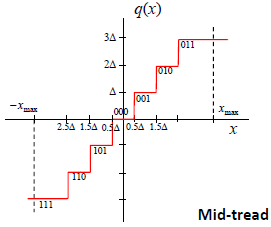
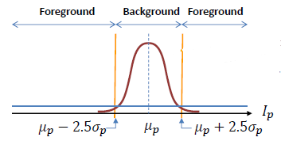

[TOC]

# 1. Statistical Signal Modelling

## 1.1. Introduction to IPA and random variables

## 1.2. Modelling of memoryless sources/processes

### 1.2.a. Sample-wise operators

#### 1. Introduction

##### Stochastic Processes

When we have a set of signals that can be analyzed as being the result of the same given experiment, we model these signals as a **stochastic process** to jointly study them.

##### Memoryless Processes

The analysis of a stochastic process relies on the **<span style='color:blue'>statistic</span>** of the samples and on the **<span style='color:blue'>dependencies</span>** among samples. **Memoryless processes** assume that every sample of the process is **<span style='color:blue'>independent</span>** of its neighbor samples.

Any **processing of memoryless processes** only takes into account the sample values (**<span style='color:blue'>sample-wise operators</span>**), but not their index (time instant or position) of their neighbor samples' values. This are non-linear operations, defined by a mapping function, they process in the same way all samples with the same value and are commonly used for **<span style='color:blue'>perceptual purposes</span>**.

##### Image model

Sample-wise operators are largely used in **image processing**; in the **<span style='color:blue'>pixel-based image model</span>**, for example, the image is understood as a collection of independent pixels. Operations also only take into account the pixel values, manipulating equally every pixel with the same value. **Pixel-based image operators** are defined as following:

- In a generic way, without taking into account the specificity of the images. These are called **range transform operators**.
- In a specific way, adapting the operator to the image pixels' statistics. These are called **histogram-based operators**.

##### Memoryless operators

These operators are very fast since they only require accessing at the pixel value of the pixel being processed. They are **memoryless** since they don't require storing any neighbor pixel values.

Other image models require analyzing a neighborhood of the pixel being processed: space-frequency data, geometrical data, region-based models... We will analyze the two main types of memoryless operators introduced before.

#### 2. Generic operators

##### Range Transform Operators

We define a transformation $T(\cdot)$ on the range of values of the input image ($r$) onto the range of values of the output image ($s$).

###### Gray level mapping

Different segments of the input gray-level range are **<span style='color:blue'>expanded or compressed</span>** depending on the transform features. The segments of $r$ where the magnitude of the derivative of $T(r)$ is greater than 1 are expanded, and the segments where it's smaller than 1 are compressed.


###### Contrast mapping

It expands (stretches) a range of the input image, mapping it into the whole output image range. A set of values of $r$ are mapped into a single value of $s$, a process called **clipping**.


Typically, clipping happens between the ends of the $r$ range and the ends of the $s$ range, mapping the minimum onto the minimum and the maximum onto the maximum. As a consequence of clipping, contrast mapping is a non-reversible transform (it's not injective).

###### Negative mapping

It inverts the range of values of the input image creating a negative version of it. This does not change the contrast of the image. The difference between two pixels remains the same, and the magnitude of the derivative of $T$ is always 1.


###### Binarization mapping

It binarizes the image by clipping all values below a threshold to 0 and all values above to 1. This is also commonly known as thresholding, and is non-reversible because of clipping.


###### Log transformation

It is mainly used to compress the dynamic range of the image.


###### Power-law

Also known as *gamma correction*, this was originally developed for correcting Cathode Ray Tubes (CRT) distortion. It's useful to implement the Stevens power law for brightness perception.

###### Pseudo color

The input range is mapped onto a higher dimensional space; for example, a 3D space representing a color space, where a color ($s$) is assigned to every grey level value ($r$). The transform can be represented by means of a Look-Up Table (LUT) that puts in correspondence the input and output values.


It's commonly used for visualization purposes in arts and biomedical applications. In satellite imagery, for example, spectral indexes are combinations between bands to obtain a parameter of interest.

##### Implementation

Let us assume we want to implement $s=T(r)=\log(r+1)$. A possible approach is to compute the transform sample by sample:

```c++
// Transform the image
for (int i = 0; i < M; ++i) {
    for (int j = 0; j < N; ++j) y[i][j] = log(x[i][j] + 1);
}
```

But the resulting image has only 256 possible different values. So, we improve the implementation using dynamic programming:

```c++
// Build the LUT
for (int k = 0; k < Max_Val; ++k) LUT[k] = log(k + 1);

// Transform the image using the LUT
for (int i = 0; i < M; ++i) {
    for (int j = 0; j < N; ++j) y[i][j] = LUT(x[i][j]);
}
```

This replaces runtime computation with simple array indexing operations.

#### 3. Histogram-based operators

##### Histogram definition

The **histogram** $h(r_k)$ of a grey-level image with range $[0\ldots L-1]$ is a discrete map that stores for each possible pixel value ($r_k$) the **<span style='color:blue'>number of ocurrences</span>** of that value in the image ($n_k$); that is, the number of pixels in the image with a given grey-level value. The histogram information is **related to the probability of occurrence of a given value** in the image. The **normalized histogram** $p(r_k)$ is an estimation of the **<span style='color:blue'>probabilty density function</span>** (pdf) of a random variable associated to the grey-level values of the image pixels:
$$
p(r_k)=\frac{h(r_k)}{\sum_{k=0}^{L-1}h(r_k)}=\frac{n_k}{\sum_{k=0}^{L-1}n_k}=\frac{n_k}{n},\forall r_k\in[0\ldots L-1].
$$

###### Histogram computation

```c++
// Compute the histogram of an image
const IMG_MAX_VAL;
vector<int> h(IMG_MAX_VAL, 0);
for (auto u: img) {
    for (auto v: u) ++h[v];
}
```

###### Examples

<center>
    <figure>
        <br>
        
    </figure>
</center>

###### Color image histogram

The histogram of a **color image** can be defined in several ways:

1. A separate histogram for each component
   - This does not represent the joint probability of the three color components.
2. A 3D histogram (joint histogram)
   - This counts the occurrences of every possible colour $(c_1,c_2,c_3)$.
   - A matrix of $L^3$ elements is created, typically $256^3$.
3. A luminance 1D histogram and a joint 2D chrominance histogram

##### Histogram equalization

###### Continuous case

**Histogram equalization** implements a pixel-based transform aiming at producing a **flat histogram output image**. It increases the global contrast and it depends on the input image's histogram. In this case, we can use the following change of variable result:

If $x$ is a continuous variable and $y=g(x)$ is a strictly monotonous map with inverse map $x=h(y)$, then the pdf of $y=g(x)$ is given by:
$$
f_y(y)=\left|\frac{dy}{dx}\right|^{-1}f_x(x)=\left|\frac{dg(x)}{dx}\right|^{-1}f_x(x)
$$

###### From continuous to discrete case

A mapping using the curve of the accumulated probability of $x$ produces an output image **with a uniform pdf** (equalized in the $[0,1]$ interval).
$$
f_y(y)=\left|\frac{dg(x)}{dx}\right|^{-1}f_x(x);\quad f_y(y)=1\implies\left|\frac{dg(x)}{dx}\right|=f_x(x)\implies y=g(x)=\int_{-\infty}^xf_x(w)dw
$$
The continuous case mapping has to be adapted to the discrete case:

- **Constraint:** elements having originally the same value (*being in the same bin*) should receive the same value (*be in the same bin*) after the transformation.
- **Note:** two different input bins can be merged into a single transformed one.

$$
s=T(r)=\int_0^rf_r(w)dw\Longleftrightarrow s_k=T(r_k)=\sum_{j=0}^kp(r_j)=\sum_{j=0}^k\frac{n_j}{n}.
$$

###### Discrete case

The resulting values ($s_k$) are defined on the range $[0,1]$. In order to have the values in the range $\{0\ldots L-1\}$, they should be scaled and rounded. One possible approach is
$$
s_k=T(r_k)=\sum_{j=0}^kp(r_j)=\sum_{j=0}^k\frac{n_j}{n};\qquad t_k=\text{round}((L-1)s_k).
$$
The final equalization maps all pixels with value $r_k$ into the value $t_k$. In this example, we can see how the **<span style='color:red'>histogram</span>** of an image gets equalized and how the **cumulative histogram** gets closer to the $y=x$ line, while observing the increasing effects on the contrast.

<center>
    <figure>
        <br>
        
    </figure>
</center>

#### 4. Conclusions

In the **pixel-based image model**, operations only take into account the values of the pixels (<span style='color:blue'>point-wise operators</span>), but neither their position nor the values of their neighbor pixels.

In range transform, a **mapping** $T(\cdot)$ is defined on the range of values of the input image $r$ onto the range of values of the output image $s$.

- The mapping **expands/contracts** segments of the input range depending on the magnitude of the derivative of the transform.
- If the mapping is not bijective, **it cannot be inverted**.

The **histogram information** is related to the probability of occurrence of a given value in the image.

- If the histogram of an image is known, **specific transforms** such as the equalization transform can be defined for that image.

### 1.2.b. Quantization

#### 1. Introduction

A very common and useful sample-wise operation is **quantization**. This operation is involved in nearly all digital signal processing.

**Scalar quantization** maps values from a scalar **continuous signal**, or a discrete one with very high resolution, onto a **finite set of values**. Truncation and rounding are simple cases of quantization. This can be also extended to **vector quantization**, a very useful tool. The difference between an input value and its quantized version is referred to as **quantization error**.

**<span style='color:blue'>Storage</span>** implies quantization. All kinds of data are to be stored: original data, transformed data, computed descriptors... Quantization carries a loss of quality: it's a **non-reversible operation**. It is necessary, then, to define **measures of quality** to assess the performance of the quantization. Commonly, **distortion measures** $d(x,q(x))$ are defined: MSE, SNR, Perceptual measures... The assessment will be done in statistical terms with the expected value of this distortion, $\mathbb E[d(X,q(X))]$.

##### Distortion/Quality measures

The error is $e[n]=x[n]-q[n]$. Different measures are defined here:

- **Mean Square Error** (MSE): $\sigma^2_{\text{MSE}}=\sigma_e^2=\mathbb E[|e[n]|^2]=\frac{1}{N}\sum_{i=1}^N|e[n]|^2.$
  - Estimation of expectation.
- **Mean Absolute Difference** (MAD): $C_{\text{MAD}}=\mathbb E[|e[n]|]=\frac{1}{N}\sum_{i=1}^N|e[n]|.$
  - Faster computation, but less sensitive to outliers.
- **Signal to Noise Ratio** (SNR): $SNR=10\log_{10}\frac{\sigma_x^2}{\sigma_e^2},\ (dB).$
  - Comparison of estimated signal powers.
- **Peak Signal to Noise Ratio** (PSNR): $PSNR=10\log_{10}\frac{M^2}{\sigma_e^2},\ (dB).$
  - Very used in signal processing. $M=$ maximum peak-to-peak value of the representation.

#### 2. Uniform quantization

##### Quantization

The input ($x$) is a **<span style='color: blue'>scalar analog value</span>** or a digital one with very high resolution. The output ($y$) is one from N possible values. A **<span style='color:blue'>quantizer</span>** $q(\cdot)$ performs a mapping $q:R\rightarrow C.$ The **encoder** can be seen as a <span style='color:brown'>selection of a cell in a partition</span>: it **classifies** $x$ as $i=\alpha(x)$, where the index links to a set of disjoint cells $S=\{S_i\}_{i\in\{1,2,\ldots,n\}}$ that forms a partition of the domain of $x$, $i\neq j\implies S_i\cap S_j=\emptyset$. Then, the **decoder** can be seen as a <span style='color:brown'>selection of a codeword</span> (cell representative): it maps an index $j$ to a representative of the cell $S_j$ as $y_j=\beta(j)$, where $C=\{y_1,y_2,\ldots,y_n\}\sub R$. There fore, the quantizer is defined as:
$$
q(x)=\beta(\alpha(x));\quad q\equiv\{S,C\}=\{\alpha,\beta\}.
$$
The quantization step introduces losses in the signal representation that have to be assessed. These losses are defined as the **quantization error**, $e_x=x-q(x).$

<span style='color:green'>❖</span> **Fixed length encoding:** the entropic coding of the source created by the quantized signal assuming fixed length codes leads to a code rate of $r=\lceil\log_2n\rceil=\lceil\log_2|C|\rceil$ bits/symbol.

##### Mid-rise quantization

Levels $y_i=\beta(\alpha(x))$ are equispaced with a space of $\Delta$. The thresholds $a_i$ are midway between levels.


The quantization could be expressed as $q_{\text{mr}}(x)=\Delta\cdot\left(\left\lfloor\frac{x}{\Delta}\right\rfloor+\frac{1}{2}\right)$, and the decomposition into encoder and decoder would be
$$
\alpha(x)=\left\lfloor\frac{x}{\Delta}\right\rfloor,\quad\beta(k)=\Delta\cdot\left(k+\frac{1}{2}\right).
$$


##### Mid-tread quantization

Levels $y_i=\beta(\alpha(x))$ are equispaced with a space of $\Delta$, the same as before, but now the values around zero have image zero:



The quantization could be expressed as $q_{\text{mt}}(x)=\Delta\cdot\left\lfloor\frac{x}{\Delta}+\frac{1}{2}\right\rfloor$, and the decomposition into encoder and decoder would be
$$
\alpha(x)=\left\lfloor\frac{x}{\Delta}+\frac{1}{2}\right\rfloor,\quad\beta(k)=\Delta\cdot k.
$$
**Note:** using mid-tread quantization, **one quantization level is lost**, which is negligible when $L$ is large, but may be important for small values. Also, **mid-tread has a zero output level**, while mid-rise **does not**.

##### Quality measure: Distortion

The **distortion** is based on a measure $d(x,y)$ that quantifies the cost of substituting the actual value $x$ by its representative $y$; for example, the squared error $d(x,y)=(x-y)^2.$ It's actually computed as the expected value of $d(x,y)$ over the input $X$:
$$
D(q)=\mathbb E[d(X,q(X))]=\int_{\mathcal X}d(x,q(x))f_X(x)dx=\sum_{i=1}^LP(y_i)\mathbb E[d(X,y_i)|X\in S_i]
$$
**<span style='color: blue'>Example</span>:** a uniform quantizer with $L$ levels. $X$ presents a uniform pdf, and the distortion error is the squared error. Then,
$$
D(q)=\sum_{i=1}^L\int_{I_i}(x-y_i)^2f_X(x)dx=\left[f_X(x\in I_i)=\frac{1}{L\Delta}\right]=\frac{1}{L\Delta}\sum_{i=1}^L\int_{I_i}(x-y_i)^2dx=\\ \left[\text{all integrals are the same}\right]=\frac{1}{\Delta}\int_0^\Delta\left(x-\frac{\Delta}{2}\right)^2dx=\frac{1}{\Delta}\left[\left(x-\frac{\Delta}{2}\right)^3\right]_0^\Delta=\boxed{\frac{\Delta^2}{12}}.
$$

This result is a good approximation for smooth pdf's. We may note this is exactly the MSE of this quantizer.

**<span style='color: blue'>Example</span>:** Show that a signal that is quantized with a uniform, scalar quantizer increases its quality (measured with the **Signal to Noise Ratio**) in $6\ dB$ with every additional bit used in the quantizer. You may assume:

- The signal $x[n]$ is always within the interval $[-A_x,A_x];$
- A *mid-rise uniform quantizer* of $B$ bits is used;
- The signal $x[n]$ is uniformly distributed within the quantization step $\Delta$, and
- The signal power can be approximated by $\sigma_x^2\approx kA_x^2,$ where $k$ is a constant value that depends on the kind of signal.
- $\log_{10}2\approx0.3.$

$$
\text{SNR}(B)=10\log_{10}\frac{\sigma_x^2}{\sigma_e^2}=\left[\sigma^2_x\approx kA_x^2;\ \sigma_e^2=\frac{\Delta^2}{12}\right]=10\log_{10}\frac{12kA_x^2}{\Delta^2}=\\\left[\text{using the length of }x,\ 2A_x=2^B\Delta\right]=10\log_{10}\frac{3k2^{2B}\Delta^2}{\Delta^2}=\\10\log_{10}(3k)+20B\log_{10}2=\left[\log_{10}2\approx0.3\right]\approx k'+6B.\quad (dB)
$$

#### 3. Non-uniform quantization

##### Motivation

When using uniform quantizers, the quantization error is **independent** of the signal level; the SNR for low level samples is **smaller** than for high level samples. For some kinds of sources, this feature is **not desirable**. For example, in voice signal, low amplitude samples are perceptually important. A **logarithm compressor-expander** is used, called a **compander**. Its range varies through time, therefore it's called an **adaptive quantizer**. Its pdf is approximately **Laplacian** (non-uniform quantizer).

##### Compander

**<span style='color:brown'>Compander modeling of non-uniform quantizers</span>:** Large amplitudes are first compressed, then uniformly quantized, and in the end, expanded again.


Signals with small amplitude have a small quantization step, while signals with large amplitude have a large quantization step. As a result, the **SNR** adapts to the signal, becoming robust to the input signal level.

##### A-Law and $\mu$-Law

There exist different implementations:

###### Power-Law companding

- $c(|x|)=|x|^p,$ for $0<p<1$ and usually $p\approx0.75.$
- This is very useful in audio coding for the coefficients of the transformed-domain polynomial approximations to the signal transform.

###### Logarithm Law

- It keeps the ratio $\frac{y_i}{\Delta_i}$ constant.
- In Europe and America, different laws (called the A-Law and the $\mu$-Law, respectively) are used for speech samples in telephony.

#### 4. Optimal quantization

##### Motivation

**Color image motivation (vector quantization):** given an image and a maximum number of colors to represent it, a <span style='color:blue'>non-uniform quantization</span> can be obtained, leading to the **optimum palette**; the optimum palette represents the image minimizing a distortion measure.

##### Optimal quantization

Given a source $X$, characterized by its pdf, define a quantizer $q(x)$ with:

- A given number of levels $L$
- Leading to the minimum distortion $D(q,x)$.

There is no closed-form solution to this problem, but there are some theoretical results and some **interesting algorithms**. Stuart P. Lloyd proved the following necessary conditions:

- The encoder $(\alpha,S_i)$ must be optimal given the decoder $(\beta,y_i).$
- The decoder $(\beta,y_i)$ must be optimal given the encoder $(\alpha,S_i).$

These conditions suggest an **iterative algorithm**. As it is easy to find the optimal $\alpha$ given $\beta$, and reciprocally it is easy to find the optimal $\beta$ given $\alpha$, the iterative algorithm should, given an initial approximation to one of the two, converge to a (presumably local) minimum. At each step, $D(q_i)$ decreases, and as $D(q_i)>0\ \forall i$, the algorithm converges. This conditions are not sufficient, though, so the algorithm may get caught in local minima of $D(q)$. Some results exist for particular pdf's.

##### Max-Lloyd Algorithm

Decision levels $a_k$ and representation values $y_k$ can be chosen to minimize a given criterion; for instance, the MSE. Given a random variable with a known pdf $p_X(x)$, we look for the $a_k$ and $y_k$ that minimize the MSE for a given number of levels $L$:
$$
\mathcal E=\mathbb E\left[(x-q(x)^2\right]=\int_{a_1}^{a_L}(x-q(x))^2f_x(x)dx=\sum_{k=1}^{L-1}\int_{a_k}^{a_{k+1}}(x-y_k)^2f_X(x)dx.
$$

###### Optimization of the MSE map

Computing the derivatives of $\mathcal E$ with respect to the variables ($a_k$ and $y_k$) and setting them equal to zero, we obtain:
$$
\frac{\part\mathcal E}{\part y_j}=\frac{\part}{\part y_j}\left(\sum_{k=1}^{L-1}\int_{a_k}^{a_{k+1}}(x-y_k)^2f_X(x)dx\right)=\frac{\part}{\part y_j}\left(\int_{a_j}^{a_{j+1}}(x-y_j)^2f_X(x)dx\right)=\\\int_{a_j}^{a_{j+1}}\frac{\part}{\part y_j}\left((x-y_j)^2\right)f_X(x)dx=-2\int_{a_j}^{a_{j+1}}(x-y_j)f_X(x)dx=0\iff\\\int_{a_j}^{a_{j+1}}xf_X(x)dx=y_j\int_{a_j}^{a_{j+1}}f_X(x)dx\iff\boxed{y_j=\frac{\int_{a_j}^{a_{j+1}}xf_X(x)dx}{\int_{a_j}^{a_{j+1}}f_X(x)dx}.}
$$

$$
\frac{\part\mathcal E}{\part a_j}=\frac{\part}{\part a_j}\left(\int_{a_{j-1}}^{a_j}(x-y_{j-1})^2f_X(x)dx+\int_{a_j}^{a_{j+1}}(x-y_j)^2f_X(x)dx\right)=\\ [\text{Fundamental Theorem of Calculus}]=(a_j-y_{j-1})^2f_x(a_j)-(a_j-y_j)^2f_x(a_j)=0\iff\\(a_j-y_{j-1})^2=(a_j-y_j)^2\iff y_j^2-y_{j-1}^2=2a_j(y_j-y_{j-1})\iff \boxed{a_j=\frac{y_j+y_{j-1}}{2}.}
$$

If $y_j=y_{j-1}$, then the algorithm has collapsed.

##### <span style='color:green'>Max-Lloyd Initialization</span>

<span style='color:green'>❖</span> Since the Max-Lloyd algorithm does not ensure reaching the optimum, the initialization step is very important; the algorithm may get trapped in the local minima closer to the initial approximation.

<span style='color:green'>❖</span> Several strategies have been proposed:

- **Random selection:** $N$ elements from the initial training data.
- **Regular lattice selection:** Product of uniform scalar quantizers.
- **Product codes:** Product derived from optimal scalar quantizers.
- **Splitting (or LBG algorithm):** Sequential optimizations.
  - Start from a quantization with $K\in\{1,2\}$ representatives.
  - Split each representative and optimize to obtain $2K$.
  - Iterate until reaching $N$ elements.

The final result depends on the correct initialization of the algorithm.

#### 5. Conclusions

**Memoryless processes** assume that every sample of the process is **independent** of its neighbor samples. The **processing of memoryless processes** only takes into account the sample values, but neither their index nor their neighbor sample values.

**Quantization** is involved in almost all of the digital signal processing field. **Storage** implies quantization, and quantization implies loss of information and quality: it is a non-reversible operation. We have studied **uniform quantization** (no information about the source), **non-uniform quantization** (with no statistical information available) and **optimal quantization** (statistical optimization).

### 1.2.c. Example: Sample-wise video processing

#### 1. Introduction

Many security applications require to prompt an alarm to trigger a recorder or to allow a human operator to evaluate the situation. False positives would be accepted.

To detect the presence of a person or object, it is not necessary to get its shape or trajectory, so the method can rely on a **sample-based model** of the image. Usually, it includes computing the pixel-to-pixel difference between images.

#### 2. Still background estimation

In several security applications, due to the setting and camera configuration, the change detection can be understood as a problem of still background estimation. A static camera is observing a scene that, in principle, does not vary: this is called the **<span style='color:blue'>background</span>** of the scene. A **large variation** can be detected by comparison with the background. This is called the **<span style='color:blue'>foreground</span>** object or person (that what is detected).

##### Still background modelling

Every pixel of the background is modeled as a **random variable**; the mean $\mu_p$ represents a pixel's actual value. The variation with respect to the mean is (mainly) due to the noise introduced by the camera.

Camera pixels are usually assumed to be **independent** and **similar**. Therefore, the noise variables (pixels) are modeled as i.i.d. random variables. The noise probability distribution of each pixel is often modeled as a Gaussian $\mathcal N\left(0,\sigma_p^2\right)$, or the empirical distribution (if any) is used. The noise image is modeled as a **stationary, white, zero-mean** stochastic process.

##### Foreground modelling

Every pixel of the foreground is modeled as a random variable; no a priori information can be assumed on foreground elements. The **source of information** can be related to intruders or even to artifacts produced in the recording of the scene. A **uniform distributed pdf** is commonly assumed.

##### Foreground/Background distinction

Once background and foreground have been statistically modeled, changes in the scene are detected by a **<span style='color:brown'>classification procedure</span>**. A **maximum likelihood classifier** is commonly used. It minimizes the probability of error in the classification. Every pixel $p$ in a new image $I$ is **separately analyzed**; if the pixel value falls in-between the two thresholds, the pixel is classified as background.


Various realizations of the background are necessary to estimate the mean of each background pixel model.

##### Further problems

When large areas have to be monitored, cameras may not be static, but may scan a given area. Images are then compared against a panoramic view of the scene. The system has to know where the camera is pointing to at every instant.

The variations in the background pixel values can be larger than expected because of changes in the illumination of the scene. If we have an exterior scene, this typically leads to a non-static background. Then, techniques for **variable background estimation are used**.

#### 3. Variable background estimation: Single Gaussian

In several security applications, due to the setting and camera configuration, the change detection can be understood as a problem of variable background estimation. A static camera is observing a scene (background) that may slowly vary (daylight changes, clouds, etc). In addition, smaller variations appear due to camera sensor noises.

The background model has to account for those possible slow variations. Every pixel of the background is modeled as a random variable. Its mean may slowly change through time, following a recursive equation of the likes of $\mu_p[n]=(1-\rho)\mu_p[n-1]+\rho I_p[n].$ As before, in the absence of foreground objects, variations with respect to the mean are due to the noise introduced by the camera. Noise samples are assumed to be i.i.d., modeled as Gaussian $\mathcal N\left(0,\sigma_p^2\right)$ functions. Its variance may be re-estimated through time as a function of the likes of $\sigma_p^2[n]=(1-\rho)\sigma_p^2[n-1]+\rho(I_p[n]-\mu_p[n])^2.$

##### Variable background classification

Every pixel of the foreground is again modeled as a random variable, without a priori information of it. A uniform distribution is assumed.

Once background and foreground are modeled, changes in the scene can be detected by a classification process. In a given instant $n$,



The process of classification is divided into two steps:

1. **Initialization**: during a training period, the initial mean and variance values of all Gaussian variables ($\mu_p,\sigma^2_p$) are estimated.
2. **Update**: the mean and variance of Gaussian variables are updated if the incoming pixels are classified as background.

$$
\mu_p[n]=\begin{cases}
	(1-\rho)\mu_p[n-1]+\rho I_p[n] \quad \text{if }p\in B\\
	\mu_p[n-1]\qquad\qquad\qquad\quad\ \ \ \text{if }p\in F,
\end{cases} \\
\sigma^2_p[n]=\begin{cases}
	(1-\rho)\sigma^2_p[n-1]+\rho(I_p[n]-\mu_p[n])^2 \quad \text{if }p\in B\\
	\sigma^2_p[n-1]\qquad\qquad\qquad\quad\ \ \ \text{if }p\in F.
\end{cases}
$$

The parameter $\rho$ establishes the **memory of the system**: $\rho\approx0$ implies no updating (**long memory**).

#### 4. <span style='color:green'>Variable background estimation: Multiple Gaussians</span>

In several security applications, systems have to model large variability of the background due to **switch between various stages of the background**. Moreover, new objects that remain in the scene for a long period of time have to be **assimilated to the background**.

#### 5. Conclusions

## 1.3. Stochastic Processes

### Characterization

When we have a set of signals that can be analyzed, as they are the result of the same experiment, we model the set of signals as a **stochastic process**, so that we can analyze them all together.

Experiment: we all pronounce the letter 'A'.

[1.3.Ex1]

- $X[n]$ is the stochastic process. (<span style='color:green'><u>random</u></span>)
- $X[n,i]$ is the $i$-th realization of the process $X[n]$. (<span style='color:green'><u>deterministic</u></span>)
- $X[n_0]$ is a random variable. (<span style='color:green'><u>random</u></span>)
- $X[n_0,i]$ is a constant value. (<span style='color:green'><u>deterministic</u></span>)

Then, a stochastic process is an ordered collection of random variables. The order can be related to different natures of the signal: time, space... The stochastic process makes reference to the set of *all possible realizations*. In reality, we will have just a small subset of these (in some cases, just one realization) and we'll want to obtain good conclusions/measures from this subset.

**Applications of processes:**

- Data synthesis (as in, reproduction of data by a machine)
  - Speech synthesis, texture synthesis
- Modelling for prediction
- Modelling for anomaly detection

To characterize stochastic processes we will extend the measures we normally use for random variables:

- **Mean** of a process: $m_{X[n]}$

$$
m_{X[n]}\equiv m_X[n]=\int_{-\infty}^\infty xf_{X[n]}(x)\ dx=\int_{-\infty}^\infty xf_{X}(x;n)\ dx.\qquad\text{(deterministic function)}
$$

- **Self-correlation** (correlation): $r_X(n_1,n_2)$

$$
r_X(n_1,n_2)=\int_{-\infty}^\infty\int_{-\infty}^\infty xyf_X(x,y;n_1,n_2)\ dx\ dy.
$$

​		This measure compares pairs of random variables.

- **Self-covariance** (covariance):

$$
C_X(n_1,n_2)=\mathbb E\left[\left(X[n_1]-m_X[n_1]\right)\left(X[n_2]-m_X[n_2]\right)\right].
$$

​		When $\forall n,m_X[n]=0\implies r_X(n_1,n_2)=C_X(n_1,n_2)$. When $n_1=n_2=n$, then
$$
C_X(n,n)=\sigma^2_X[n]=\mathbb E\left[(X[n]-m_X[n])^2\right]=r_X(n,n)-m_X^2[n].
$$

- **Cross-correlation**:

$$
r_{X,Y}(n_1,n_2)=\mathbb E[X[n_1]Y[n_2]].
$$

- **Cross-covariance**:

$$
C_{X,Y}(n_1,n_2)=\mathbb E\left[(X[n_1]-m_X[n_1])(Y[n_2]-m_Y[n_2])\right]
$$

<span style='color:blue'>**Example:**</span> sinusoid signal with random uniformly-distributed phase on $[-\pi,\pi)$. Then,
$$
X[n]=A\cos[2\pi f_0n+\theta].
$$
We calculate the mean:
$$
m_X[n]=\mathbb E[X[n]]=\left[\mathbb E[g(X)]=\int_{-\infty}^\infty g(x)f_X(x)\ dx \right]=\int_{-\infty}^\infty A\cos[2\pi f_0n+\theta]f_\Theta(\theta)\ d\theta=\\=\frac{A}{2\pi}\int_{-\pi}^\pi\cos[2\pi f_0n+\theta]\ d\theta=0.
$$
the autocorrelation:
$$
r_X(n_1,n_2)=\mathbb E[A\cos[2\pi f_0n_1+\theta]\cdot A\cos[2\pi f_0n_2+\theta]]=\mathbb E[A^2\cos[2\pi f_0n_1+\theta]\cos[2\pi f_0n_2+\theta]]=\\=\left[\cos\alpha\cos\beta=\frac{1}{2}\cos(\alpha+\beta)+\frac{1}{2}\cos(\alpha-\beta)\right]=\\=\frac{A^2}{2}\left(\mathbb E[\cos[2\pi f_0(n_1+n_2)+2\theta]]+\mathbb E[\cos[2\pi f_0(n_1-n_2)]]\right)=0+\frac{A^2}{2}\cos[2\pi f_0(n_1-n_2)].
$$
When $n_1=n_2=n\implies\sigma_X^2=C_X(n,n)=\frac{A^2}{2}.$

- **Stationarity**: a process is called **stationary** when its statistical properties (mean, correlation, variance...) don't change with respect to the initial time instant. Statistical measures' calculation yields:

$$
\text{Mean:}\quad m_X[n]=\mathbb E[X[n]]=\left[\text{the process is stationary}\right]=\\=m_X.\\
\text{Correlation:}\quad r_X(n_1,n_2)=\mathbb E[X[n_1]X[n_2]]=[n_1=n+l,n_2=n]=\\=\mathbb E[X[n+l]X[n]]=r_X(n+l,n)=[\text{stationary}]=\\=r_x(l).\\
\text{Covariance:}\quad C_X(n_1,n_2)=\mathbb E[(X[n_1]-m_X[n_1])(X[n_2]-m_X[n_2])]=\\=[n_1=n+l,n_2=n]=C_X(n+l,n)=[\text{stationary}]=\\=C_X(l).\\
\text{Variance:}\quad\sigma^2_X[n]=C_X(n,n)=C_X(l)\Big|_{l=0}=C_X(0)=\\=\sigma^2_X.
$$

For **joint stationary processes**,
$$
\text{Cross-variance:}\quad C_{XY}(n_1,n_2)=[n_1=n+l,n_2=n]=C_{XY}(n+l,n)=C_{XY}(l)=C_{YX}(-l).
$$
<span style='color:blue'>**Example:**</span> sinusoid with random phase (continued)

We calculated the mean, $m_X[n]=0$, and the autocorrelation $r_X(n_1,n_2)=\frac{A^2}{2}\cos[2\pi f_0(n_1-n_2)]$. When flushing in $n_1=n+l,n_2=n$, we can see that $r_X(n+l,n)=\frac{A^2}{2}\cos[2\pi f_0l]=r_X(l)$ only depends on $l$.

Stationary processes with mean and autocorrelation are **stationary in a wide sense**.

- **Ergodicity**: in a practical case, it is possible we just have some realizations of the studied process, or even only one. We want to estimate parameters on these realizations, for example the mean of the autocorrelation. We say that a process is **ergodic** if:

  - A unique realization of the process assumes all the statistical properties of the process in a sufficiently large interval.
  - We can replace statistical expectancies on samples with time means on the realization.

  All ergodic processes are stationary; furthermore,

$$
(1)\quad\lim_{N\to\infty}\frac{1}{N+1}\sum_{n=0}^Nx[n]=[\text{ergodic}]=\mathbb E[X[n]]\implies\text{constant expectancy}\\\implies\mathbb E[X[n]]=m_X[n]=m_X.\\
(2)\quad\lim_{N\to\infty}\frac{1}{N+1}\sum_{n=0}^Nx[n+l]\cdot x[n]=[\text{ergodic}]=r_X(n+l,n)\equiv r_X(l).
$$

This proves $\text{ergodicity}\implies\text{stationarity}.\square$

#### Spectral power density

If we want to study a process in the frequency domain, the Fourier transform of a realization does not give enough information. As a consequence, we work with the autocorrelation function of the process,
$$
r_X(n_1,n_2)=\mathbb E[X[n_1]X[n_2]]=r_X(n+l,n).
$$
In general (not stationary), we average the autocorrelation in time like this:
$$
\bar r_X(l)=\lim_{N\to\infty}\frac{1}{2N+1}\sum_{n=-N}^Nr_X(n+l,n).
$$

---------

And then, we calculate
$$
S_X(f)=\mathcal F\{r_X(l)\}=\sum_{l=-\infty}^\infty\bar r_X(l)e^{-j2\pi fl}.
$$
This is called the **Wiener-Khintchine theorem**.

------

$S_X$ is called the **spectral power density**. When working directly with stationary processes, the dependency on $n$ is
$$
r_X(n+l,n)=[\text{stationary}]=r_X(l),\\
S_X(f)=\sum_{l=-\infty}^\infty r_X(l)e^{-j2\pi fl}\longleftrightarrow r_X(l)=\int_{-\frac{1}{2}}^\frac{1}{2}S_X(f)e^{j2\pi fl}.
$$
If $X[n]$ is real and stationary, $S_X(f)$ is an even function:
$$
S_X(f)=\sum_{l=-\infty}^\infty r_X(l)e^{-j2\pi fl},\\
S_X(-f)=\sum_{l=-\infty}^\infty r_X(l)e^{j2\pi fl}=[l=-m]=\sum_{m=-\infty}^\infty r_X(-m)e^{-j2\pi fm}=[r_X(l)=r_X(-l)]=\\=\sum_{m=-\infty}^\infty r_X(m)e^{-j2\pi fm}=S_X(f)\implies S_X(f)=S_X(-f).\qquad\qquad\qquad\qquad\qquad\qquad\qquad\square
$$
The **power** of the process is
$$
P_X=\mathbb E\left[X^2[n]\right]=\mathbb E[X[n+l]X[n]]\Big|_{l=0}=[\text{stationary}]=r_X(l)\Big|_{l=0}=r_X(0).
$$
Then,
$$
r_X(0)=r_X(l)\Big|_{l=0}=\int_{-\frac{1}{2}}^\frac{1}{2}S_X(f)e^{j2\pi fl}\ df\Big|_{l=0}\\\implies P_X=r_X(0)=\int_{-\frac{1}{2}}^\frac{1}{2}S_X(f)\ df.
$$
For this reason, this is called the spectral power density (it is divided by the length; here, this is $1$).

### Linear filtering of processes

If we have a characterized process $X[n]$ that is put through a known filter, we want to be able to characterize the output process $Y[n]$:
$$
X[n]\longrightarrow\boxed{h[n]}\longrightarrow Y[n].
$$

- **Mean** of $Y[n]$:

$$
m_Y[n]=\mathbb E[Y[n]]=\left[\text{LIT system: }Y[n]=\sum_{m=-\infty}^\infty h[m]X[n-m]\right]=\mathbb E\left[\sum_{m=-\infty}^\infty h[m]X[n-m]\right]=\\
=\sum_{m=-\infty}^\infty h[m]\mathbb E[X[n-m]]=\sum_{m=-\infty}^\infty h[m]m_X[n-m]=[\text{if stat.}]=\sum_{m=-\infty}^\infty h[m]m_X=m_X\sum_{m=-\infty}^\infty h[m]=\\
=m_XH(0).
$$

​		**Note:** $Y[n]$ is a linear combination of random variables $X[n]$, so the mean is the mean of this variables times the sum of the filter coefficients.

- **Cross-correlation**:

$$
r_{YX}(n+l,n)=\mathbb E[Y[n+l]X[n]]=\left[\text{LIT system: }Y[n]=\sum_{m=-\infty}^\infty h[m]X[n-m]\right]=\\
=\mathbb E\left[\sum_{m=-\infty}^\infty h[m]X[n+l-m]X[n]\right]=\sum_{m=-\infty}^\infty h[m]\mathbb E[X[n+l-m]X[n]]=[X[n]\text{ stat.}]=\\
=\sum_{m=-\infty}^\infty h[m]r_X(l-m)=r_X(l)*h[l]=r_{YX}[l].
$$

​		**Note:** if the input is stationary, the output will be as well, even though the characterization won't be the same.
$$
r_{YX}[l]=h[l]*r_X[l]\ \longleftrightarrow\ S_{YX}(f)=S_X(f)H(f).
$$

- **Self-correlation at the output**:

$$
r_Y(n+l,n)=\mathbb E[Y[n+l]Y[n]]=\left[\text{LIT system: }Y[n]=\sum_{m=-\infty}^\infty h[m]X[n-m]\right]=\\
=\mathbb E\left[\left(\sum_{k=-\infty}^\infty h[k]X[n+l-k]\right)\left(\sum_{m=-\infty}^\infty h[m]X[n-m]\right)\right]=[\mathbb E\text{ and }h[n]\text{ linear}]=\\
=\sum_{k=-\infty}^\infty\sum_{m=-\infty}^\infty h[k]h[m]\mathbb E\left[X[n+l-k]X[n-m]\right]=[\text{if }X[n]\text{ stat.}]=\\
=\sum_{k=-\infty}^\infty\sum_{m=-\infty}^\infty h[k]h[m]r_X[l+m-k]=\sum_{m=-\infty}^\infty h[m]\sum_{k=-\infty}^\infty h[k]r_X[l+m-k]=\\
=\sum_{m=-\infty}^\infty h[m]r_{YX}[l+m]=\sum_{q=-\infty}^\infty h[-q]r_{YX}[l-q]=r_{YX}[l]*h[-l]=\\
=r_X[l]*h[l]*h[-l].\\
\dots\implies\boxed{r_Y[l]=r_X[l]*h[l]*h[-l].}\longleftrightarrow S_Y(f)=S_X(f)H(f)H^*(f).
$$

​		This implies that $S_Y(f)=S_X(f)\cdot\lvert H(f)\rvert^2$. This is coherent with the positivity of the spectral power density, as $S_X>0$ by definition and $\lvert H(f)\rvert^2>0$.

### Vector notation

We now suppose we are working with a finite set of data and that we have **finite impulse response filters** of $N$ coefficients.

### Examples

#### Characterization of memoryless processes

We use this models to characterize some data. Samples of the process are iid Gaussian of parameters $(m_X,\sigma_X^2)$, so
$$
\boldsymbol\rightsquigarrow\texttt{Independent: }f_X(x,y;n_1,n_2)=f_X(x;n_1)\cdot f_X(y;n_2);\\
\boldsymbol\rightsquigarrow\texttt{Identically distributed: }f_X(x;n_1)=f_X(x;n_2),\forall n_1,n_2;\\
\boldsymbol\rightsquigarrow\texttt{Gaussian: }f_I(x;n):\mathcal N\left(m_X,\sigma^2_X\right)\rightarrow\mathcal N\left(0,\sigma^2_X\right).
$$

- **Mean:**

$$
\mathbb E[X[n]]=[\text{identically distributed}]=m_X=\left[\mathcal N\left(0,\sigma^2_X\right)\right]=0.
$$

- **Self-correlation:**

$$
\mathbb E[X[n+l]\cdot X[n]]=[\text{indep.}]=\begin{cases}
\boxed{l=0}\rightarrow\mathbb E\left[X^2[n]\right]=P_X[n]=[\text{id.dist.}]=P_X=\\
\qquad\quad\ =\left[\mathcal N\left(0,\sigma^2_X\right)\right]=\sigma_X^2.
\\
\\
\boxed{l\neq0}\rightarrow\mathbb E[X[n+l]X[n]]=\mathbb E[X[n+l]]\cdot
\mathbb E[X[n]]=\\
\qquad\quad\ \ \ =m_X[n+l]\cdot m_X[n]=m_X^2=\left[\mathcal N\left(0,\sigma^2_X\right)\right]=\\
\qquad\quad\ \ \ =\boxed{0.}
\end{cases}
$$

​		As they are iid samples, we have that $r_X[l]=\sigma_X^2\delta[l]$. If they were independent but not identically distributed, we would have $r_X[n+l,n]=\sigma_X^2[n]\delta[n]$.

Departing from the stationary case, we calculate the spectral power density:
$$
r_X[l]=\sigma_X^2\delta[l],\\
S_x(f)=\sum_{l=-\infty}^{+\infty}r[l]e^{-j2\pi fl}
$$
$S_X(f)$ presents identical values throughout all of the frequency spectrum. This is called **white noise**.

- **Self-correlation matrix:**

$$
R_X[l]=\mathbb E\left[X[n+l]X^T[n]\right]\implies R_X=\begin{bmatrix}
r_X[0] & \cdots & r_X[N-1] \\
\vdots & \ddots & \vdots \\
r_X[-N+1] & \cdots & r_X[0]
\end{bmatrix}.
$$

​		For an iid null-mean Gaussian distribution,
$$
\newcommand{\Id}{\text{Id}}
R_X=\begin{bmatrix}
\sigma^2_X & 0 & \cdots & 0 \\
0 & \sigma_X^2 & \cdots & 0 \\
\vdots & \vdots & \ddots & \vdots \\
0 & 0 & \cdots & \sigma_X^2
\end{bmatrix}=\sigma^2_X\Id.
$$
<span style='color:blue'>Example:</span> filtering a white process (iid, $\mathcal N\left(0,\sigma^2_X\right)$).
$$
W[n]\rightarrow\boxed{h[n]}\rightarrow Y[n],\ Y[n]=h^TX[n].\\
\bullet\ \mathbb E[Y[n]]=\mathbb E\left[h^TX[n]\right]=h^T\mathbb E[X[n]]=[\text{iid}]=h^T\boldsymbol m_X=m_Xh^T\boldsymbol1=0.\\
\bullet\ r[n+l,n]=[\text{stat.}]=r_Y[l]=r_X[l]*h[l]*h[-l]\implies r_Y[l]=h^TR_X[l]h.
$$
The filter is $h=\begin{bmatrix}\alpha\\\beta\end{bmatrix}$, and so,
$$
r_Y[0]=\begin{bmatrix}\alpha & \beta\end{bmatrix}\begin{bmatrix}\sigma^2_X & 0\\0 & \sigma^2_X\end{bmatrix}\begin{bmatrix}\alpha\\\beta\end{bmatrix}=\alpha^2\sigma_X^2+\beta^2\sigma_X^2
$$
If we now calculate $r_Y[1]\equiv r_Y[-1]=h^TR_X[1]h$, and as $R_X[1]=\begin{bmatrix}0 & 0\\\sigma^2_X & 0\end{bmatrix}\implies r_Y[1]=\alpha\beta\sigma^2_X$. Now the duration of the signal is $2N-1=2\cdot2-1=3$, and the spectral power density is
$$
S_Y(f)=\left[\alpha^2+\beta^2\right]\sigma_X^2+2\alpha\beta\cos(2\pi f).
$$
The **output power** is
$$
P_Y[n]=[\text{stat.}]=P_Y=r_Y[0]=\left[\alpha^2+\beta^2\right]\sigma_X^2.
$$

----

From a statistics point of view,
$$
Y[n]=h^TX[n]=\begin{bmatrix}h[0]&h[1]&\cdots&h[N-1]\end{bmatrix}\begin{bmatrix}X[n]\\X[n-1]\\\vdots\\X[n-N+1]\end{bmatrix}=\\
=h[0]X[n]+h[1]X[n-1]+\cdots+h[N-1]X[n-N+1]=\sum_{m=0}^{N-1}h[m]X[n-m].\\
\rightsquigarrow\texttt{Mean: }m_Y[n]=\sum_{m=0}^{N-1}h[m]m_X[n-m]
$$
If they are iid (in particular, stationary)
$$
\sigma_Y^2=\sum_{m=0}^{N-1}h^2[m]\sigma_X^2.
$$
We will always assume that, for $N$ big enough, the output of a filter is Gaussian.