# Introducció al Processament Audiovisual

## Pràctica 1: Modelat Estadístic de la Senyal I. Processos sense memòria.

### 1. Processos sense memòria de senyals d'imatge

Primer de tot, veiem amb quines imatges treballarem. Les carreguem totes amb `ima = Image_Read()`, i les podem veure amb `Image_Display(ima)`:

- *Im1_Sea.png*:

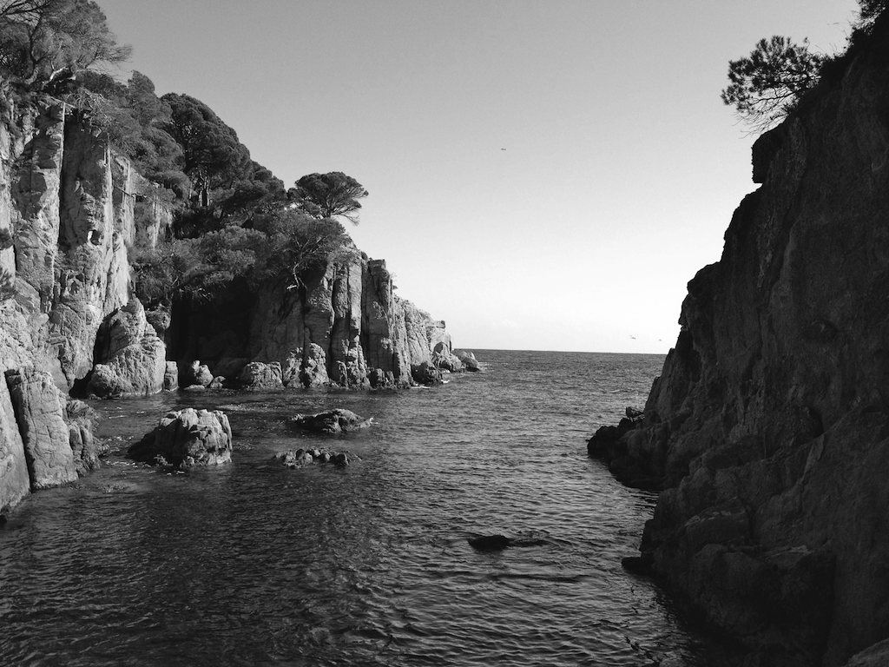

- *Im2_Clock.png*:

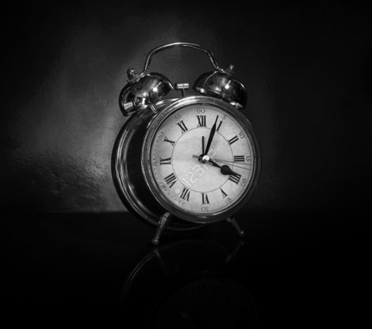

- *Im3_Drops.png*:

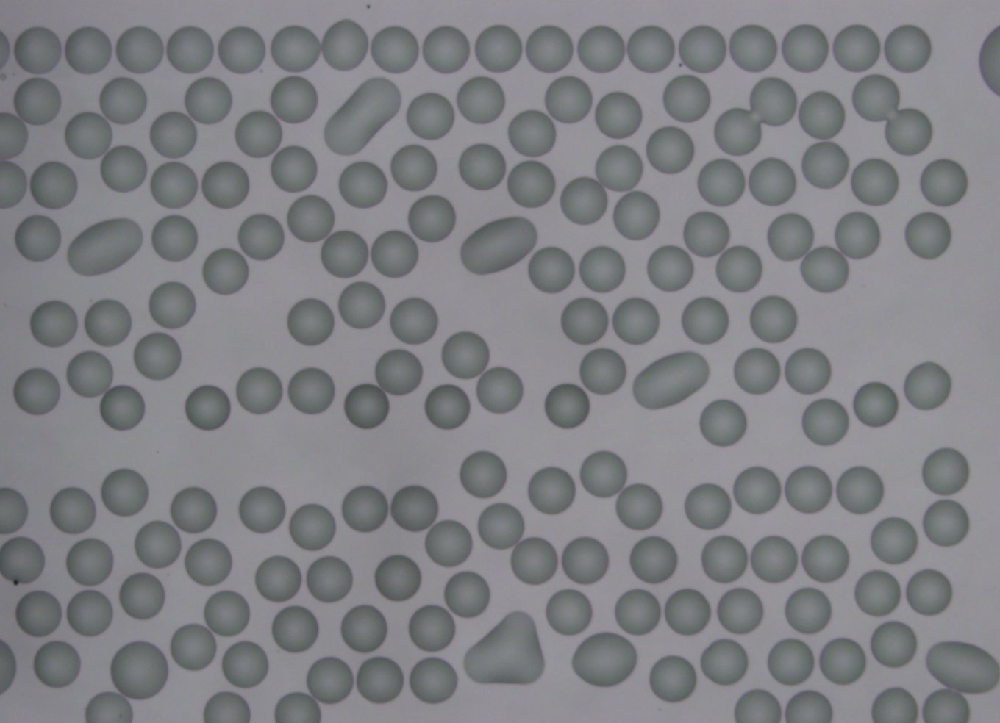

- *Im4_White.png*:


- *Im5_Boy.png*:

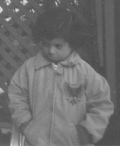

#### 1.1. Histogrames d'imatges.

Els histogrames de les diferents imatges són:

- Imatge 1: *Im1_Sea.png*

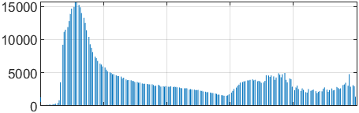

L'histograma de la primera imatge té un rang de grisos força ampli, el que es relaciona amb el contrast notable de la imatge original.

- Imatge 2: *Im2_Clock.png*

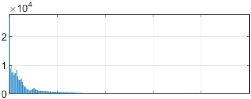

En la segona imatge, podem veure que la majoria de pixels tenen valors baixos, propers al negre, i que el rang de l'histograma és bastant estret. Això reflecteix el fet que la imatge és molt fosca, i poc contrastada.

- Imatge 3: *Im3_Drops.png*

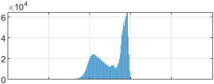

En aquesta tercera imatge veiem que els valors dels pixels es concentren en el centre del rang dinàmic. Això reflecteix el fet que la imatge té molts tons grisos semblants.

- Imatge 4: *Im4_White.png*

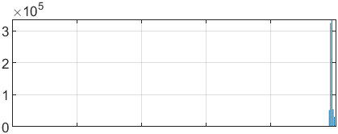

Aquí podem veure clarament pics de quantitat de pixels concentrats tots a la part superior del rang dinàmic dels pixels, ja que la imatge original és tota blanca i no s'hi observa cap mena de detall a simple vista. Altre cop, tots els valors dels píxels es troben en un tros molt estret del rang dinàmic, el que ens dóna informació sobre el poc contrast de la imatge.

- Imatge 5: *Im5_Boy.png*

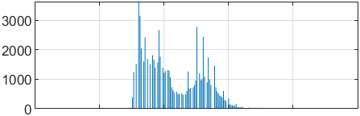

En aquesta imatge passa una cosa semblant a la imatge 3; tenim valors concentrats en el centre, el que reflecteix el fet que la imatge té molts tons de gris d'intensitat semblant.

#### 1.2. Contrast d'imatges (lineal i no lineal).

Executant la instrucció `Ima_1 = Image_Contrast(ima1, [0.25 0.75], [0.0 1.0])` veiem com canvia la imatge 1 de la següent manera:

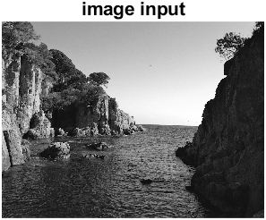				$\longrightarrow$					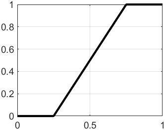				$\longrightarrow$		 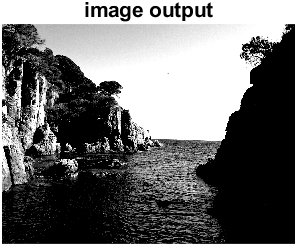

La imatge del centre representa la transformació que fa la funció sobre l'histograma.

##### 1.2.a. Millora del contrast d'una imatge.

Hem d'incrementar el contrast de la imatge *Im5_Boy.png*. Observant l'histograma, veiem que la densitat de pixels està concentrada entre 0.3 i 0.65. Per tant, fem `Image_Contrast(ima5, [0.3 0.65], [0.0 1.0])`, i queda:

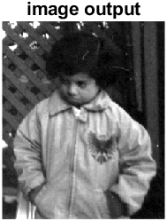

Fent això, hem perdut informació, perquè més enllà del 0.65 hi havia també valors més elevats de pixels. Per tant, no es pot recuperar exactament la mateixa imatge. Tot i això, fent la transformació inversa se'n pot aconseguir una de molt semblant.

##### 1.2.b. Abans de comptar gotes.

Amb els mètodes que tenim, binaritzar exactament és impossible, però ens hi podem acostar molt. En particular, observant l'histograma,

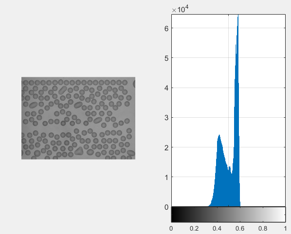

veiem que hi ha molts pixels amb valor al voltant del $0.6\cdot256$. Però, provant amb diversos valors, hem considerat que el millor és enviar l'interval $[0.4749,0.475]$ a l'interval $[0,1]$ amb la instrucció `Image_Contrast(ima3, [0.4749 0.475], [0.0 1.0])`. Aquesta transformació té el gràfic següent:

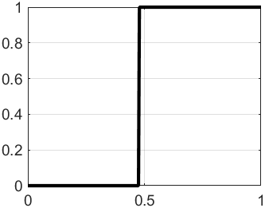

Aquí el *clipping* és gairebé perfecte, tot i que el pendent podria ser més vertical.

##### 1.2.c. Una imatge blanca?

Aparentment, *Im4_White.png* és una imatge completament blanca. Però si observem l'histograma podem veure que hi ha valors que no són blancs. Per tant, si transformem l'histograma amb la instrucció `Image_Contrast(ima4, [0.9839 1.0], [0.0 1.0])`, la imatge ens queda:


i ampliant la zona de l'esquerra, trobem el preu d'una *Lasagne Bolognaise*,

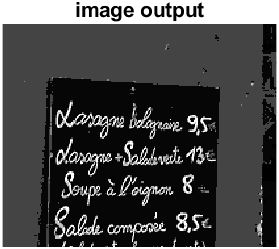

que són 9.50€.

#### 1.2.d. La imatge va ser manipulada.

La imatge va ser efectivament manipulada. Si fem `Image_Contrast(ima2, [0.002 0.025], [0.0 1.0])`, podem veure un reflexe del rellotge a la superfície on es recolza aquest. En aquest reflexe, es veu que ni tan sols els nombres del rellotge són nombres romans, sinó aràbics. Això és incongruent, i per tant fa sospitar que la imatge ha estat retocada. Si el reflexe fos la versió real, serien dos quarts de nou.

​									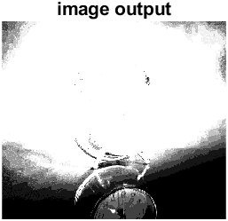 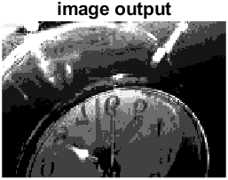

#### 1.2.e. Imatge negativa.

Per invertir la imatge, fem `Image_Contrast(ima1, [0.0 1.0], [1.0 0.0])`. El resultat és el següent:

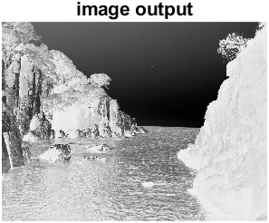

#### 1.2.f. Utilitzant el paràmetre $\gamma$.

Si mirem l'histograma de la imatge *Im5_Boy.png*, com hem dit abans es veu que la densitat de pixels esta concentrada a la zona de 0.3 a 0.65. Farem la transformació de l'histograma amb el paràmetre $\gamma$ igual a 0.5 i a 2.0:

```matlab
Image_Contrast(ima5, [0.3 0.65], [0.0 1.0], 0.5);
```

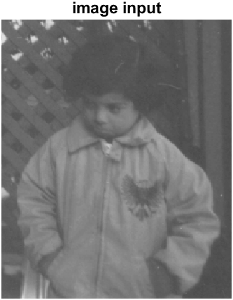

```matlab
Image_Contrast(ima5, [0.3 0.65], [0.0 1.0], 2.0);
```

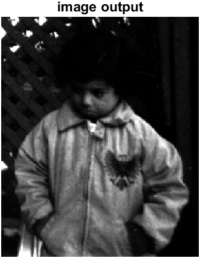

Amb $\gamma<1$, la imatge s'aclara, perquè el rang dels blancs s'expandeix, mentre que el dels negres es comprimeix. El contrari passa amb $\gamma>1$: el rang dels negres s'expandeix, i el dels blancs es comprimeix, així que la imatge es veu més fosca.

#### 1.3. Equalització de l'histograma

